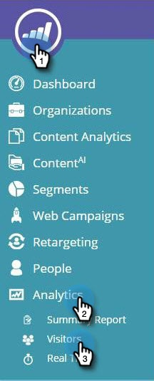

# Web个性化概述 {#web-personalization-overview}

## 简介 {#introduction}

对于新的Marketo客户，实时个性化分为四个应用程序，使用以下两个图块访问：Web个性化和内容AI。

 

>[!NOTE]
>
>Web个性化和内容AI提供Marketo支持的所有语言（英语、法语、德语、日语、葡萄牙语、西班牙语）。

现有客户将继续通过实时个性化拼贴访问应用程序，直到续订，届时他们将使用上述登录。

单击“Web个性化”拼贴时，会显示“功能板”页面。 单击ContentAI拼贴，然后直接转到“内容”Recommendations页面。

这四个应用是：

* Web个性化
* 基于帐户的Web营销
* 网站重定位
* ContentAI

的 **Web个性化** “磁贴”是您创建个性化Web营销活动的访问点。 基于帐户的Web营销和Web重定位。 您可以在“内容分析”页面上添加内容。

**基于帐户的Web营销** 适用于Web个性化和指定帐户功能。 “指定帐户”页面提供有关现有客户、总参与和组织趋势的图形信息，以及帐户列表。 您也可以在此处创建新的命名帐户。

**网站重定位** 使您能够向分段受众进行再营销。 您可以设置区段，但不能在过滤器中使用指定帐户。

**ContentAI** 是提供内容推荐的位置。 您可以轻松地将内容添加到“内容”Recommendations页面。

>[!NOTE]
>
>要访问基于帐户的Web营销或网站重定位，您必须单击“Web个性化”拼贴，即使您没有Web个性化应用程序也是如此。

## 组织 {#organizations}

“组织”选项卡显示在指定时间段内访问您网站的组织的所有详细信息（名称、位置、活动和时间戳）。 表格可以按时间、位置、域和自由文本搜索来排序和组织。

>[!TIP]
>
>“最活跃”与“最新” — 此表由已识别的组织和Internet服务提供商（由ISP图标表示）组织。 它可以根据以下内容进行排序：
>
>* 最活跃：表中最活跃的组织（基于页面查看次数）
>* 最新：表中最近的组织（默认）
>* 要获得有价值的分析，请根据最活跃的

**组织 — 右侧面板**

“组织”页面的右侧面板提供了以下功能和分析：

<table> 
 <tbody> 
  <tr> 
   <td>
<strong>电子表格图标</strong>:该图标位于面板的右上方，用于下载CSV格式的“组织”表格以供离线使用

<strong>设置电子邮件警报</strong>:每次选定组织访问网站时，都会向登录用户发送电子邮件

<strong>潜在客户</strong>:打开所选组织的潜在客户表

<strong>共享</strong>:打开一个弹出窗口，通过电子邮件发送并共享访问该网页的组织的详细信息

<strong>位置图标</strong>:显示所选组织的国家/地区和城市

<strong>链接</strong>:Jigsaw、Whois、Linkedin、Google、Twitter打开一个新窗口，其中包含来自相应网页的其他信息，可进一步分析选定的组织

<strong>搜索</strong>:显示访客通过搜索引擎到达时使用的关键词

<strong>反向链接</strong>:显示将流量引荐至您网站的页面的URL链接

<strong>访客</strong>:显示访问次数、选定组织查看的页面数量及其电子邮件地址（如果他们填写了提交表单）以及上次访问的时间和日期

<strong>点击流</strong>:显示网站上用户活动和URL路径的表格，以及访问每个页面的时间
</td> 
   <td></td> 
  </tr> 
 </tbody> 
</table>

**共享组织**

是否要将网站访客的信息共享给同事？ 单击组织，然后单击右侧面板上的共享链接。

此操作会激活共享此组织叠加图，您可以在其中发送一封电子邮件，共享访问网站的组织的名称和详细信息。

## 访客 {#visitors}

“访客”页面显示在给定时间段内到达您网站的每位访客的所有详细信息和在线行为。 该页面可以深入分析每个访客的活动和在线行为。 表中的访客数据会在24-48小时内更新。

访客页面的右侧面板提供了以下分析：

<table> 
 <thead> 
  <tr> 
   <th colspan="1" rowspan="1">名称</th> 
   <th colspan="1" rowspan="1">描述</th> 
  </tr> 
 </thead> 
 <tbody> 
  <tr> 
   <td colspan="1" rowspan="1"><strong>电子表格图标</strong></td> 
   <td colspan="1" rowspan="1">该图标位于面板的右上角，可下载CSV格式的“访客”表以供离线使用</td> 
  </tr> 
  <tr> 
   <td colspan="1" rowspan="1">
<strong>组织名称</strong>
</td> 
   <td colspan="1" rowspan="1"> </td> 
  </tr> 
  <tr> 
   <td colspan="1" rowspan="1"><strong>设置营销活动</strong></td> 
   <td colspan="1" rowspan="1">用于设置与选定访客关联的Campaign CTA</td> 
  </tr> 
  <tr> 
   <td colspan="1"><strong>位置</strong></td> 
   <td colspan="1">显示访客的国家/地区、州和城市</td> 
  </tr> 
  <tr> 
   <td colspan="1" rowspan="1"><strong>点击流</strong></td> 
   <td colspan="1" rowspan="1">显示访客在网站上的活动和URL路径以及访客访问每个页面的时长表</td> 
  </tr> 
 </tbody> 
</table>

## 实时 {#real-time}

“实时”页面实时显示您网站上的访客，并衡量活动的执行情况。

实时页面分为6个内容丰富的现场访客详细信息表：

<table> 
 <thead> 
  <tr> 
   <th colspan="1" rowspan="1">名称</th> 
   <th colspan="1" rowspan="1">描述</th> 
  </tr> 
 </thead> 
 <tbody> 
  <tr> 
   <td colspan="1" rowspan="1"><strong>访客</strong></td> 
   <td colspan="1" rowspan="1"> 表示您网站上的当前访客数</td> 
  </tr> 
  <tr> 
   <td colspan="1" rowspan="1">
<strong>每分钟点击量</strong>
</td> 
   <td colspan="1" rowspan="1"> 显示每分钟点击您网站的次数的实时折线图</td> 
  </tr> 
  <tr> 
   <td colspan="1" rowspan="1"><strong>热门组织</strong></td> 
   <td colspan="1" rowspan="1">组织表的简短版本</td> 
  </tr> 
  <tr> 
   <td colspan="1"><strong>实时区段</strong></td> 
   <td colspan="1">当前与指定区段匹配的Onsite访客数</td> 
  </tr> 
  <tr> 
   <td colspan="1"><strong>当前浏览</strong></td> 
   <td colspan="1">现场访客当前正在查看的页面的URL</td> 
  </tr> 
  <tr> 
   <td colspan="1" rowspan="1"><strong>热门推荐</strong></td> 
   <td colspan="1" rowspan="1">将访客引荐到您网站的引荐URL</td> 
  </tr> 
 </tbody> 
</table>
