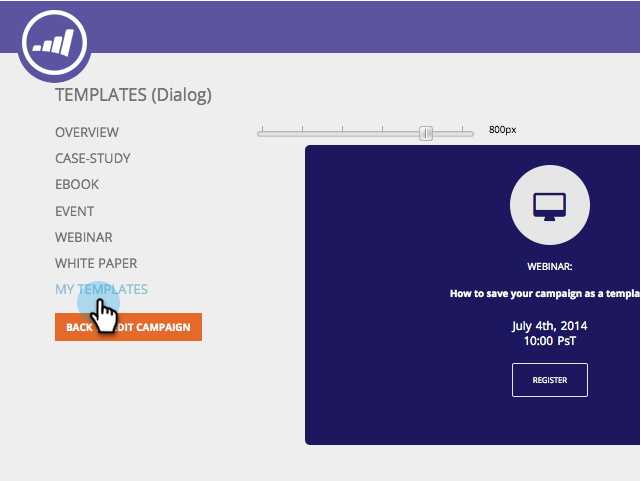

# 将营销活动保存为模板 {#save-your-campaign-as-a-template}

您是否曾花时间创建过完美的Web营销活动？ 现在，您可以将其另存为模板，以便将来轻松重复使用。

1. 前往 **[!UICONTROL Web Campaigns]**。

   

1. 搜索要另存为模板的营销策划。

   

1. 单击编辑图标。

   

1. 检查&#x200B;**[!UICONTROL Use as template]**&#x200B;并单击&#x200B;**[!UICONTROL Save]**。

      

1. 下次创建营销活动并选择模板时，请查看“设置营销活动”页面中的[!UICONTROL My Templates]以查看您保存的模板。

   
