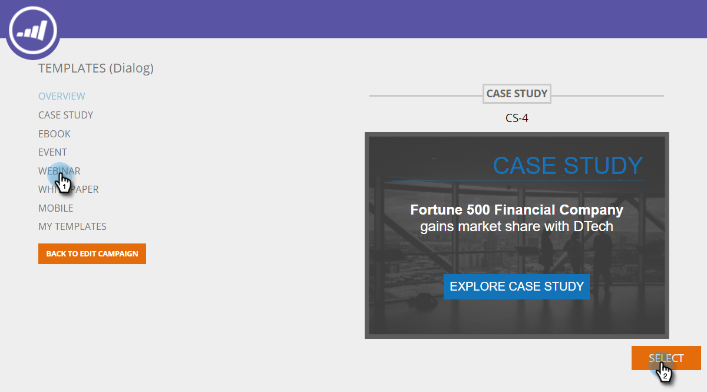

# 使用模板创建Web活动{#using-templates-to-create-web-campaigns}

通过使用我们内置的模板或通过[保存您自己的](save-your-campaign-as-a-template.md)来加快和简化Web活动创建过程。

>[!NOTE]
>
>模板针对所有设备和桌面和移动浏览体验进行了优化。

1. 转到&#x200B;**Web活动**。

   

1. 单击&#x200B;**新建Web活动**。

   

1. 命名活动。

   

1. 选择目标区段。

   

1. 单击&#x200B;**模板**。

   

1. 选择适合您的活动的区域，查看并选择适合您的模板。

   >[!NOTE]
   >
   >有一些很酷的模板可供选择，我们将在将来添加更多模板。

   

   >[!TIP]
   >
   >对于移动活动，请从&#x200B;**mobile**&#x200B;部分选择模板。

1. 自定义模板。

   

1. 单击&#x200B;**保存**。

   

干得好！ 您是否看到使用模板节省了多少时间？

>[!MORELIKETHIS]
>
>[将活动另存为模板](/help/marketo/product-docs/web-personalization/using-templates/save-your-campaign-as-a-template.md)
