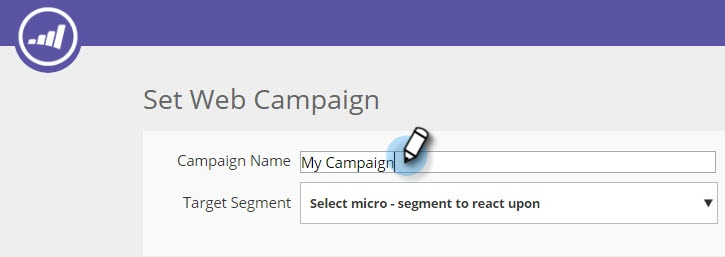

# 使用模板创建Web活动 {#using-templates-to-create-web-campaigns}

通过使用我们内建的模板或保存您自己的模板，加快和简化您的Web活动 [创建流程](save-your-campaign-as-a-template.md)。

>[!NOTE]
>
>模板针对所有设备和桌面和移动设备进行了优化。

1. 转到Web活动。

   

1. 单击“新建Web活动”。

   

1. 命名活动。

   

1. 选择目标区段。

   

1. 单击“模板”。

   

1. 选择适合您的活动的区域以查看并选择适合您的模板。

   >[!NOTE]
   >
   >**提醒**
   >
   >有一些很酷的模板可供选择，我们将来添加更多模板。

   

   >[!TIP]
   >
   >对于移动活动，从移动区域 **选择** 模板。

1. 自定义模板。

   

1. 单击“保存”。

   

干得好！ 您看到使用模板节省了多少时间吗？

>[!NOTE]
>
>**相关文章**
>
>* [将活动另存为模板](save-your-campaign-as-a-template.md)

>

