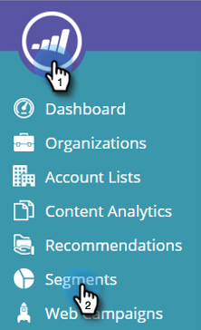

# 创建基本Web区段 {#create-a-basic-web-segment}

让我们创建一个基本区段，以来自美国和金融服务业的所有Web访客为目标。

1. 转到 **区段**.

   

1. 单击 **新建**.

   

1. 输入区段名称。

   

1. 拖动 **位置** 从右侧菜单中将其拖放到区段编辑器中。

   

1. 从下拉列表中选择要添加的国家/地区。 选择 **美国**.

   

   >[!NOTE]
   >
   >每个区段的城市数量限制为300个。

1. 拖动 **行业** 从右侧菜单中将其拖放到区段编辑器中。

   

1. 从下拉列表中选择要添加行业。 选择 **金融服务业**.

   

   现在，您已为所有访问您网站的美国客户和金融业潜在客户建立了一个基本区段。

1. 单击 **保存** 保存区段或 **保存并定义营销活动** 以转到“营销活动”页面。

   

现在，您已对美国访客进行了分段，接下来请添加金融服务行业。

>[!MORELIKETHIS]
>
>[Web区段](/help/marketo/product-docs/web-personalization/using-web-segments/web-segments.md)
