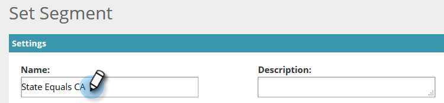
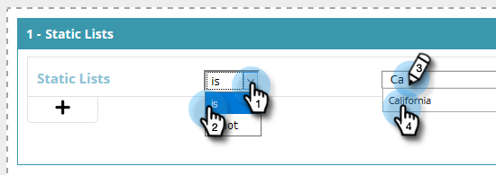
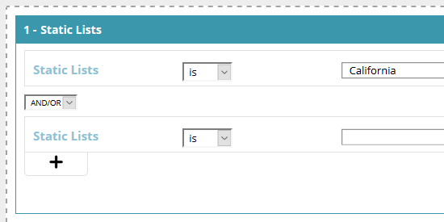

# 使用静态列表{#create-a-segment-using-a-static-list}创建段

当已知Web访客访问您的网站时，根据他们是否在您的Marketo [静态列表](https://docs.marketo.com/display/DOCS/Understanding+Static+Lists)中细分这些。

1. 转至&#x200B;**区段**。

   

1. 单击&#x200B;**新建**。

   

1. 输入区段名称。

   

1. 在“已知潜在客户”中，将**静态列表**拖到画布上。

   

1. 单击下拉框以选择&#x200B;**is**&#x200B;或&#x200B;**is not**（取决于所需内容），并键入静态列表的名称。

   

1. 如果要添加多个列表，则需要通过单击&#x200B;**+**&#x200B;为每个字符创建新行。 如果您只想要一个列表，请跳到[步骤8](#eight)。

   

1. 对于多个列表(或多个“is not”列表)，重复您在[步骤5](#five)中学习的步骤。

   

   >[!NOTE]
   >
   >和/或下拉就是这样。 单击它可选择&#x200B;**和**、**或**&#x200B;或&#x200B;**和/或**。

1. 单击&#x200B;**保存**&#x200B;以保存区段，或单击**保存并定义活动**以保存并转到活动页。

   

