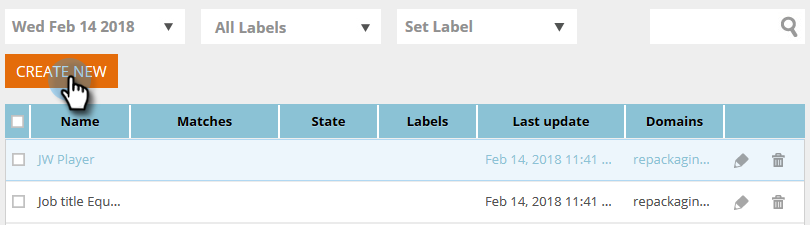

# 使用静态列表创建区段 {#create-a-segment-using-a-static-list}

在已知Web访客访问您的网站时，根据他们是否在Marketo [静态列表](/help/marketo/product-docs/core-marketo-concepts/smart-lists-and-static-lists/static-lists/understanding-static-lists.md)中划分访客。

1. 转到&#x200B;**[!UICONTROL Segments]**。

   

1. 单击 **[!UICONTROL Create New]**。

   

1. 输入区段名称。

   

1. 在已知潜在客户中，将&#x200B;**[!UICONTROL Static Lists]**&#x200B;拖到画布上。

   

1. 单击下拉菜单以选择&#x200B;**[!UICONTROL is]**&#x200B;或&#x200B;**[!UICONTROL is not]**（取决于您想要的内容），并键入静态列表的名称。

   

1. 如果要添加多个列表，则需要通过单击&#x200B;**+**&#x200B;为每个列表创建一个新行。 如果只需要一个列表，请跳至[步骤8](#eight)。

   

1. 对于多个列表（或多个“不是”列表），请重复您在[步骤5](#five)中学习的步骤。

   

   >[!NOTE]
   >
   >和/或下拉菜单就是这样。 单击它以选择&#x200B;**[!UICONTROL and]**、**[!UICONTROL or]**&#x200B;或&#x200B;**[!UICONTROL and/or]**。

1. 单击&#x200B;**[!UICONTROL Save]**&#x200B;以保存区段，或单击&#x200B;**[!UICONTROL Save & Define Campaign]**&#x200B;以保存并转到[!UICONTROL Campaigns]页面。

   
