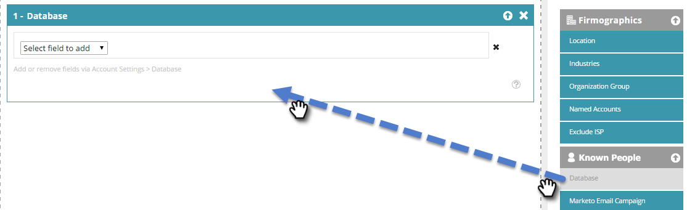
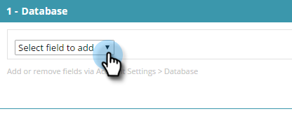

# 使用已知人员数据创建区段 {#create-a-segment-using-known-person-data}

以下是如何使用已知人员数据值创建区段。

>[!PREREQUISITES]
>
>[管理人员数据](/help/marketo/product-docs/web-personalization/using-web-segments/manage-person-data.md)

1. 转到 **区段**.

   

1. 单击 **新建**.

   

1. 输入区段名称。

   

1. 在个人资料分段中，拖动 **数据库** 到画布上。

   

1. 从下拉列表中选择人员数据字段。

   

1. 输入人员数据值。

   

   每个字段只能有一个值。 例如，如果要为职称字段添加多个值，则需要为每个值创建一个具有相同字段名称的新行。 请确保使用OR值以确保任何值捕获匹配项。

   

## 选择多个人员数据字段 {#selecting-multiple-person-data-fields}

1. 单击 **+** 以添加另一个人员数据字段。

   

1. 选择AND/OR运算符。 选择要添加的字段。 选择人员数据字段。 输入人员数据值。

   

1. 单击 **保存** 保存区段或 **保存并定义营销活动** 以保存并转到“营销活动”页面。

   

   现在，您已设置一个以已知人员数据为目标的区段。
