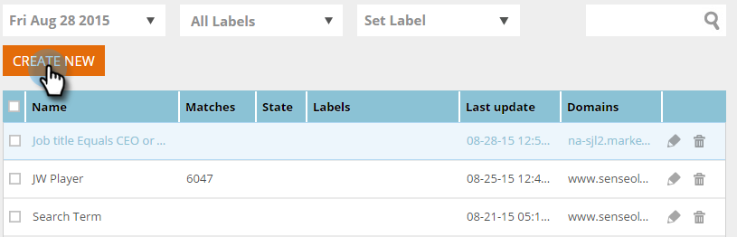

# 使用已知人员数据{#create-a-segment-using-known-person-data}创建区段

下面介绍如何使用“已知人员数据”值创建区段。

>[!PREREQUISITES]
>
>[管理人员数据](/help/marketo/product-docs/web-personalization/using-web-segments/manage-person-data.md)

1. 转至&#x200B;**区段**。

   

1. 单击&#x200B;**新建**。

   

1. 输入区段名称。

   

1. 在“用户档案分段”中，将&#x200B;**Database**&#x200B;拖动到画布上。

   

1. 从下拉菜单中选择人员数据字段。

   

1. 输入“人员数据”值。

   

   每个字段只能有一个值。 例如，如果要为职务字段添加多个值，则需要为每个值创建一个字段名称相同的新行。 请务必使用OR值，以确保任何值都捕获匹配项。

   

## 选择多人数据字段{#selecting-multiple-person-data-fields}

1. 单击&#x200B;**+**&#x200B;添加另一个人数据字段。

   

1. 选择AND/OR运算符。 选择要添加的字段。 选择“人员数据”字段。 输入人员数据值。

   

1. 单击&#x200B;**保存**&#x200B;以保存区段，或单击&#x200B;**保存并定义活动**&#x200B;以保存并转到活动页。

   

   您现在已设置区段定位“已知人员”数据。
