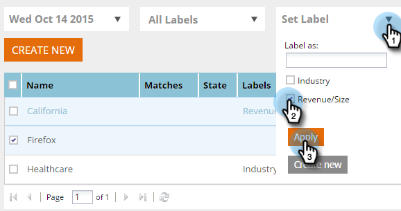

# 为区段设置标签 {#label-your-segment}

您的区段是否太多，以至于滚动变得繁琐？ 使用标签来标记区段，以便您能够快速找到它们。

## 标记区段 {#tag-a-segment}

1. 登录Web个性化，然后转到 **区段**.

   

1. 选择要为其添加标签的区段。

   

1. 要使用现有标签，请单击 **设置标签**，然后单击 **应用**.

   

1. 或者，要创建新标签，请单击 **设置标签**，输入新标签名称，然后单击 **新建**.

   

   >[!NOTE]
   >
   >“新建”按钮显示新标签的名称。 如果标签太长，则“新建”可能不会显示在此处。

酷！ 您现在知道如何为区段分配和创建标签。
