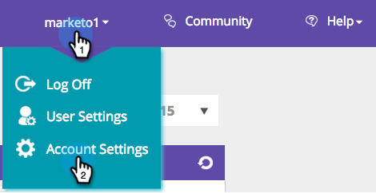

# 管理人员数据 {#manage-person-data}

通过选择要在分段中使用的人员字段来利用[!DNL Web Personalization]的人员数据。

1. 前往 **[!UICONTROL Account Settings]**。

   

1. 前往 **[!UICONTROL Database]**。

   

## 添加新人员字段 {#adding-a-new-person-field}

1. 从下拉列表中选择&#x200B;**要添加的字段**&#x200B;以将人员数据字段添加到列表。

   

   >[!NOTE]
   >
   >新字段会以待处理状态添加，激活过程最长可能需要24小时。

## 删除人员字段 {#deleting-a-person-field}

1. 单击删除图标()可从列表中删除字段。 单击&#x200B;**[!UICONTROL Yes]**&#x200B;确认要删除该字段。

   

   >[!NOTE]
   >
   >**管理您的人员数据字段**
   >
   >* 只能包含人员数据字段
   >* 您最多可以添加30个人数据字段
   >* 添加新字段最多需要24小时才能激活
   >* 字符串类型的最大长度为255个字符
   >* 隐藏字段将自动删除

<table>
 <tbody>
  <tr>
   <th>
REST API名称
</th>
   <th>
SOAP API名称
</th>
   <th>
友好名称
</th>
  </tr>
  <tr>
   <td>
部门
</td>
   <td>
部门
</td>
   <td>
部门
</td>
  </tr>
  <tr>
   <td>
标题
</td>
   <td>
标题
</td>
   <td>
职务
</td>
  </tr>
  <tr>
   <td>
评级
</td>
   <td>
评级
</td>
   <td>
评级
</td>
  </tr>
  <tr>
   <td>
商机得分
</td>
   <td>
商机得分
</td>
   <td>
得分
</td>
  </tr>
  <tr>
   <td>
商机状态
</td>
   <td>
潜在客户状态
</td>
   <td>
状态
</td>
  </tr>
  <tr>
   <td>
优先级
</td>
   <td>
优先级
</td>
   <td>
优先级
</td>
  </tr>
  <tr>
   <td>
leadRole
</td>
   <td>
潜在客户角色
</td>
   <td>
角色
</td>
  </tr>
  <tr>
   <td>
已取消订阅
</td>
   <td>
取消订阅
</td>
   <td>
取消订阅
</td>
  </tr>
 </tbody>
</table>

为新[!DNL Web Personalization]帐户现成提供了以下潜在客户字段：

>[!MORELIKETHIS]
>
>[使用已知人员数据创建区段](/help/marketo/product-docs/web-personalization/using-web-segments/create-a-segment-using-known-person-data.md)
