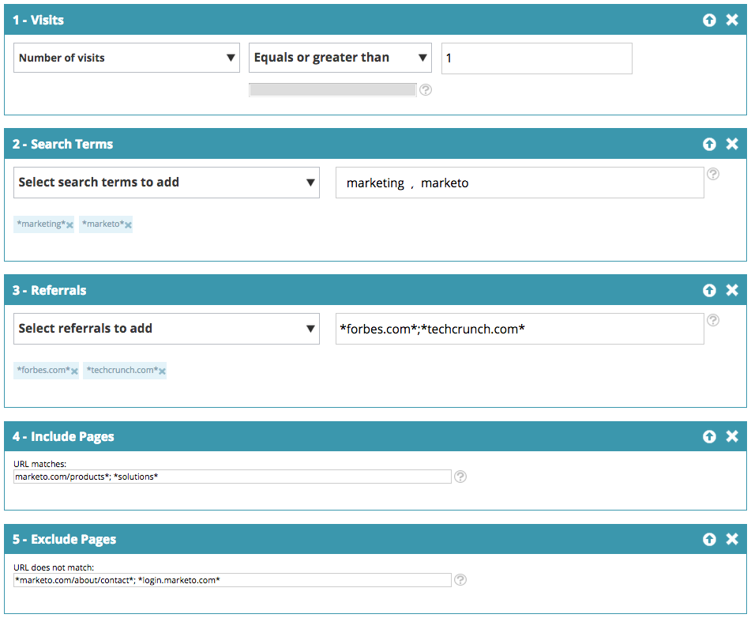

# Web区段{#web-segments}

## 视图段{#view-segment}

区段选项卡显示您根据各种属性设置的所有自定义区段。  **区段是一组符合在“设置区段”页面中定义的指定标准的访客。**  区段可以是特定行业、地点的访客，也可以基于访客的现场活动。

在Web个性化中，访客可以匹配多个细分。 例如，如果存在用于美国访客的区段和用于金融公司的区段，则来自美国银行的Web访客将匹配&#x200B;**两个**&#x200B;用于美国访客的区段和用于金融公司的区段。

**图表：**  “区段”页根据区段（y轴）和区段名称（x轴）中的访客数显示选定区段的条形图。

<table> 
 <thead> 
  <tr> 
   <th colspan="1" rowspan="1">名称</th> 
   <th colspan="1" rowspan="1">说明</th> 
  </tr> 
 </thead> 
 <tbody> 
  <tr> 
   <td colspan="1" rowspan="1"><strong>名称</strong></td> 
   <td colspan="1" rowspan="1">区段的标题</td> 
  </tr> 
  <tr> 
   <td colspan="1" rowspan="1">
<strong>匹配</strong>
</td> 
   <td colspan="1" rowspan="1">满足区段的自定义、定义标准的访客数</td> 
  </tr> 
  <tr> 
   <td colspan="1" rowspan="1"><strong>设置活动</strong></td> 
   <td colspan="1" rowspan="1">允许您设置与选定搜索词关联的活动CTA</td> 
  </tr> 
  <tr> 
   <td colspan="1"><strong>访客</strong></td> 
   <td colspan="1">与所选搜索词关联的访客表的预览</td> 
  </tr> 
  <tr> 
   <td colspan="1" rowspan="1"><strong>Clickstream</strong></td> 
   <td colspan="1" rowspan="1">显示访客在站点上的活动和URL路径以及访问每个页面的时间表 </td> 
  </tr> 
 </tbody> 
</table>

请参阅[如何创建和视图区段标签](/help/marketo/product-docs/web-personalization/using-web-segments/label-your-segment.md)

**区段 — 右侧面板**

在表中选择区段后，右侧面板中将显示有关区段的其他详细信息。

这些详细信息包括：

* 区段名称
* 区段的创建日期
* 显示与区段一起运行的活动的关联活动。 单击反应数将转到“活动”页，其中显示区段的活动CTA（行动动员）
* 区段的匹配项数(满足区段标准的访客数)和匹配区段的独特（唯一）访客数。 单击唯一访客链接可转到访客的页面，其中显示区段的结果
* 区段的所有者/用户创建者
* 与区段关联的域站点
* 区段选定标准的简短摘要

## 启用或禁用区段{#enable-or-disable-a-segment}

要启用或禁用区段，请选中表格中该区段的复选框，并在表格底部的“选择操作”下拉框中，选择操作“启用”或“禁用”。 禁用区段后，“状态”列下将显示“禁用”字样。

## 创建区段{#create-segments}

您创建的区段符合您在&#x200B;**设置区段**&#x200B;页面中定义的任何特定条件。 您还可以根据一系列标准组合自定义您的细分，定位活动中的特定受众。

创建新区段

在&#x200B;**区段**&#x200B;页面中，单击图表下的&#x200B;**新建**。 出现以下屏幕。

为区段定义常规参数：

* **名称：**  命名您的区段。
* **说明：**  提供区段标准的更详细说明。
* **域：**  选择要包含在区段中的域。
* **区段规则逻辑：**  选择AND/OR逻辑以构建每个分段属性
* **计时：** 定义您希望在活动中的访客参与程度

   * **进入时**:从访客到网站
   * **第1次至第9次单击**:在网站上点击特定量后吸引访客

>[!TIP]
>
>**区段规则逻辑**
>
>有三个筛选选项：
>
>1. 使用所有过滤器（1和2以及3...）
>1. 使用任何过滤器（1或2或3...）
>1. 高级过滤器(使用和/或表达式)

   >
   >    
   高级过滤器允许您控制区段条件。 输入以“和”和“或”分隔的筛选器编号。
   >
   >    
   * 1和2和3
   >    * 1或2或3

   >
   >    混合“and”和“or”需要括号来阐明逻辑意图。 例如“1或2”和“3”必须作为以下内容之一写成：
   >
   >    
   * 1和（2或3）
   >    * （1和2）或3

   >
   >    嵌套括号可用于更复杂的逻辑，例如
   >
   >    
   * （1和2）或（3和4）
   >    * 1和(2或（3和4）)

   >
   >    在插入、删除或重新排序后检查逻辑。

将右侧列中的区段属性拖放到左侧的区段编辑器中：

### Firmographics {#firmographics}

**位置**

将&#x200B;**位置**&#x200B;拖放到区段编辑器中。

* 从以下参数中进行选择：

   * **包括**  — 选择是希望活动包括还是排除位置。
   * **选择要添加的国家**  — 从下拉框中，选择要包含在区段中的国家/地区。国家/地区名称显示在右侧。 您可以选择多个国家/地区。

添加国家/地区后，您还可以指定区段的州、市和邮政编码。

* **选择要添加的州或省**  — 从下拉框中，选择要包括的美国州或加拿大省。您可以进行多个选择。
* **邮政编码**  — 输入您希望包含在区段中的邮政编码。
* **城市**  — 进入您希望包括的城市。在城市之间使用分号。

>[!TIP]
>
>**我选择哪些区段条件？“AND”还是“OR”？** OR在每个字段中用作附加选项。潜在客户只需满足在每个字段中选择的多个标准中的一个标准，即可获得区段资格。 (例如，潜在客户可以来自U，S. *或来自国防工业的*)。 AND函数作为此段必须满足的附加必需参数。 (例如，潜在客户必须来自美国和国防工业)。 在每个分段用户档案中，每个单独的字段都可以同时使用，具体取决于所选的“区段条件”，即“AND”或“OR”。

**工** 业在“ **用户档案** 细分”部分下，选中“工业”旁 **边的框**。

* 从以下参数中进行选择：

   * **包括**  — 选择是希望区段包含还是排除行业。
   * **选择要添加的行业**  — 选择要包含在区段中的行业。该行业显示在下拉框下方。 您可以选择多个行业。

**组织组**

在&#x200B;**用户档案分段**&#x200B;部分下，选中&#x200B;**组织组旁边的框。**

* 从下拉框中，从以下选项中进行选择：

   * 财富500强 — 仅包括此领域财富500强公司
   * 《财富1000强》 — 在此领域仅包括《财富1000强》公司
   * 2000年全球公司 — 包括这一部分中的2000年全球数据
   * 企业 — 包括员工超过1,000且收入超过2.5亿美元的组织
   * SMB — 仅包括此领域中的中小型企业

**— 指定帐户 —**

**组织**

* **来自这些公司（特定名称）**

   * 从“选择要添加的公司”下拉菜单中选择要目标的公司。
   * 您可以键入要目标的确切组织名称。 *建议&#x200B;_always_&#x200B;使用“指定帐户”列表，而不是手动键入名称，以获得更好的匹配项（请参阅下文）。

**指定帐户列表**

从[命名帐户列表](/help/marketo/product-docs/web-personalization/account-based-web-marketing/create-a-new-account-list.md)中进行选择，以细分关键目标帐户。

>[!NOTE]
>
>指定帐户列表名称旁边的方括号中的数字用作Web Personalization [读取API](https://developers.marketo.com/documentation/websites/rtp-js-api/)列表的索引引用。

**排除ISP**

不包括网段中的互联网服务提供商(ISP)。

### 已知人员{#known-people}

**数据库**

Web个性化与您的Marketo数据库集成，使您能够根据已知的人物属性和数据对活动进行细分和个性化。

选择“数据库”，然后从下拉列表中选择一个人员数据字段。 选择&#x200B;**+**&#x200B;以从下拉菜单中添加字段。

您可以从“帐户设置”>“数据库”中添加或删除人员数据字段

>[!TIP]
>
>根据“营销”到“职位”等人员的所有人员数据字段创建区段标准；得分；角色；等……
>
>例如 “职位等于CMO”和“分数小于或等于50”

**Marketo电子邮** 件营销活动通过电子邮件引用访客（点击Marketo电子邮件并到达网站）来推荐营销活动，并对活动进行个性化设置。按营销人员项目名称或活动名称细分，并继续通过电子邮件与Web的对话。 从下拉列表中选择+以添加字段。

**状态**

根据潜在客户的状态定义区段：已知或匿名。

* 已知 — 从下拉框中选择此选项以查看已知访客。 当访客在您的网站上提交表单并显示在“Web个性化人物”页面时，即为已知信息。
* 匿名 — 从下拉框中为匿名访客选择此选项。

### 行为{#behavioral}

**访问 — 根** 据访客行为或身份定义您的细分。

* 访问次数 — 从下拉框中选择此选项，以指定网站上潜在客户的访问次数。

   * 从下拉框中选择“等于”、“等于”或“大于”，或“等于”或“小于”。

* 特定访问 — 从下拉框中选择此选项以指定特定访客。

   * 在右侧的文本框中，输入要跟踪的访客号。 单击访客(在访客页面中)和右侧面板上的“设置活动”时，可以找到唯一的Web个性化访客标识号。 访客ID位于“高级设置”部分。 访客ID也可在URL中找到(例如，访客=JZJIFJNUI60PZ8Y97BHTY9BL8PKWS)。

**搜索词**  — 根据潜在客户的搜索词定义区段。

* 搜索的访客 — 从下拉列表中，选择要从访客搜索中跟踪的词，或添加您自己的搜索词。 （搜索词中不需要使用*通配符，因为它被设置为默认包含包含搜索词的短语）。

**引用**  — 添加访客引用的URL。

* 选择要添加的引荐 — 从下拉列表中，选择要跟踪或添加您自己的引荐的引荐站点。 选择后，引用将显示在下面的框中。 （允许使用*作为通配符）

**包括页面**  — 跟踪在您的网站上访问的特定页面潜在客户。

* URL匹配 — 添加要跟踪的特定网页的URL。 可以通过用分号分隔多个URL来添加它们。 （允许使用*作为通配符）。

**排除页面**  — 排除您不想在区段中匹配的特定页面。（允许使用*作为通配符）。

* URL不匹配 — 添加要从跟踪中排除的特定网页的URL。 可以添加多个URL，方法是用分号分隔它们

### 设备/浏览器{#device-browser}

**Mobile OS**

将Mobile OS拖放到区段编辑器中

* **访客类型** 

   **Mobile OS**  — 从下拉框中，从列出的一个或多个移动OS中进行选择。下面显示选定的移动操作系统。

   * 访客使用任何移动设备
   * 访客正在使用此特定设备/操作系统
   * 访客没有使用任何移动设备

* **设备**   — 从下拉列表中，从一个或多个设备（Apple、Samsung、LG、HTC、Nexus、Blackberry等）中进行选择。所选设备显示如下。

**浏览器**

目标访客。

* 浏览器类型 — 从下拉框中，选择一个或多个Internet浏览器。 选定的浏览器显示在下面。
* 浏览器版本 — 输入要添加到区段的浏览器版本。 您可以通过用逗号分隔多个版本。 （允许使用*作为通配符）。

### API {#api}

**数据事件**  — 触发特定自定义访客的细分事件

添加要事件的目标值。 例如，来自第三方数据源。

**用户上下文API**

Web个性化API调用[在此处了解有关它的更多信息。](https://developers.marketo.com/documentation/websites/rtp-user-context-api/)

>[!TIP]
>
>**使用通配符**  — 当您要包含任何包含其中某项(例如，“[google.com](https://google.com)”或“search term product”，我们称之为通配符，应在两端输入星号。因此，来自[google.com](https://google.com)的任何内容都应作为* [google.com](https://google.com)*输入

## 编辑区段{#edit-segments}

您可以编辑已创建的区段。

1. 要编辑区段，请转到&#x200B;**区段**。

   

1. 在&#x200B;**区段**&#x200B;表中，单击要编辑的区段的编辑图标()。 将打开&#x200B;**设置区段**&#x200B;页，其中显示选定的区段。
1. 应用您希望对区段进行的任何编辑或更改。
1. 单击&#x200B;**保存**。

## 删除区段{#delete-segments}

您可以删除已创建的区段。

1. 从上面的&#x200B;**区段**&#x200B;页面中，选择一个区段。
1. 单击要删除的区段的删除图标()。
1. 此时会显示确认消息，确认您即将删除&#x200B;**区段**。

>[!NOTE]
您无法删除与活动关联的区段。 首先，您需要删除活动，然后删除区段。

太棒了！ 了解了“区段”部分之后，让我们了解一下活动。

>[!MORELIKETHIS]
* [创建基本Web区段](/help/marketo/product-docs/web-personalization/using-web-segments/create-a-basic-web-segment.md)
* [创建新对话框Web活动](/help/marketo/product-docs/web-personalization/working-with-web-campaigns/create-a-new-dialog-web-campaign.md)
* [在Zone Web活动中新建](/help/marketo/product-docs/web-personalization/working-with-web-campaigns/create-a-new-in-zone-web-campaign.md)
* [创建新的Widget Web活动](/help/marketo/product-docs/web-personalization/working-with-web-campaigns/create-a-new-widget-web-campaign.md)

