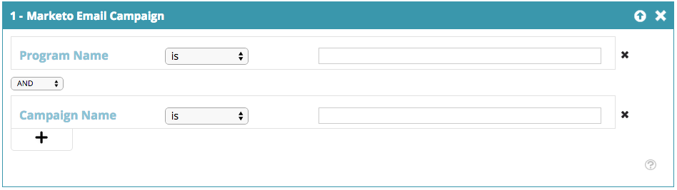

# Web区段 {#web-segments}

## 查看区段 {#view-segment}

“区段”选项卡显示您根据各种属性设置的所有自定义区段。  **区段是指符合“设置区段”页面中定义的指定标准的访客集合。**  区段可以是来自特定行业、位置或基于访客现场活动的访客。

在Web个性化中，访客可以匹配多个区段。 例如，如果有一个针对美国访客的区段和一个针对金融公司的区段，则来自美国银行的Web访客将匹配 **both** 美国访客的区段和金融公司的区段。

**图表：**  “区段”页根据区段的访客数（y轴）和区段名称（x轴）显示选定区段的条形图。

<table> 
 <thead> 
  <tr> 
   <th colspan="1" rowspan="1">名称</th> 
   <th colspan="1" rowspan="1">描述</th> 
  </tr> 
 </thead> 
 <tbody> 
  <tr> 
   <td colspan="1" rowspan="1"><strong>名称</strong></td> 
   <td colspan="1" rowspan="1">区段的标题</td> 
  </tr> 
  <tr> 
   <td colspan="1" rowspan="1">
<strong>匹配</strong>
</td> 
   <td colspan="1" rowspan="1">符合区段的自定义标准的访客数</td> 
  </tr> 
  <tr> 
   <td colspan="1" rowspan="1"><strong>设置营销活动</strong></td> 
   <td colspan="1" rowspan="1">用于设置与选定搜索词关联的Campaign CTA</td> 
  </tr> 
  <tr> 
   <td colspan="1"><strong>访客</strong></td> 
   <td colspan="1">与选定搜索词关联的访客表预览</td> 
  </tr> 
  <tr> 
   <td colspan="1" rowspan="1"><strong>点击流</strong></td> 
   <td colspan="1" rowspan="1">显示访客在网站上的活动和URL路径以及访客访问每个页面的时长表 </td> 
  </tr> 
 </tbody> 
</table>

请参阅 [如何创建和查看区段标签](/help/marketo/product-docs/web-personalization/using-web-segments/label-your-segment.md)

**区段 — 右侧面板**

在表格中选择区段会在右侧面板中显示有关该区段的更多详细信息。

这些详细信息包括：

* 区段名称
* 区段的创建日期
* 显示与区段一起运行的营销活动的关联营销活动。 单击反应次数会转到营销活动页面，其中显示了该客户群的营销活动CTA（行动动员）
* 区段的匹配项数量（满足区段标准的访客数量）和与区段匹配的独特（独特）访客数量。 单击独特访客链接会转到访客的页面，其中显示区段的结果
* 区段的所有者/用户创建者
* 与区段关联的域站点
* 区段选定标准的简短摘要

## 启用或禁用区段 {#enable-or-disable-a-segment}

要启用或禁用区段，请在表格中选中该区段的复选框，并在表格底部的“选择操作”下拉框中，选择“启用”或“禁用”操作。 禁用区段后，“状态”列下会显示“禁用”一词。

## 创建区段 {#create-segments}

您创建的区段符合您在 **设置区段** 页面。 您还可以根据标准组合自定义客户群，以定位营销活动中的特定受众。

创建新区段

从 **区段** 页面，单击 **新建** 下。 出现以下屏幕。

为区段定义常规参数：

* **名称：**  命名区段。
* **描述：**  提供区段标准的更详细说明。
* **域：**  选择要包含在区段中的域。
* **区段规则逻辑：**  选择AND/OR逻辑来构建每个分段属性
* **时间：** 定义您希望在营销活动中的访客参与度级别

   * **登录时**:访客访问网站后即可参与
   * **第1次 — 第9次单击后**:在网站上点击特定数量后吸引访客

>[!TIP]
>
>**区段规则逻辑**
>
>有三个过滤选项：
>
>1. 使用所有过滤器（1和2以及3...）
>1. 使用任何过滤器（1或2或3...）
>1. 高级过滤器（使用和/或表达式）

   >
   >    高级过滤器允许您控制区段条件。 输入以“and”和“or”分隔的过滤器编号。
   >
   >    * 1和2及3
   >    * 1或2或3

   >
   >    混合“and”和“or”需要括号来阐明逻辑意图。 例如“1”或“2”和“3”必须写成下列内容之一：
   >
   >    * 1和（2或3）
   >    * （1和2）或3

   >
   >    对于更复杂的逻辑(例如，
   >
   >    * （1和2）或（3和4）
   >    * 1和(2或（3和4）)

   >
   >    在进行任何插入、删除或重新排序后，请检查您的逻辑。

将区段属性从右侧列拖放到左侧的区段编辑器中：

### Firmographics {#firmographics}

**位置**

拖放 **位置** 到区段编辑器中。

* 从以下参数中进行选择：

   * **包括**  — 选择是希望营销活动包含还是排除位置。
   * **选择要添加的国家/地区**  — 从下拉框中，选择要包含在区段中的国家/地区。 国家/地区名称显示在右侧。 您可以选择多个国家/地区。

添加国家/地区后，您还可以指定区段的州、市和邮政编码。

* **选择要添加的州或省**  — 从下拉框中，选择要包括的美国州或加拿大省。 您可以进行多个选择。
* **邮政编码**  — 输入要包含在区段中的邮政编码。
* **城市**  — 输入要包括的城市。 在城市之间使用分号。

>[!TIP]
>
>**我可以选择哪些区段条件？ “AND”还是“OR”？** OR用作每个字段内的附加选项。 为了符合区段资格，潜在客户只需满足每个字段内选定的多个标准中的一个标准。 (例如，潜在客户可以来自美国。 *或* 来自国防工业)。 AND函数作为此区段必须满足的其他必需参数。 （例如，前景必须来自美国和国防工业）。 在每个分段配置文件中，每个单独的字段都可以同时起“AND”或“OR”的作用，具体取决于选择的区段条件。

**行业** 在 **用户档案分段** ，请选中 **行业**.

* 从以下参数中进行选择：

   * **包括**  — 选择是希望区段包含还是排除某个行业。
   * **选择要添加的行业**  — 选择要包含在区段中的行业。 该行业显示在下拉框下方。 您可以选择多个行业。

**组织组**

在 **用户档案分段** ，请选中 **组织组。**

* 从下拉框中，从以下选项中选择：

   * 《财富》500强 — 仅包括此领域的《财富》500强公司
   * 《财富》1000强 — 仅包括此部分的《财富》1000强公司
   * 2000年全球 — 包括此部分中的2000年全球公司
   * 企业 — 包括员工超过1,000人且收入超过2.5亿美元的组织
   * 中小型企业 — 仅包括此区段中的中小型企业

**— 指定帐户 —**

**组织**

* **来自这些公司（特定名称）**

   * 从“选择要添加的公司”下拉列表中选择要定位的公司。
   * 您可以键入要定位的确切组织名称。 *它是 _always_ 建议使用指定帐户列表，而不是手动键入名称以获得更好的匹配项（请参阅下文）。

**指定帐户列表**

从 [指定帐户列表](/help/marketo/product-docs/web-personalization/account-based-web-marketing/create-a-new-account-list.md) 对关键目标帐户进行分段。

>[!NOTE]
>
>指定帐户列表名称旁边方括号中的数字将用作Web个性化列表的索引引用 [读取API](https://developers.marketo.com/documentation/websites/rtp-js-api/).

**排除ISP**

区段不包括互联网服务提供商(ISP)。

### 已知人员 {#known-people}

**数据库**

Web Personalization与Marketo数据库集成，允许您按已知人员属性和数据对营销活动进行分段和个性化。

选择数据库，然后从下拉列表中选择人员数据字段。 选择 **+** 从下拉菜单添加字段。

您可以从帐户设置>数据库中添加或删除人员数据字段

>[!TIP]
>
>根据Marketo人员（如职位）的所有人员数据字段创建区段标准；得分；角色；等等……
>
>例如 “职位等于CMO”且“得分小于或等于50”

**Marketo Email Campaign** 通过访客通过单击Marketo电子邮件并到达网站时的电子邮件反向链接，对营销活动进行分段和个性化。 按Marketo项目名称或营销策划名称进行分段，并继续从电子邮件到Web的对话。 从下拉菜单中选择+以添加字段。

**状态**

根据潜在客户的状态定义区段：已知或匿名。

* 已知 — 从下拉框中为已知访客选择此选项。 访客在您的网站上提交表单并显示在“Web个性化人员”页面时即为已知访客。
* 匿名 — 从下拉框中为匿名访客选择此选项。

### 行为 {#behavioral}

**访问 —** 根据访客行为或识别定义区段。

* 访问次数 — 从下拉框中选择此选项，可指定网站上潜在访客的访问次数。

   * 从下拉框中选择“等于”、“等于”或“大于”、“等于”或“小于”。

* 特定访问 — 从下拉框中选择此选项可指定特定访客。

   * 在右侧的文本框中，输入您希望跟踪的访客编号。 单击访客（在访客页面中）和右侧面板上的设置促销活动时，可以找到独特的Web个性化访客标识号。 访客ID位于高级设置部分。 访客ID也可在URL中找到(例如VISITOR=JZJIFJNUI60PZ8Y97BHTY9BL8PKWS)。

**搜索词**  — 根据潜在客户的搜索词定义区段。

* 搜索的访客 — 从下拉列表中，选择要从访客搜索中跟踪的术语，或添加您自己的搜索术语。 (无需 &#42; 对搜索词设置通配符，因为它默认设置为包含包含搜索词的短语)。

**推荐**  — 添加访客引荐的URL。

* 选择要添加的推荐 — 从下拉列表中，选择要跟踪或添加您自己的推荐的推荐网站。 选择后，反向链接将显示在下方的框中。 (使用 &#42; （允许使用通配符）

**包含页面**  — 跟踪在您的网站上访问的潜在访客的特定页面。

* URL匹配 — 添加您要跟踪的特定网页的URL。 您可以添加多个URL，方法是用分号分隔它们。 (使用 &#42; 通配符)。

**排除页面**  — 排除您不希望在区段中匹配的特定页面。 (使用 &#42; 通配符)。

* URL不匹配 — 添加您要从跟踪中排除的特定网页的URL。 您可以添加多个URL，方法是用分号分隔它们

### 设备/浏览器 {#device-browser}

**移动设备操作系统**

将移动设备操作系统拖放到区段编辑器中

* **访客类型** 

   **移动设备操作系统**  — 从下拉框中，从列出的一个或多个移动设备操作系统中进行选择。 选定的移动设备操作系统显示在下面。

   * 访客正在使用任何移动设备
   * 访客正在使用此特定设备/操作系统
   * 访客未使用任何移动设备

* **设备**   — 从下拉列表中，从一个或多个设备(Apple、三星、LG、HTC、Nexus、Blackberry等)中进行选择。 下面显示选定的设备。

**浏览器**

定位使用特定浏览器类型和/或版本的访客。

* 浏览器类型 — 从下拉框中，选择一个或多个Internet浏览器。 下面显示选定的浏览器。
* 浏览器版本 — 输入您要添加到区段的浏览器版本。 您可以使用逗号分隔各个版本，以选择多个版本。 (使用 &#42; 通配符)。

### API {#api}

**数据事件**  — 对触发特定自定义数据事件的访客进行分段

添加要定位的事件值。 例如，来自第三方数据源。

**用户上下文API**

Web个性化API调用  [请在此处阅读更多相关信息。](https://developers.marketo.com/documentation/websites/rtp-user-context-api/)

>[!TIP]
>
>**使用通配符 —** 您希望包含任何搜索词或包含其中某些内容(例如，&quot;[google.com](https://google.com)“或“搜索词产品”，我们称此为通配符，并且输入时应带有星号 — 此小家伙&#42;  — 在每一端。 所以任何来自 [google.com](https://google.com) 应作为输入 &#42; [google.com](https://google.com)&#42;

## 编辑区段 {#edit-segments}

您可以编辑已创建的区段。

1. 要编辑区段，请转到 **区段**.

   

1. 在 **区段** 表格中，单击编辑图标( )。 的 **设置区段** 页面。
1. 应用您希望对区段进行的任何编辑或更改。
1. 单击 **保存**.

## 删除区段 {#delete-segments}

您可以删除已创建的区段。

1. 从 **区段** ，请选择一个区段。
1. 单击删除图标(  )。
1. 此时会显示确认消息，确认您将要删除 **区段**.

>[!NOTE]
>
>您无法删除与营销活动关联的区段。 首先，您需要删除营销活动，然后删除客户群。

太棒了！ 现在，您已了解区段部分，接下来让我们了解营销活动。

>[!MORELIKETHIS]
>
>* [创建基本Web区段](/help/marketo/product-docs/web-personalization/using-web-segments/create-a-basic-web-segment.md)
>* [创建新对话框Web营销活动](/help/marketo/product-docs/web-personalization/working-with-web-campaigns/create-a-new-dialog-web-campaign.md)
>* [在区域Web营销活动中新建](/help/marketo/product-docs/web-personalization/working-with-web-campaigns/create-a-new-in-zone-web-campaign.md)
>* [创建新的小组件Web营销活动](/help/marketo/product-docs/web-personalization/working-with-web-campaigns/create-a-new-widget-web-campaign.md)

