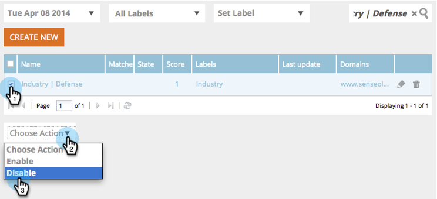

# 网络细分 {#web-segments}

## 视图段 {#view-segment}

区段选项卡显示您根据各种属性设置的所有自定义区段。  **区段是一组符合在“设置区段”页面中定义的指定条件的访客。**  区段可以是特定行业、地点的访客，也可以基于访客的现场活动。

在Web个性化中，访客可以匹配多个区段。 例如，如果存在针对美国访客的细分和针对金融公司的细分，则来自美国银行的Web访客将匹 **配** 针对美国访客的细分和针对金融公司的细分。

**图形：** “区段”页根据区段（y轴）的访客数和区段名称（x轴）显示选定区段的条形图。

<table> 
 <thead> 
  <tr> 
   <th colspan="1" rowspan="1">名称</th> 
   <th colspan="1" rowspan="1">说明</th> 
  </tr> 
 </thead> 
 <tbody> 
  <tr> 
   <td colspan="1" rowspan="1"><strong>名称</strong></td> 
   <td colspan="1" rowspan="1">区段的标题</td> 
  </tr> 
  <tr> 
   <td colspan="1" rowspan="1">
<strong>匹配项</strong>
</td> 
   <td colspan="1" rowspan="1">满足区段的自定义、定义标准的访客数</td> 
  </tr> 
  <tr> 
   <td colspan="1" rowspan="1"><strong>设置活动</strong></td> 
   <td colspan="1" rowspan="1">允许您设置与所选搜索词关联的活动CTA</td> 
  </tr> 
  <tr> 
   <td colspan="1"><strong>访客</strong></td> 
   <td colspan="1">与所选搜索词关联的访客表的预览</td> 
  </tr> 
  <tr> 
   <td colspan="1" rowspan="1"><strong>Clickstream</strong></td> 
   <td colspan="1" rowspan="1">显示访客在站点上的活动和URL路径以及访问每个页面的时间表 </td> 
  </tr> 
 </tbody> 
</table>

了解 [如何创建和视图区段标签](label-your-segment.md)

**区段——右侧面板**

在表中选择区段后，右侧面板中会显示有关区段的其他详细信息。

这些详细信息包括：

* 区段名称
* 区段的创建日期
* 关联的活动显示与区段一起运行的活动。 单击反应数将转到活动页，其中显示区段的活动CTA（行动动员）
* 区段的匹配项数(满足区段标准的访客数)和匹配区段的不同（唯一）访客数。 单击唯一访客链接将转到访客页面，其中显示区段的结果
* 区段的所有者／用户创建者
* 与区段关联的域站点
* 区段选定标准的简短摘要

## 启用或禁用区段 {#enable-or-disable-a-segment}

要启用或禁用区段，请选中表中该区段的复选框，并在表底部的“选择操作”下拉框中，选择操作“启用”或“禁用”。 禁用区段后，“状态”列下将显示“禁用”一词。

## 创建区段 {#create-segments}

您创建的区段符合您在“设置区段”页面中定义的 **任何特定** 条件。 您还可以根据一系列标准来自定义您的细分，定位活动中的特定受众。

创建新区段

在“区 **段** ”页面 **中** ，单击图形下的“新建”。 出现以下屏幕。

定义区段的常规参数：

1. &#x200B;

   * **名称：** 命名您的区段。
   * **描述：** 提供更详细的细分标准说明。
   * **域：** 选择要包含在区段中的域。
   * **细分规则逻辑：** 选择AND/OR逻辑以构建每个分段属性
   * **时间：** 定义您希望在访客中的活动参与程度

      * **进入时**:从访客到网站
      * **第1次至第9次单击**:在网站上点击特定数量后吸引访客

>[!TIP]
>
>**细分规则逻辑**
>
>有三个筛选选项：
>
>1. 使用所有过滤器（1和2和3...）
>1. 使用任何过滤器（1或2或3...）
>1. 高级过滤器(使用和／或表达式)
>    1. &#x200B;
>
>       高级过滤器允许您控制段条件。 输入以“和”和“或”分隔的筛选器编号。
>       * 1和2和3
>       * 1或2或3
>
>       混合“和”和“或”需要括号来阐明逻辑意图。 例如，“1或2”和“3”必须作为以下内容之一写成：
>       * 1和（2或3）
>       * （1和2）或3
>
>       对于更复杂的逻辑，如
>       * （1和2）或（3和4）
>       * 1和(2或（3和4）)
>
>       在插入、删除或重新排序后检查逻辑。

将右侧列中的区段属性拖放到左侧的区段编辑器中：

### Firmographics {#firmographics}

**位置**

将**位置**拖放到区段编辑器中。

* 从以下参数中进行选择：

   * **包括**-选择您希望活动包括还是排除位置。
   * **选择要添加的国家** -从下拉框中，选择要包含在区段中的国家／地区。 国家／地区名称显示在右侧。 您可以选择多个国家／地区。

添加国家／地区后，您还可以指定区段的州／省、市／自治区和邮政编码。

* **选择要添加的州或省** -从下拉框中，选择要包括的美国州或加拿大省。 您可以进行多个选择。
* **邮政编码** -输入您希望包含在您的区段中的邮政编码。
* **城市** -进入您希望包括的城市。 在城市之间使用分号。

>[!TIP]
>
>**我选择哪些细分条件？ “AND”或“OR”? **OR在每个字段中用作附加选项。 潜在客户只需满足每个字段中选定的多个标准中的一个标准，即可获得区段资格。 (例如，潜在客户可以来自美国 *或* 国防工业)。 AND函数作为此段必须满足的附加必需参数。 (例如，潜在客户必须来自美国和国防工业)。 在每个分段用户档案中，每个单独的字段都可以同时使用“AND”或“OR”，具体取决于所选的“段条件”。

**行业** 在“ **用户档案细分** ”部分下，选中“行业”旁 **边的框**。

* 从以下参数中进行选择：

   * **包括** -选择您希望区段包括还是排除行业。
   * **选择要添加的行业** -选择要包含在区段中的行业。 该行业显示在下拉框下方。 您可以选择多个行业。

**组织组**

在“用户档案 **分段** ”部分下，选中“组织组” **旁边的框。**

* 从下拉框中，选择以下选项：

   * 财富500强——仅包括此领域的财富500强公司
   * Fortune 1000 —— 仅包括此领域的Fortune 1000公司
   * Global 2000 —— 包括这一部分的Global 2000公司
   * 企业——包括员工超过1,000且收入超过2.5亿美元的组织
   * SMB —— 仅包括此领域中的中小型企业

**指定帐户**

**组织**

* 

   * **来自这些公司（特定名称）**

      * 从“选择要添加的公司”下拉菜单中选择要目标的公司。
      * 您可以键入要目标的确切组织名称。 *始终建议使 *用指定帐户列表，而不是手动键入名称以获得更好的匹配项（请参阅下文）。*

**指定帐户列表**

从指定帐户 [列表中选择](../../../product-docs/web-personalization/account-based-web-marketing/create-a-new-account-list.md) ，以细分关键目标帐户

>[!NOTE]
>
>指定帐户列表名称旁方括号中的数字将用作Web个性化阅读API列表的索引 [引用](http://developers.marketo.com/documentation/websites/rtp-js-api/)。

**排除ISP**

不包括网络服务提供商(ISP)。

### 已知人物 {#known-people}

**数据库**

Web个性化与您的Marketo活动库集成，使您能够根据已知人物属性和数据对客户进行细分和个性化。

选择数据库，然后从下拉列表中选择一个人员数据字段。 从下 **拉框** 中选择+以添加字段。

您可以从“帐户设置”>“数据库”中添加或删除人员数据字段

>[!TIP]
>
>根据从Market到Job Title等人员的所有人员数据字段创建您的细分标准；得分；角色；等等。.
>
>例如 “职位等于CMO”和“得分小于或等于50”

**Marketo电子邮件活动** 区段，并通过电子邮件推荐，让访客点击Marketo电子邮件并到达网站，从而个性化活动。 按营销人员项目名称或活动名称进行细分，并继续通过电子邮件与Web进行对话。 从下拉列表中选择+以添加字段。

**状态**

根据潜在客户的状态定义您的细分：已知或匿名。

* 

   * 已知——从下拉框中选择此选项，查看已知访客。 访客在您的网站上提交表单并显示在“Web个性化人员”页面时即为人所知。
   * 匿名——从下拉框中为匿名访客选择此选项。

### 行为 {#behavioral}

**访问** -根据访客行为或识别定义您的细分。

* 

   * 访问次数——从下拉框中选择此选项，指定网站潜在客户的访问次数。

      * 从下拉框中选择“等于”、“等于”或“大于”、“等于”或“小于”。
   * 特定访问——从下拉框中选择此选项以指定特定访客。

      * 在右侧的文本框中，输入要跟踪的访客号。 单击访客(在访客页面)和右侧面板上的设置访客时，可以找到唯一的Web个性化活动标识号。 访客ID位于“高级设置”部分。 访客ID也可在URL中找到(例如，访客=JZJIFJNUI60PZ8Y97BHTY9BL8PKWS)。

**搜索词** -根据潜在客户的搜索词定义区段。

* 

   * 搜索的访客-从下拉列表中，选择要在访客搜索中跟踪的词，或添加您自己的搜索词。 （由于通配符被设置为默认值以包含包含搜索词的短语，因此无需对搜索词使用*通配符）。

**引用** -添加访客引用的URL。

* 

   * 选择要添加的推荐——从下拉列表中，选择您要跟踪或添加您自己的推荐的推荐站点。 选择后，引用将显示在下面的框中。 （允许使用*作为通配符）

**包括页面** -跟踪在您的网站上访问的特定页面潜在客户。

* 

   * URL匹配——添加要跟踪的特定网页的URL。 可以通过用分号分隔多个URL来添加它们。 （允许使用*作为通配符）。

**排除页面** -排除您不希望在区段中匹配的特定页面。 （允许使用*作为通配符）。

* 

   * 

      * URL不匹配——添加要从跟踪中排除的特定网页的URL。 可以通过用分号分隔多个URL来添加它们

### 设备／浏览器 {#device-browser}

**移动操作系统**

将Mobile OS拖放到区段编辑器中

* **访客类型**
   **Mobile OS** —— 从下拉框中，从列出的一个或多个移动OS中进行选择。 选定的移动操作系统显示如下。

   * 访客正在使用任何移动设备** **
   * 访客正在使用此特定设备／操作系统
   * 访客未使用任何移动设备

* **设备** -在下拉列表中，从一个或多个设备（Apple、Samsung、LG、HTC、Nexus、Blackberry等）中进行选择。 选定设备显示如下。

**浏览器**

目标访客，使用特定的浏览器类型和／或版本。

* 

   * 浏览器类型——从下拉框中，选择一个或多个Internet浏览器。 选定的浏览器显示如下。
   * 浏览器版本——输入要添加到区段的浏览器版本。 您可以通过用逗号分隔多个版本。 （允许使用*作为通配符）。

### API {#api}

**数据事件** -触发特定自定义数据事件的细分访客

添加要事件的目标值。 例如，来自第三方数据源。

**用户上下文API**

Web个性化API调用 [在此处了解详情。](http://developers.marketo.com/documentation/websites/rtp-user-context-api/)

>[!TIP]
>
>**使用通配符- **您希望包含任何搜索词或URL，其中包含某些内容，例如“ [google.com](http://google.com)”或“搜索词产品”，我们称其为通配符，应在两端输入星号。 因此，来自 [google.com的](http://google.com) 任何内容都应作为* [google.com](http://google.com)*

## 编辑区段 {#edit-segments}

您可以编辑已创建的区段。

1. 要编辑区段，请转至 **区段**。

   

1. 在“区 **段** ”(Segments)表格中 ，单击要编辑的区段的编辑图标()。 此时 **将打开** “设置区段”页，其中显示选定的区段。
1. 应用您希望对区段进行的任何编辑或更改。
1. 单击 **保存**。

## 删除区段 {#delete-segments}

您可以删除已创建的区段。

1. 从上面 **的** “区段”页面中，选择区段。
1. 单击要删除  的区段的删除图标()** **。
1. 此时会显示确认消息，确认您将要删除 **区段**。

>[!NOTE]
无法删除与活动关联的区段。 首先，您需要删除活动，然后删除区段。

太好了！ 现在，您已了解“区段”部分，让我们了解一下活动。

>[!MORELIKETHIS]
* [创建基本Web区段](create-a-basic-web-segment.md)
* [创建新对话框Web活动](../../../product-docs/web-personalization/working-with-web-campaigns/create-a-new-dialog-web-campaign.md)
* [在Zone Web中新建活动](../../../product-docs/web-personalization/working-with-web-campaigns/create-a-new-in-zone-web-campaign.md)
* [创建新的构件Web活动](../../../product-docs/web-personalization/working-with-web-campaigns/create-a-new-widget-web-campaign.md)

