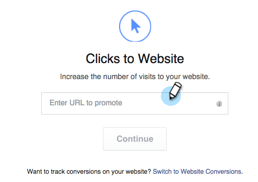
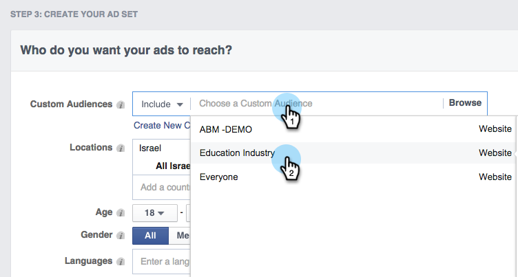

# Facebook中的个性化再营销{#personalized-remarketing-in-facebook}

个性化再营销使您能够使用RTP数据和Facebook再营销的强大功能与用户重新互动。

>[!PREREQUISITES]
>
>* 完成[使用Web个性化数据](/help/marketo/product-docs/web-personalization/website-retargeting/retargeting-with-web-personalization-data.md)重新定位设置
>* 查看有关自定义受众](https://developers.facebook.com/docs/ads-for-websites/website-custom-audiences/getting-started#install-the-pixel)和再营销的 [ Facebook文档。

## 在Facebook{#creating-an-audience-in-facebook}中创建受众

1. 在Facebook中，转到“广告管理器”中的[受众选项卡](https://www.facebook.com/ads/audience_manager)。

1. 单击&#x200B;**工具**&#x200B;并选择&#x200B;**受众**。

   

1. 单击&#x200B;**创建自定义受众**。

   

1. 选择&#x200B;**网站流量**。

   

1. 在“网站流量”列表中，选择&#x200B;**自定义组合**。

   

1. 在“包括”列表中，选择&#x200B;**事件**。

   

1. 在“事件”列表中，选择&#x200B;**RTP再营销**&#x200B;并选择一个参数。

   

1. 在此示例中，选择“行业”以包含&#x200B;**教育**。 输入&#x200B;**教育**，并编辑&#x200B;**在最近**&#x200B;中为180天。 输入受众名称：**教育行业**。 单击&#x200B;**创建受众**。

   

1. 您现在已在Facebook中使用RTP数据创建了新的自定义受众。

   

## Facebook中的RTP数据点{#rtp-data-points-in-facebook}

<table> 
 <tbody> 
  <tr> 
   <th>事件名称</th> 
   <th> </th> 
  </tr> 
  <tr> 
   <td>RTP再营销</td> 
   <td> 
    
 
     <table> 
      <tbody> 
       <tr> 
        <th>参数</th> 
        <th>值</th> 
       </tr> 
       <tr> 
        <td>ABM列表</td> 
        <td>(基于帐户的列表的名称)</td> 
       </tr> 
       <tr> 
        <td colspan="1">类别</td> 
        <td colspan="1">
财富500强

财富1000强

2000年全球
</td> 
       </tr> 
       <tr> 
        <td colspan="1">组</td> 
        <td colspan="1">
企业

中小型企业
</td> 
       </tr> 
       <tr> 
        <td>行业</td> 
        <td>
Defense

教育

金融服务

政府

医疗保健、制药、生物技术

软件和Internet

等……（根据RTP行业选项）
</td> 
       </tr> 
       <tr> 
        <td colspan="1">分段受众</td> 
        <td colspan="1">(在RTP中创建的分段受众的名称)</td> 
       </tr> 
      </tbody> 
     </table> 
    
</td> 
  </tr> 
 </tbody> 
</table>

## 目标您的受众，使用Ad {#target-your-audience-with-an-ad}

有关其他详细信息，请参阅[Facebook的文档](https://developers.facebook.com/docs/ads-for-websites/website-custom-audiences/getting-started#target-your-audience)。

1. 转至广告管理器，单击&#x200B;**创建广告**。

   

1. 选择&#x200B;**将人员发送到您的网站**&#x200B;作为活动的目标。

   

1. 输入您的网站URL。

   

1. 创建您的广告集。 从您创建的受众的列表（例如，教育行业）中选择自定义受众。

   

1. 选择所有其他广告集选项，设置预算并定义广告创意。

   

1. 现在，所有人都在Facebook上准备了个性化再营销活动。

>[!MORELIKETHIS]
>
>* [使用Web个性化数据重新定位](/help/marketo/product-docs/web-personalization/website-retargeting/retargeting-with-web-personalization-data.md)
>* [Google中的个性化再营销](/help/marketo/product-docs/web-personalization/website-retargeting/personalized-remarketing-in-google.md)

