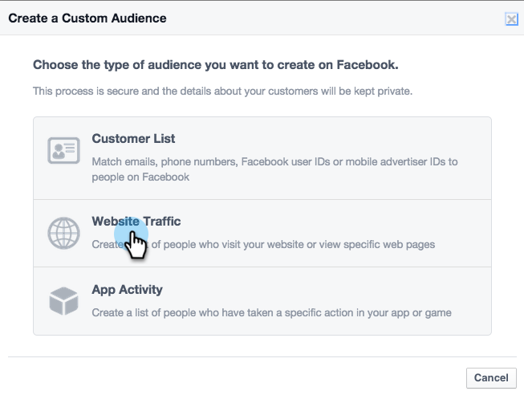

# Facebook中的个性化再营销 {#personalized-remarketing-in-facebook}

个性化再营销使您能够使用RTP数据和Facebook再营销的强大功能与用户重新互动。

>[!NOTE]
>
>**先决条件**
>
>* 通过Web个 [性化数据设置完成重定向](retargeting-with-web-personalization-data.md)
>* 查看自定  义受 [众和再营销的Facebook](https://developers.facebook.com/docs/ads-for-websites/website-custom-audiences/getting-started#install-the-pixel)文档

>

## 在Facebook中创建受众 {#creating-an-audience-in-facebook}

1. 在Facebook中，转到“广告管 [理器](https://www.facebook.com/ads/audience_manager) ”中的“受众”选项卡。
1. 单击 **工具** ，然后选 **择受众**。

   

1. 单击 **“创建自定义受众**”。

   

1. 选择 **网站流量**。

   

1. 在网站流量列表中，选择**自定义组合**。

   

1. 在包括列表中，选择 **事件**。

   

1. 在事件列表中，选择**RTP再营销**并选择一个参数。

   

1. 在此示例中，选择“行业”以包含 **教育**。 输 **入**“教育”，并 **在“最近** ”(In the Last)中编辑180天。 输入受众名称： **教育行业**。 单击 **创建受众**。

   

1. 您现在已在Facebook中使用RTP受众创建新的自定义数据。

   

## Facebook中的RTP数据点 {#rtp-data-points-in-facebook}

<table> 
 <tbody> 
  <tr> 
   <th>事件名称</th> 
   <th> </th> 
  </tr> 
  <tr> 
   <td>RTP再营销</td> 
   <td> 
    
 
     <table> 
      <tbody> 
       <tr> 
        <th>参数</th> 
        <th>值</th> 
       </tr> 
       <tr> 
        <td>ABM列表</td> 
        <td>(基于帐户的列表的名称)</td> 
       </tr> 
       <tr> 
        <td colspan="1">类别</td> 
        <td colspan="1">
财富500强

财富1000强

Global 2000
</td> 
       </tr> 
       <tr> 
        <td colspan="1">组</td> 
        <td colspan="1">
企业

中小型企业
</td> 
       </tr> 
       <tr> 
        <td>行业</td> 
        <td>
防御

教育

金融服务

政府

医疗保健、制药、生物技术

软件和因特网

等……（根据RTP行业选项）
</td> 
       </tr> 
       <tr> 
        <td colspan="1">分段受众</td> 
        <td colspan="1">(在RTP中创建的分段受众的名称)</td> 
       </tr> 
      </tbody> 
     </table> 
    
</td> 
  </tr> 
 </tbody> 
</table>

## 用广告目标受众 {#target-your-audience-with-an-ad}

有关其他详细信息， [请参阅Facebook的文档](https://developers.facebook.com/docs/ads-for-websites/website-custom-audiences/getting-started#target-your-audience)。

1. 转至广告管理器，单击 **创建广告**。

   

1. 选 **择将人员发送到您** 的网站，作为活动的目标。

   

1. 输入您的网站URL。

   

1. 创建您的广告集。 从您创建的受众列表（例如，教育行业）中选择自定义受众。

   

1. 选择所有其他广告集选项，设置预算并定义广告创意。

   

1. 现在，您已经在Facebook上建立了个性化再营销活动。

>[!NOTE]
>
>**相关文章**
>
>* [使用Web个性化数据重新定位](retargeting-with-web-personalization-data.md)
>* [Google中的个性化再营销](personalized-remarketing-in-google.md)

>

