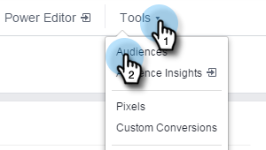

# [!DNL Facebook]中的个性化再营销 {#personalized-remarketing-in-facebook}

个性化再营销让您能够利用RTP数据和Facebook再营销的强大功能，重新吸引用户。

>[!PREREQUISITES]
>
>* 使用Web Personalization数据完成[重定位](/help/marketo/product-docs/web-personalization/website-retargeting/retargeting-with-web-personalization-data.md)设置
>* 查看有关自定义受众[和再营销的](https://developers.facebook.com/docs/ads-for-websites/website-custom-audiences/getting-started#install-the-pixel)Facebook文档。

## 在[!DNL Facebook]中创建受众 {#creating-an-audience-in-facebook}

1. 在[!DNL Facebook]中，转到广告管理器中的[受众选项卡](https://www.facebook.com/ads/audience_manager)。

1. 单击&#x200B;**[!UICONTROL Tools]**&#x200B;并选择&#x200B;**[!UICONTROL Audiences]**。

1. 单击 **[!UICONTROL Create a Custom Audience]**。

1. 选择 **[!UICONTROL Website Traffic]**。

1. 在[!UICONTROL Website traffic]列表中，选择&#x200B;**[!UICONTROL Custom Combination]**。

1. 在包含列表中，选择&#x200B;**[!UICONTROL Event]**。

1. 在[!UICONTROL Event]列表中，选择&#x200B;**[!UICONTROL RTP Remarketing]**&#x200B;并选择参数。

1. 对于此示例，选择[!UICONTROL Industry]以包含&#x200B;**[!UICONTROL Education]**。 输入&#x200B;**[!UICONTROL Education]**，并将&#x200B;**[!UICONTROL In the Last]**&#x200B;编辑为180天。 输入受众名称： **教育行业**。 单击 **[!UICONTROL Create Audience]**。

1. 您现在已在[!DNL Facebook]中使用RTP数据创建新的自定义受众。

## [!DNL Facebook]中的RTP数据点 {#rtp-data-points-in-facebook}

<table>
 <tbody>
  <tr>
   <th>活动名称</th>
   <th> </th>
  </tr>
  <tr>
   <td>RTP再营销</td>
   <td>
    

     <table>
      <tbody>
       <tr>
        <th>参数</th>
        <th>值</th>
       </tr>
       <tr>
        <td>ABM列表</td>
        <td>（基于帐户的列表的名称）</td>
       </tr>
       <tr>
        <td colspan="1">类别</td>
        <td colspan="1">
财富 500 强

财富 1000 强

Global 2000
</td>
       </tr>
       <tr>
        <td colspan="1">组</td>
        <td colspan="1">
企业

SMB
</td>
       </tr>
       <tr>
        <td>行业</td>
        <td>
防御

教育

金融服务

政府

医疗保健、医药、生物技术

软件和Internet

等等…… （根据RTP Industry选项）
</td>
       </tr>
       <tr>
        <td colspan="1">分段受众</td>
        <td colspan="1">（在RTP中创建的分段受众的名称）</td>
       </tr>
      </tbody>
     </table>
    
</td>
  </tr>
 </tbody>
</table>

## 使用广告定位受众 {#target-your-audience-with-an-ad}

有关其他详细信息，请参阅[Facebook文档](https://developers.facebook.com/docs/ads-for-websites/website-custom-audiences/getting-started#target-your-audience)。

1. 转到广告管理器，单击&#x200B;**[!UICONTROL Create Ad]**。

   

1. 选择&#x200B;**[!UICONTROL Send people to your website]**&#x200B;作为营销活动的目标。

   

1. 输入您的网站URL。

   

1. 创建您的广告集。 从您创建的受众列表中选择自定义受众，例如“教育行业”。

   

1. 选择所有其他广告集选项，设置预算并定义广告创意。

   

1. 现在，您已在[!DNL Facebook]中设置了一个个性化的再营销活动。

>[!MORELIKETHIS]
>
>* [使用Web Personalization数据重新定位](/help/marketo/product-docs/web-personalization/website-retargeting/retargeting-with-web-personalization-data.md)
>* 在Google中[个性化再营销](/help/marketo/product-docs/web-personalization/website-retargeting/personalized-remarketing-in-google.md)
