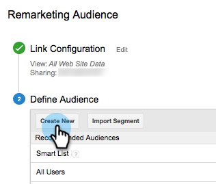
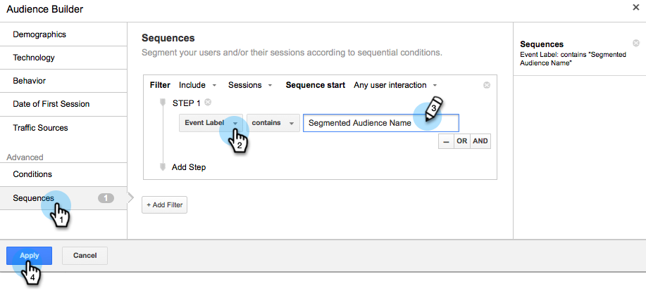

# Google中的个性化再营销{#personalized-remarketing-in-google}

个性化再营销使您能借助RTP数据和Google Analytics的强大功能与用户重新互动，触及Google Display Network的触及范围。

>[!PREREQUISITES]
>
>* 完成[使用Web个性化数据](/help/marketo/product-docs/web-personalization/website-retargeting/retargeting-with-web-personalization-data.md)重定位配置
>* 查阅[使用Google Analytics帮助](https://support.google.com/analytics/topic/2611283?hl=en&amp;ref_topic=3413645)文档进行再营销。

## 在Google {#creating-a-remarketing-audience-in-google}中创建再营销受众

1. 登录您的Google Analytics。 单击&#x200B;**Admin**、**Account**、**Property**。 单击&#x200B;**受众定义**&#x200B;和&#x200B;**受众**。

   

1. 单击&#x200B;**+新建受众**。

   

1. **链接配置**:链接到您的Google Adwords帐户。**定义受众**:单击 **新建**。

   

1. 在受众 Builder中，单击“自定义Dimension、自定义变量、事件”下的&#x200B;**序列**&#x200B;和&#x200B;**查找RTP数据**。

>[!TIP]
>
>如何在Analytics中查找RTP数据以构建受众?
>
>Google Analytics:
>
>* 自定义变量：组织、行业
>* 事件类别:区段， Insightera-CTA， RTP — 再营销
>* 事件标签：区段名称、活动名称、区段受众名称

>
>
在Google Universal Analytics中：
>
>* 自定义Dimension:组织、行业、类别（财富500,1000强，全球2000强）、集团（企业、SMB）、ABM列表(指定帐户列表)
>* 事件类别:RTP段、RTP活动RTP再营销
>* 事件标签：区段名称、活动名称、区段受众名称

**从RTP分段受众数据再营销受众示例**

1. 单击&#x200B;**序列。**
1. 选择&#x200B;**事件标签。**
1. 输入&#x200B;**分段受众的名称**（如RTP中所示）。
1. 单击&#x200B;**应用**。

**来自RTP行业数据的受众示例**

1. 单击&#x200B;**序列**。
1. 选择&#x200B;**RTP-Industry**。
1. 输入&#x200B;**Industry**&#x200B;的名称(例如 金融服务、教育……)。
1. 单击&#x200B;**应用**。
1. 输入&#x200B;**受众名称**。 单击&#x200B;**保存**。

## 在Google Adwords中创建再营销广告活动{#create-a-remarketing-ad-campaign-in-google-adwords}

1. 登录&#x200B;**Google Adwords**。 单击&#x200B;**活动**，选择&#x200B;**仅显示网络**。

   

1. 输入&#x200B;**活动名称**，选择&#x200B;**类型再营销。**

   

1. 输入&#x200B;**广告组名称，**&#x200B;输入&#x200B;**增强的CPC**，选择&#x200B;**再营销列表**。

   

1. 单击“保存”并继续。
1. 添加图像或文本广告，并开始再营销活动。

   

>[!MORELIKETHIS]
>
>* [使用Web个性化数据重新定位](/help/marketo/product-docs/web-personalization/website-retargeting/retargeting-with-web-personalization-data.md)
>* [Facebook中的个性化再营销](/help/marketo/product-docs/web-personalization/website-retargeting/personalized-remarketing-in-facebook.md)

