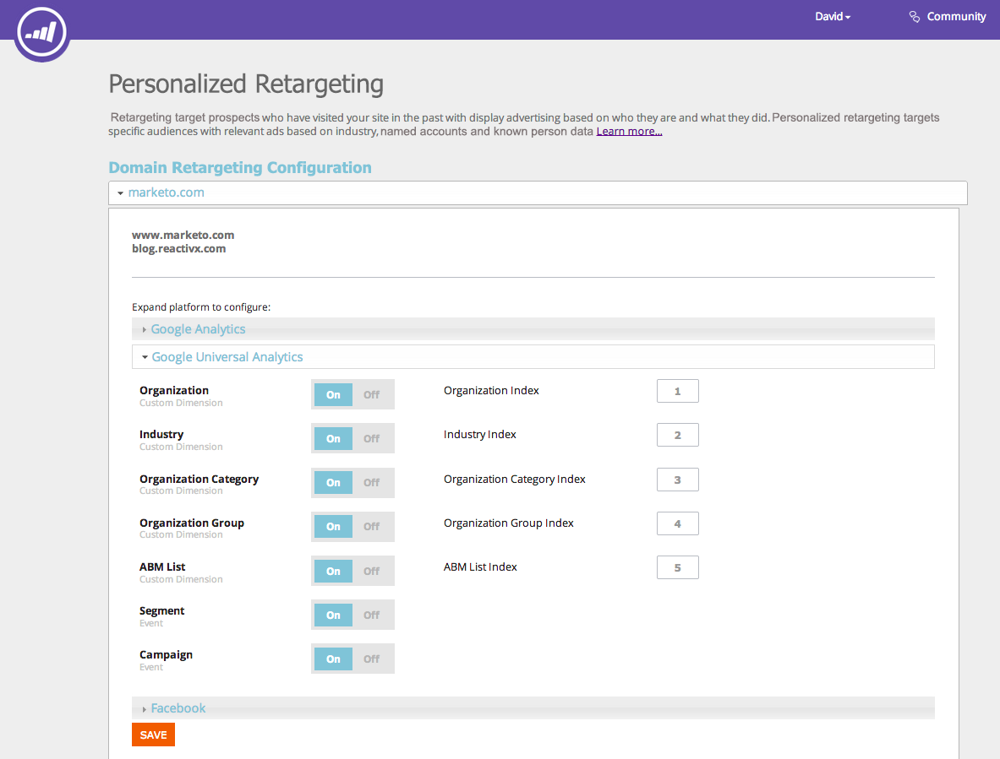
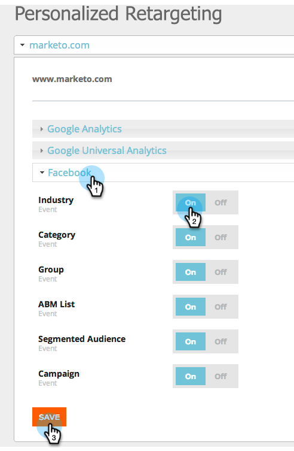

# 使用Web个性化数据重新定位 {#retargeting-with-web-personalization-data}

>[!AVAILABILITY]
>
>网站重定位现在归入“Web个性化”拼贴之下。 如果您仅购买了重定位，您将看到此拼贴并通过访问Web个性化产品 **仅限** 已启用重新定位功能。 这让您能够访问帐户设置、重定位页面、区段和其他跟踪页面。

再营销的目标是以前访问过您网站的潜在客户，并根据他们的身份和所做的事情显示广告。 个性化重定位通过基于行业、指定帐户和已知人员数据的相关广告定位特定受众。

Web个性化当前会将数据附加到以下再营销平台：

* [Google](/help/marketo/product-docs/web-personalization/website-retargeting/personalized-remarketing-in-google.md)
* [Facebook](/help/marketo/product-docs/web-personalization/website-retargeting/personalized-remarketing-in-facebook.md)

Web个性化可将以下数据通过发送至再营销平台，以创建受众并运行再营销广告活动：

<table> 
 <tbody> 
  <tr> 
   <th colspan="1">Web个性化数据</th> 
  </tr> 
  <tr> 
   <th>
行业
</th> 
  </tr> 
  <tr> 
   <th>
组（企业、SMB）
</th> 
  </tr> 
  <tr> 
   <th>
类别（《财富》500/1000强，《全球2000强》）
</th> 
  </tr> 
  <tr> 
   <th>
ABM列表（指定帐户列表）
</th> 
  </tr> 
  <tr> 
   <th>
分段受众（基于区段）
</th> 
  </tr> 
  <tr> 
   <th>
已单击Web营销活动
</th> 
  </tr> 
 </tbody> 
</table>

## 再营销配置 {#remarketing-configuration}

1. 转到 **重定位**.

   

   >[!NOTE]
   >
   >重新定位配置是按域或子域进行的。 如果要将数据从这些域发送到重定位平台，请激活其他域。

1. 按域激活Google Analytics或Google Universal Analytics的设置。

   >[!NOTE]
   >
   >您需要在网站上实施Google重定位标记。
   >
   >如果已设置与Web个性化和Google Analytics的集成，则无需编辑此部件，因为它与“帐户设置”下的配置相同。

   

1. 激活Facebook的配置。 单击并展开Facebook折叠面板，单击 **日期** 以将相应的事件和数据发送到FacebookAudience Manager。 单击 **保存**.

   >[!NOTE]
   >
   >您需要拥有 [facebook自定义受众像素](https://developers.facebook.com/docs/ads-for-websites/website-custom-audiences/getting-started#install-the-pixel)已安装您的网站以便此功能正常工作。

   

## 创建分段受众 {#creating-segmented-audience}

利用分段受众，可选择现有区段作为受众以用于重新定位营销活动。 例如，选择您的已知人员区段。

>[!TIP]
>
>无需为已在域配置中通过发送的行业数据或其他数据创建分段受众。 最好对基于已知人员数据的区段使用分段受众。

1. 单击 **创建分段受众**.

   

1. 输入受众名称，选择渠道，然后从现有区段列表中选择区段。

   

1. 单击 **保存**.

   现在，您已完成Web个性化中的重定位设置，登录到重定位平台，根据此数据创建受众并设置重定位广告营销活动。
