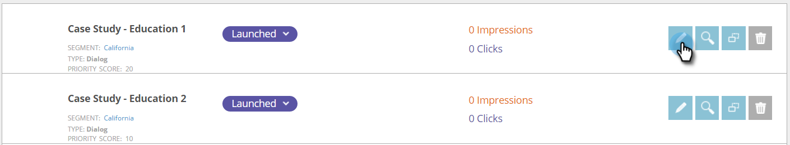

# AB测试您的Web营销活动 {#ab-test-your-web-campaign}

测试是优化Web营销活动以实现更好参与的绝佳方法。 下面是如何开始的。

要A/B测试您的个性化促销活动，您可以选择两个或多个促销活动，将它们与同一个促销活动相关联 **拆分测试** 组，并选择 **自动调整** 以自动继续最佳效果营销活动。

>[!TIP]
>
>如果您希望手动计算并查看哪个营销活动表现更好，请不要启用自动调整。

## 如何设置拆分A/B测试 {#how-to-set-up-a-split-a-b-test}

1. 转到Web营销活动。

   

   >[!NOTE]
   >
   >为了更便于找到所需的营销策划，请使用 [筛选功能](/help/marketo/product-docs/web-personalization/working-with-web-campaigns/filter-web-campaigns.md).

1. 选择您要进行A/B测试的第一个营销活动。 单击 **编辑**.

   

1. 在营销活动页面中，选择 **拆分测试** 并单击 **新建**.

   

1. 输入 **拆分测试组名称**，单击 **创建**. 选择 **自动调整**.

   

1. **保存** 或 **Launch** 营销活动。

   >[!TIP]
   >
   >选择 **自动调整** 允许Web个性化平台自动识别性能更好的拆分测试活动，并在暂停其他活动的同时继续执行转化率最高的活动。

1. 对第二个营销活动重复上述过程。

1. 选择要进行A/B测试的第二个营销活动。 单击 **编辑**.

   

1. 在 **设置营销活动** 页面，选择 **拆分测试** 并选择 **组** 从下拉菜单中。 选择 **自动调整**.

   

1. **保存** 或 **Launch** 营销活动。

1. 对第三个或第四个要测试的营销活动重复此过程。

1. In **Web营销活动** 您可以看到A/B图标表示的分割测试营销活动。

   

>[!TIP]
>
>1. 您可以测试所需数量的营销活动。 最佳实践是两到三个营销活动
>1. 确保每个拆分测试组都与同一区段相关联。 您想要针对同一受众进行测试。
>1. 尝试不同的内容片段（案例研究A与案例研究B），更改消息传递和创意、颜色、尺寸或行动号召。
>1. 优化并享受您的个性化内容！

>[!MORELIKETHIS]
>
>* [创建对话营销活动](/help/marketo/product-docs/web-personalization/working-with-web-campaigns/create-a-new-dialog-web-campaign.md)
>* [在区域营销活动中创建RTP](/help/marketo/product-docs/web-personalization/working-with-web-campaigns/create-a-new-in-zone-web-campaign.md)
>* [创建RTP构件营销活动](/help/marketo/product-docs/web-personalization/working-with-web-campaigns/create-a-new-widget-web-campaign.md)
