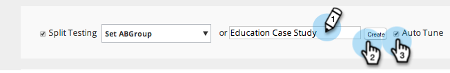

# 对 Web 营销活动进行 AB 测试 {#ab-test-your-web-campaign}

测试是优化Web促销活动以实现更好参与的绝佳方法。 下面是如何开始的。

要A/B测试您的个性化营销活动，您可以选择两个或更多营销活动，将它们关联到同一&#x200B;**[!UICONTROL Split Test]**&#x200B;组，并选择&#x200B;**[!UICONTROL Auto Tune]**&#x200B;以自动继续最佳效果营销活动。

>[!TIP]
>
>如果您希望手动计算并查看哪个促销活动表现更好，请不要启用[!UICONTROL Auto Tune]。

## 如何设置拆分A/B测试 {#how-to-set-up-a-split-a-b-test}

1. 转到&#x200B;**[!UICONTROL Web Campaigns]**。

   

   >[!NOTE]
   >
   >若要更轻松地找到所需的营销活动，请使用[筛选器功能](/help/marketo/product-docs/web-personalization/working-with-web-campaigns/filter-web-campaigns.md)。

1. 选择您要进行A/B测试的第一个营销活动。 单击 **[!UICONTROL Edit]**。

   

1. 在营销活动页面中，选择&#x200B;**[!UICONTROL Split Testing]**&#x200B;并单击&#x200B;**[!UICONTROL Create New]**。

   

1. 输入&#x200B;**拆分测试组名称**，单击&#x200B;**[!UICONTROL Create]**。 选择 **[!UICONTROL Auto Tune]**。

   

1. **[!UICONTROL Save]**&#x200B;或&#x200B;**[!UICONTROL Launch]**&#x200B;营销活动。

   >[!TIP]
   >
   >选择&#x200B;**[!UICONTROL Auto Tune]**&#x200B;可让[!DNL Web Personalization]平台自动识别表现较好的拆分测试营销活动，并在暂停其他营销活动时继续使用转化率最高的营销活动。

1. 对第二个营销活动重复上述过程。

1. 选择要进行A/B测试的第二个营销活动。 单击 **[!UICONTROL Edit]**。

   

1. 在&#x200B;**[!UICONTROL Set Campaign]**&#x200B;页面中，选择&#x200B;**拆分测试**，然后从下拉列表中选择&#x200B;**组**。 选择 **[!UICONTROL Auto Tune]**。

   

1. **[!UICONTROL Save]**&#x200B;或&#x200B;**[!UICONTROL Launch]**&#x200B;营销活动。

1. 对第三个或第四个要测试的营销活动重复此过程。

1. 在&#x200B;**[!UICONTROL Web Campaigns]**&#x200B;中，您可以看到由A/B图标表示的分割测试营销活动。

   

>[!TIP]
>
>1. 您可以测试所需数量的营销活动。 最佳实践为两到三个营销活动
>1. 确保每个拆分测试组都与同一区段相关联。 您想要针对同一受众进行测试。
>1. 尝试不同的内容片段（案例研究A与案例研究B），更改消息传递和创意、颜色、尺寸或行动号召。
>1. 优化并享受您的个性化内容！

>[!MORELIKETHIS]
>
>* [创建对话营销活动](/help/marketo/product-docs/web-personalization/working-with-web-campaigns/create-a-new-dialog-web-campaign.md)
>* [在区域营销活动中创建RTP](/help/marketo/product-docs/web-personalization/working-with-web-campaigns/create-a-new-in-zone-web-campaign.md)
>* [创建RTP构件营销活动](/help/marketo/product-docs/web-personalization/working-with-web-campaigns/create-a-new-widget-web-campaign.md)
