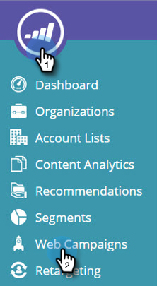

# 克隆Web营销活动 {#clone-a-web-campaign}

使用“Web营销活动”页面上的克隆功能可以复制营销活动设置并更改内容以进行剥离测试优化，也可以克隆具有相同内容的营销活动并将其定位到不同的区段。 在秒内创建Web营销活动！

## 创建克隆营销活动 {#create-a-clone-campaign}

1. 转到 **Web营销活动**.

   

   >[!NOTE]
   >
   >为了更便于查找所需的Web营销活动，请使用 [过滤功能](/help/marketo/product-docs/web-personalization/working-with-web-campaigns/filter-web-campaigns.md).

1. 对于Web营销活动，单击 **克隆**.

   

1. 营销活动克隆过程可将现有Web营销活动中的所有内容复制到新的克隆营销活动中。 新的克隆Web营销活动的标题为“[营销活动名称] 复制”。

   

   >[!TIP]
   >
   >Web营销活动中的所有内容都会复制到克隆营销活动中，但拆分测试除外，因此，如果您想要针对其他活动进行测试，请不要忘记向克隆营销活动添加拆分测试组。

>[!MORELIKETHIS]
>
>* [创建对话营销活动](/help/marketo/product-docs/web-personalization/working-with-web-campaigns/create-a-new-dialog-web-campaign.md)
>* [在区域营销活动中创建RTP](/help/marketo/product-docs/web-personalization/working-with-web-campaigns/create-a-new-in-zone-web-campaign.md)
>* [创建RTP构件营销活动](/help/marketo/product-docs/web-personalization/working-with-web-campaigns/create-a-new-widget-web-campaign.md)
