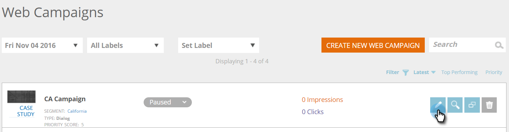

# 创建新对话框Web活动 {#create-a-new-dialog-web-campaign}

## 创建对话框Web活动 {#create-a-dialog-web-campaign}

创建Web活动，实时个性化您的Web内容，并在适当的时间向适当的用户提供适当的信息。

Web活动是与特定段关联的自定义反应。 该反应可以是您网站上的对话框、 [区域替换](create-a-new-in-zone-web-campaign.md)、构 [件](create-a-new-widget-web-campaign.md)功能或电子邮件警报。

1. 转到 **Web活动**。

   

1. 选 **择“新建Web活动**”。

   

1. 选择“ **对话框** ”Web活动类型。 在编辑器中设计和添加您的创意。 单 **击预览** ，了解网站活动在您的网站上会如何反应。

   

<table> 
 <thead> 
  <tr> 
   <th colspan="1" rowspan="1">名称</th> 
   <th colspan="1" rowspan="1">说明</th> 
  </tr> 
 </thead> 
 <tbody> 
  <tr> 
   <td colspan="1"><strong>显示于</strong></td> 
   <td colspan="1">允许您自 <a href="http://docs.marketo.com/display/DOCS/Set+How+Your+Web+Campaign+Displays" rel="nofollow">定义Web活动的显</a> 示时间和显示方式。</td> 
  </tr> 
  <tr> 
   <td colspan="1" rowspan="1"><strong>对话框样式</strong></td> 
   <td colspan="1" rowspan="1"> 
    <ul> 
     <li>现代装饰——带有半透明黑色装饰和圆角的别致而别具一格的对话</li> 
     <li>现代裁切II —— 时尚而独具匠心的对话，配以浅色阴影修剪、圆角和关闭按钮</li> 
     <li>透明——一个完全透明的对话框，非常适用于对动作的透明(png)图像。 </li> 
     <li>基本——一个简单的样式对话框，标题空间更粗，可满足您的基本对话框需求。</li> 
    </ul></td> 
  </tr> 
  <tr> 
   <td colspan="1"><strong>将输入／输出动画</strong></td> 
   <td colspan="1">在对话框进入和／或退出时设置。 选择效果（下拉、盲、滑动、淡入淡出、无效果）、持续时间（以秒为单位）和方向（上、下、左、右）。</td> 
  </tr> 
  <tr> 
   <td colspan="1" rowspan="1">
<strong>位置</strong>
</td> 
   <td colspan="1" rowspan="1">为对话框在页面上的位置选择9个选项之一。 例如，选择中间框将在屏幕的中间显示对话框。</td> 
  </tr> 
  <tr> 
   <td colspan="1" rowspan="1">
<strong>按坐标</strong>

 
</td> 
   <td colspan="1" rowspan="1">有关该对话框的其他定位选项，请选中复选框“定位坐标”，然后输入您希望显示该对话框的确切屏幕坐标（水平、垂直）。</td> 
  </tr> 
  <tr> 
   <td colspan="1"><strong>按钮填充</strong></td> 
   <td colspan="1">使用颜色、样式和位置自定义模态的关闭按钮。 您还可以通过在“图像URL”框中链接到自己的按钮来使用它。</td> 
  </tr> 
  <tr> 
   <td colspan="1"><strong>粘贴</strong></td> 
   <td colspan="1">通过选中“粘滞”复选框，对话框将保持原位，不受任何时间限制，直到用户关闭，并将显示在访客整个会话中的所有页面上。</td> 
  </tr> 
  <tr> 
   <td colspan="1"><strong>Modal</strong></td> 
   <td colspan="1">更多关注该对话框，并在对话框窗口后面以暗色背景启动它，从而提高用户对该对话框的认识。</td> 
  </tr> 
  <tr> 
   <td colspan="1"><strong>Modal颜色</strong></td> 
   <td colspan="1">自定义模态的颜色和不透明度。</td> 
  </tr> 
  <tr> 
   <td colspan="1"><strong>超时 </strong></td> 
   <td colspan="1">在淡出之前激活对话框的秒数。</td> 
  </tr> 
  <tr> 
   <td colspan="1"><strong>标题颜色</strong></td> 
   <td colspan="1">将对话框的标题栏设置为首选颜色。 颜色可以从颜色图表中选择，也可以作为十六进制颜色代码输入。 </td> 
  </tr> 
  <tr> 
   <td colspan="1"><strong>内容背景颜色 </strong></td> 
   <td colspan="1">将对话框的背景颜色设置为首选颜色。 颜色可以从颜色图表中选择，也可以作为十六进制颜色代码输入。 </td> 
  </tr> 
  <tr> 
   <td colspan="1"><strong>对话框标题</strong></td> 
   <td colspan="1">在对话框的标题栏中添加标题。</td> 
  </tr> 
  <tr> 
   <td colspan="1"><strong>宽度和高度</strong></td> 
   <td colspan="1">选择对话框的像素大小。</td> 
  </tr> 
  <tr> 
   <td colspan="1"><strong>宽度自动</strong></td> 
   <td colspan="1">选中此复选框后，对话框将自动适应内容宽度。</td> 
  </tr> 
  <tr> 
   <td colspan="1"><strong>可调整大小 </strong></td> 
   <td colspan="1">选中可调整大小复选框后，用户可调整对话框的大小。</td> 
  </tr> 
  <tr> 
   <td colspan="1"><strong>富文本编辑器</strong></td> 
   <td colspan="1">
富文本编辑器允许文本格式化、链接和图像插入。 <a href="using-the-web-personalization-rich-text-editor.md">请在此处阅读更多</a>。
</td> 
  </tr> 
  <tr> 
   <td colspan="1"><strong>预览现场</strong></td> 
   <td colspan="1">预览活动在启动之前。  
    <ul> 
     <li>URL —— 输入活动将运行的示例URL，查看预览的实时外观示例。</li> 
     <li>设备-预览活动按设备的显示方式：桌面、移动纵向、移动横向、平板电脑纵向、纵向横向。 </li> 
     <li>预览-单 <strong>击 </strong>预览以打开示例URL的新窗口，查看活动的反应。 </li> 
     <li>共享——使用“共享”按钮向同事发送电子邮件，并提供链接以查看代理活动。</li> 
    </ul></td> 
  </tr> 
 </tbody> 
</table>

>[!TIP]
>
>通过使用我们内置的模板或将您的现有活动 [另存为模板](../../../product-docs/web-personalization/using-templates/using-templates-to-create-web-campaigns.md) ，以便 [重复使用，从而加快和简化活动创建流程](../../../product-docs/web-personalization/using-templates/using-templates-to-create-web-campaigns.md) 。

## 编辑Web活动 {#edit-a-web-campaign}

1. 在Web **活动****页面** 中 **，单** 击Web活动上的“编辑”。

>[!NOTE]
>
>要更轻松地找到所需的Web活动，请使用筛 [选功能](filter-web-campaigns.md)。

## 预览Web活动 {#preview-a-web-campaign}

1. 从Web **活动** 页面，单 **击要** 视图的Web活动上的预览。

## 克隆Web活动 {#clone-a-web-campaign}

请参 [阅克隆Web活动](clone-a-web-campaign.md)。

## 删除Web活动 {#delete-a-web-campaign}

1. 在Web **活动页** ，单击要删除的Web活动上的**删除**。

   

1. 将显示一条确认消息，确认是否要删除Web活动。

>[!NOTE]
>
>**相关文章**
>
>* [在Zone Web中新建活动](create-a-new-in-zone-web-campaign.md)
>* [创建新的构件Web活动](create-a-new-widget-web-campaign.md)

