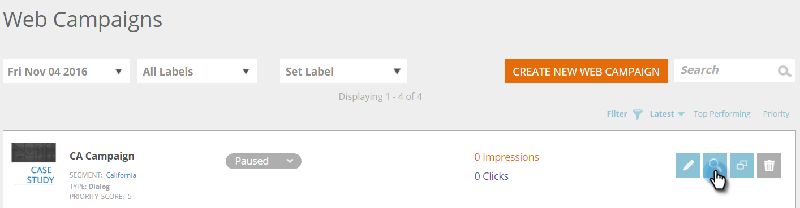

# 创建新对话框Web营销活动 {#create-a-new-dialog-web-campaign}

## 创建对话框Web营销活动 {#create-a-dialog-web-campaign}

创建Web营销活动以实时个性化您的Web内容，并在适当的时间向适当的用户提供适当的信息。

Web促销活动是与特定区段关联的自定义反应。 反应可以是您网站上的一个对话框， [区域替换](/help/marketo/product-docs/web-personalization/working-with-web-campaigns/create-a-new-in-zone-web-campaign.md), a [小组件功能](/help/marketo/product-docs/web-personalization/working-with-web-campaigns/create-a-new-widget-web-campaign.md) 或电子邮件警报。

1. 转到 **Web营销活动**.

   

1. 选择 **创建新Web营销活动**.

   

1. 选择 **对话框** web营销活动类型。 在编辑器中设计并添加您的创作元素。 单击 **预览** 以了解web营销活动对您网站的反应。

   

<table> 
 <thead> 
  <tr> 
   <th colspan="1" rowspan="1">名称</th> 
   <th colspan="1" rowspan="1">描述</th> 
  </tr> 
 </thead> 
 <tbody> 
  <tr> 
   <td colspan="1"><strong>显示于</strong></td> 
   <td colspan="1">允许您 <a href="/help/marketo/product-docs/web-personalization/working-with-web-campaigns/set-how-your-web-campaign-displays.md" rel="nofollow">自定义时间和方式</a> 将显示您的web营销活动。</td> 
  </tr> 
  <tr> 
   <td colspan="1" rowspan="1"><strong>对话框样式</strong></td> 
   <td colspan="1" rowspan="1"> 
    <ul> 
     <li>现代剪裁 — 采用半透明的黑色剪裁和圆角的时尚而独特的对话</li> 
     <li>现代裁边II — 时尚而独特的对话，配有浅阴影的裁边、圆角和关闭按钮</li> 
     <li>透明 — 一个完全透明的对话框，非常适合于调用操作时使用透明(png)图像。 </li> 
     <li>基本 — 简单的样式对话框，标题空间较厚，可满足您的基本对话框需求。</li> 
    </ul></td> 
  </tr> 
  <tr> 
   <td colspan="1"><strong>制作输入/输出动画</strong></td> 
   <td colspan="1">在对话框进入和/或退出时设置。 选择效果（放置、盲、滑动、渐隐、无效果）、持续时间（以秒为单位）和方向（上、下、左、右）。</td> 
  </tr> 
  <tr> 
   <td colspan="1" rowspan="1">
<strong>位置</strong>
</td> 
   <td colspan="1" rowspan="1">从9个选项中选择一个选项，以确定对话框在页面上的位置。 例如，选择中间框会在屏幕中间显示对话框。</td> 
  </tr> 
  <tr> 
   <td colspan="1" rowspan="1">
<strong>按坐标</strong>

 
</td> 
   <td colspan="1" rowspan="1">有关该对话框的其他定位选项，请选中“位置坐标”复选框，然后输入您希望显示对话框的确切屏幕坐标（水平、垂直）。</td> 
  </tr> 
  <tr> 
   <td colspan="1"><strong>按钮填充</strong></td> 
   <td colspan="1">使用颜色、样式和位置自定义模式的关闭按钮。 您还可以在“图像URL”框中通过链接到您自己的按钮来使用该按钮。</td> 
  </tr> 
  <tr> 
   <td colspan="1"><strong>置顶</strong></td> 
   <td colspan="1">通过选中置顶复选框，该对话框将保持原位（无任何时间限制），直到用户关闭为止，并将显示在访客会话期间的所有页面上。</td> 
  </tr> 
  <tr> 
   <td colspan="1"><strong>模态</strong></td> 
   <td colspan="1">将更多焦点放在对话框上，并在对话框窗口后面以深色背景启动该对话框，从而提高用户对该对话框的感知度。</td> 
  </tr> 
  <tr> 
   <td colspan="1"><strong>模式颜色</strong></td> 
   <td colspan="1">自定义模式窗口的颜色和不透明度。</td> 
  </tr> 
  <tr> 
   <td colspan="1"><strong>超时 </strong></td> 
   <td colspan="1">对话框在淡出前激活的秒数。</td> 
  </tr> 
  <tr> 
   <td colspan="1"><strong>标题颜色</strong></td> 
   <td colspan="1">将对话框的标题栏设置为首选颜色。 颜色可以从颜色图表中选择，也可以输入为十六进制颜色代码。 </td> 
  </tr> 
  <tr> 
   <td colspan="1"><strong>内容背景颜色 </strong></td> 
   <td colspan="1">将对话框的背景颜色设置为首选颜色。 颜色可以从颜色图表中选择，也可以输入为十六进制颜色代码。 </td> 
  </tr> 
  <tr> 
   <td colspan="1"><strong>对话框标题</strong></td> 
   <td colspan="1">在对话框的标题栏中添加标题。</td> 
  </tr> 
  <tr> 
   <td colspan="1"><strong>宽度和高度</strong></td> 
   <td colspan="1">选择对话框的像素大小。</td> 
  </tr> 
  <tr> 
   <td colspan="1"><strong>宽度自动</strong></td> 
   <td colspan="1">选中此复选框后，对话框将自动适合内容宽度。</td> 
  </tr> 
  <tr> 
   <td colspan="1"><strong>可调整大小 </strong></td> 
   <td colspan="1">选中可调整大小的复选框将允许用户调整对话框的大小。</td> 
  </tr> 
  <tr> 
   <td colspan="1"><strong>富文本编辑器</strong></td> 
   <td colspan="1">
富文本编辑器允许文本格式、链接和图像插入。 <a href="/help/marketo/product-docs/web-personalization/working-with-web-campaigns/using-the-web-personalization-rich-text-editor.md">有关更多信息，请参阅此处</a>.
</td> 
  </tr> 
  <tr> 
   <td colspan="1"><strong>在网站上预览</strong></td> 
   <td colspan="1">在启动促销活动之前进行预览。  
    <ul> 
     <li>URL — 输入运行营销活动的示例URL，以查看营销活动外观的预览示例。</li> 
     <li>设备 — 预览按设备显示营销活动的方式：台式机、移动设备纵向、移动设备横向、平板电脑纵向、纵向横向。 </li> 
     <li>预览 — 单击 <strong>预览 </strong>打开示例URL的新窗口，以了解营销活动如何反应。 </li> 
     <li>共享 — 使用“共享”按钮向同事发送一封包含链接的电子邮件，以查看代理营销活动。</li> 
    </ul></td> 
  </tr> 
 </tbody> 
</table>

>[!TIP]
>
>通过使用 [内置模板](/help/marketo/product-docs/web-personalization/using-templates/using-templates-to-create-web-campaigns.md) 或 [保存现有营销活动](/help/marketo/product-docs/web-personalization/using-templates/using-templates-to-create-web-campaigns.md) 作为模板以供重复使用。

## 编辑Web营销活动 {#edit-a-web-campaign}

1. 从 **Web营销活动** 页面，单击 **编辑** 在web营销活动上。

>[!NOTE]
>
>为了更便于查找所需的Web营销活动，请使用 [过滤功能](/help/marketo/product-docs/web-personalization/working-with-web-campaigns/filter-web-campaigns.md).

## 预览Web营销活动 {#preview-a-web-campaign}

1. 从 **Web营销活动** 页面，单击 **预览** 在要查看的web营销活动上。

## 克隆Web营销活动 {#clone-a-web-campaign}

请参阅 [克隆Web营销活动](/help/marketo/product-docs/web-personalization/working-with-web-campaigns/clone-a-web-campaign.md).

## 删除Web营销活动 {#delete-a-web-campaign}

1. 从 **Web营销活动** 页面，单击 **删除** 在要删除的web营销活动上。

   

1. 将显示确认消息，确认您是否要删除Web营销活动。

>[!MORELIKETHIS]
>
>* [在区域营销活动中创建RTP](/help/marketo/product-docs/web-personalization/working-with-web-campaigns/create-a-new-in-zone-web-campaign.md)
>* [创建RTP小组件促销活动](/help/marketo/product-docs/web-personalization/working-with-web-campaigns/create-a-new-widget-web-campaign.md)

