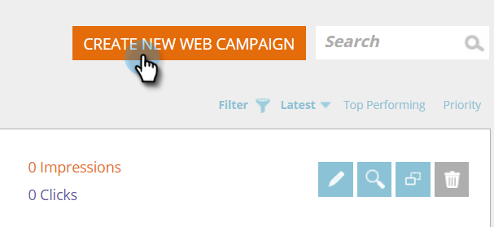

# 在区域Web活动{#create-a-new-in-zone-web-campaign}中新建

Web活动是与特定段关联的自定义反应，可以是网站上的[对话框](create-a-new-dialog-web-campaign.md)、区域替换、[构件功能](create-a-new-widget-web-campaign.md)或电子邮件警报。 “区域内”Web活动将根据区域ID将网站的元素替换为内容或图形横幅。

## 创建In Zone Web活动{#create-an-in-zone-web-campaign}

1. 转至&#x200B;**Web活动**。

   

1. 选择&#x200B;**创建新Web活动。**

   

1. 选择&#x200B;**In Zone**&#x200B;活动类型。 自定义并添加&#x200B;**区域id。** 将活动设置 **** 为Sticky，并在编辑器中添加您的创意。将页面的URL添加到预览，然后单击&#x200B;**预览**&#x200B;以查看活动在您的站点上的反应。

   

   >[!NOTE]
   >
   >**定义**
   >
   >
   >**什么是区域ID?**
   >
   >
   >区域ID是您希望“区域内”Web活动在现场的位置。 要查找“区域ID”，只需转到您的网站，选择要替换为Web活动的区域并右键单击。 在Chrome中，选项为“Inspect元素”，在其他浏览器中可能不同。
   >
   >
   >然后，您要查找与网站的此部分关联的“id”，该“id”将突出显示，因为您正在检查该元素。 例如，如果在Chrome中右键单击后，突出显示的文本显示`
`，则“featured-slider”是您应在“zone id”部分中键入的内容。 通常使用“div id”，但也可以使用任何ID，如h1 id、p id等。

<table> 
 <thead> 
  <tr> 
   <th colspan="1" rowspan="1">名称</th> 
   <th colspan="1" rowspan="1">说明</th> 
  </tr> 
 </thead> 
 <tbody> 
  <tr> 
   <td colspan="1" rowspan="1"><strong> 区域ID </strong></td> 
   <td colspan="1" rowspan="1">
输入在活动替换的网站元素的HTML代码中找到的id的名称。
</td> 
  </tr> 
  <tr> 
   <td colspan="1" rowspan="1">
<strong> 粘贴 </strong>
</td> 
   <td colspan="1" rowspan="1">默认情况下，“粘滞”复选框会选中“在区域活动”，并在网站上访客会话的整个区域ID位置保留“在区域活动”。 建议始终将“In Zone”设置为“Sticky”。</td> 
  </tr> 
  <tr> 
   <td colspan="1" rowspan="1">
<strong> 渐隐</strong> 
</td> 
   <td colspan="1" rowspan="1">选中“使用效果”复选框和“淡化”可对网站上的“区域ID”区域提供淡入淡出效果。 如果“在区域”是图形横幅，则首先加载页面，然后活动激活时会产生渐隐效果。</td> 
  </tr> 
  <tr> 
   <td colspan="1"><strong>滑动</strong></td> 
   <td colspan="1">选中“使用效果”复选框和“滑动”选项后，网站上的“区域标识”区域将显示滑动效果。 如果“在区域”是图形横幅，则首先加载页面，然后活动以从左到右的滑动效果激活。</td> 
  </tr> 
  <tr> 
   <td colspan="1"><strong> 富文本编辑器  </strong></td> 
   <td colspan="1">富文本编辑器允许文本格式化、链接和图像插入。 <a href="using-the-web-personalization-rich-text-editor.md">请在此处阅读更多</a> 。</td> 
  </tr> 
  <tr> 
   <td colspan="1"><strong> 预览现场   </strong></td> 
   <td colspan="1">预览活动在启动之前。  
    <ul> 
     <li> URL —— 输入活动将运行的示例URL，查看预览的实时外观示例。</li> 
     <li>设备-预览活动按设备的显示方式：桌面、移动纵向、移动横向、平板电脑纵向、纵向横向。</li> 
     <li> 预览-单击<strong>预览</strong>打开示例URL的新窗口，了解活动的反应。</li> 
     <li> 共享——使用“共享”按钮向同事发送电子邮件，并提供链接以查看代理活动。</li> 
    </ul></td> 
  </tr> 
 </tbody> 
</table>

>[!TIP]
>
>使用我们的[内置模板](../../../product-docs/web-personalization/using-templates/using-templates-to-create-web-campaigns.md)或[将现有活动](../../../product-docs/web-personalization/using-templates/using-templates-to-create-web-campaigns.md)保存为模板以供重用，从而加快和简化活动创建过程。

>[!NOTE]
>
>**想要A/B测试Web活动?** 可以对一个或多个Web活动 [进行A/B测试以获得最佳结果](ab-test-your-web-campaign.md)。利用自动调整功能，平台可自动识别性能更好的活动，继续保持转换率最高的活动，并暂停其他。

## 编辑Web活动{#edit-a-web-campaign}

从&#x200B;**Web活动**&#x200B;页面，单击活动上的&#x200B;**编辑**。

>[!NOTE]
>
>要更轻松地找到所需活动，请使用[过滤器功能](filter-web-campaigns.md)。

## 预览Web活动{#preview-a-web-campaign}

1. 在Web活动页面上，单击您要视图的Web活动上的**预览**。

   

## 克隆Web活动{#clone-a-web-campaign}

请参阅[克隆Web活动](clone-a-web-campaign.md)。

## 删除Web活动{#delete-a-web-campaign}

1. 在Web活动页中，单击要删除的活动上的**删除**。

   

1. 此时会显示一条确认消息，确认是否要删除活动。

>[!MORELIKETHIS]
>
>* [创建新的构件Web活动](create-a-new-widget-web-campaign.md)
>* [创建新对话框Web活动](create-a-new-dialog-web-campaign.md)

