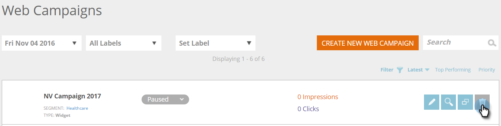

# 创建新的构件Web营销活动 {#create-a-new-widget-web-campaign}

Web营销活动是与特定区段关联的自定义反应，可以是 [对话框](/help/marketo/product-docs/web-personalization/working-with-web-campaigns/create-a-new-dialog-web-campaign.md) 在您的网站上， [区域替换](/help/marketo/product-docs/web-personalization/working-with-web-campaigns/create-a-new-in-zone-web-campaign.md)、小组件功能或电子邮件警报。 Widget Web营销活动是出现在网页垂直侧的文本或横幅，具有展开和收缩功能，同时在整个访问期间都固定在网站页面上。

## 创建构件Web营销活动 {#create-a-widget-web-campaign}

1. 转到 **Web营销活动**.

   

1. 选择 **创建新的Web营销活动**.

   

1. 选择 **构件** 营销活动类型。

   

1. 使用多个选项自定义构件。

   

1. 单击 **预览** 以查看Web营销活动在您的网站上将如何反应。

   

<table> 
 <thead> 
  <tr> 
   <th colspan="1" rowspan="1">名称</th> 
   <th colspan="1" rowspan="1">描述</th> 
  </tr> 
 </thead> 
 <tbody> 
  <tr> 
   <td colspan="1"><strong>模板</strong></td> 
   <td colspan="1">从多个预建模板中选择一个。</td> 
  </tr> 
  <tr> 
   <td colspan="1"><strong>显示于</strong></td> 
   <td colspan="1">允许您 <a href="/help/marketo/product-docs/web-personalization/working-with-web-campaigns/set-how-your-web-campaign-displays.md" rel="nofollow">自定义时间和方式</a> 此时将显示您的Web营销活动。</td> 
  </tr> 
  <tr> 
   <td colspan="1"><strong>动画输入/输出</strong></td> 
   <td colspan="1">在对话框输入和/或退出时设置。 选择效果（放置、遮蔽、滑动、渐隐、无效果）、持续时间（以秒为单位）和方向（向上、向下、向左、向右）。</td> 
  </tr> 
  <tr> 
   <td colspan="1"><strong>位置</strong></td> 
   <td colspan="1">为构件在页面上的位置选择四个选项之一：右、左、上、下。 position %是定位的百分比，以指示小组件在浏览器页面中的显示位置（例如，“50%底部”将导致小组件在页面底部半下方显示，“10%左侧”将导致小组件在页面左上角附近显示，等等）。 </td> 
  </tr> 
  <tr> 
   <td colspan="1" rowspan="1"><strong>构件颜色</strong></td> 
   <td colspan="1" rowspan="1">
从颜色图中选择构件颜色，或将其输入为RGB颜色代码。 也可以通过沿任一方向移动底部的栏来选择小组件背景的透明度级别。
</td> 
  </tr> 
  <tr> 
   <td colspan="1" rowspan="1">
<strong>小组件按钮</strong> 
</td> 
   <td colspan="1" rowspan="1">自定义构件按钮本身。 箭头：允许您从右侧下拉菜单中的多个不同图标中进行选择。 左侧下拉列表决定其颜色。 自定义：插入任何托管图像的URL。 接受的文件类型 — .JPEG、.GIF（包括动画）、.PNG、.APNG、.SVG、.BMP。 文本：构件可以是文本 — 自定义其颜色、大小和字体。</td> 
  </tr> 
  <tr> 
   <td colspan="1"><strong>粘性</strong></td> 
   <td colspan="1">选择此选项可确保在访客会话期间该构件将显示在所有网页上。</td> 
  </tr> 
  <tr> 
   <td colspan="1"><strong>最小化Campaign显示上的构件</strong></td> 
   <td colspan="1">插入构件，但将其保持在最小状态，需要用户单击它以将其最大化。</td> 
  </tr> 
  <tr> 
   <td colspan="1"><strong>恢复默认值 </strong></td> 
   <td colspan="1">通过将构件颜色设置为默认的透明灰色选项，恢复构件的原始默认设置。</td> 
  </tr> 
  <tr> 
   <td colspan="1"><strong>在站点上预览 </strong></td> 
   <td colspan="1">在启动营销活动之前进行预览。  
    <ul> 
     <li>URL — 输入营销活动将运行的示例URL，以查看营销活动实时外观的预览示例。</li> 
     <li>预览 — 单击 <strong>预览 </strong>打开示例URL的新窗口以查看营销活动的反应方式(添加 <a href="https://chrome.google.com/extensions/detail/ldiddonjplchallbngbccbfdfeldohkj?hl=en" rel="nofollow">Chrome扩展</a> 获得最佳的Web营销活动预览体验。)。 </li> 
     <li>共享 — 使用“共享”按钮向同事发送电子邮件，其中包含查看代理营销活动的链接。</li> 
    </ul></td> 
  </tr> 
 </tbody> 
</table>

>[!NOTE]
>
>**是否希望对Web营销活动进行A/B测试？** 一个或多个Web营销活动可以是 [A/B测试以获得最佳结果](/help/marketo/product-docs/web-personalization/working-with-web-campaigns/ab-test-your-web-campaign.md). 借助自动调整功能，平台会自动识别效果较好的营销活动，继续提供转化率最高的营销活动，并暂停其他营销活动。

## 编辑Web活动 {#edit-a-web-campaign}

在Web营销策划页面中，单击 **编辑** 在营销策划中。

>[!NOTE]
>
>为了更便于找到所需的营销策划，请使用 [筛选功能](/help/marketo/product-docs/web-personalization/working-with-web-campaigns/filter-web-campaigns.md).

## 克隆Web营销活动 {#clone-a-web-campaign}

参见 [克隆Web营销活动](/help/marketo/product-docs/web-personalization/working-with-web-campaigns/clone-a-web-campaign.md).

## 预览Web营销活动 {#preview-a-web-campaign}

在Web营销策划页面中，单击 **预览** 在要预览的Web营销活动上

## 删除Web活动 {#delete-a-web-campaign}

1. 在Web营销策划页面中，单击 **删除** 要删除的Web营销活动上的标记。

   

1. 此时将显示确认消息，确认是否要删除Web营销活动。

>[!MORELIKETHIS]
>
>* [新建区域内的Web营销活动](/help/marketo/product-docs/web-personalization/working-with-web-campaigns/create-a-new-in-zone-web-campaign.md)
>* [新建Dialog Web营销活动](/help/marketo/product-docs/web-personalization/working-with-web-campaigns/create-a-new-dialog-web-campaign.md)
