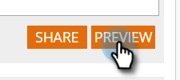

# 创建新的小组件Web营销活动 {#create-a-new-widget-web-campaign}

Web促销活动是与特定区段关联的自定义反应，可以是 [对话框](/help/marketo/product-docs/web-personalization/working-with-web-campaigns/create-a-new-dialog-web-campaign.md) 在您的网站上， [区域替换](/help/marketo/product-docs/web-personalization/working-with-web-campaigns/create-a-new-in-zone-web-campaign.md)、小组件功能或电子邮件警报。 小组件Web营销活动是在网页的垂直侧显示的文本或横幅，能够进行扩展和收缩，但在整个访问期间仍会在网站页面上固定。

## 创建小组件Web营销活动 {#create-a-widget-web-campaign}

1. 转到 **Web营销活动**.

   

1. 选择 **创建新Web营销活动**.

   

1. 选择 **构件** 营销活动类型。

   

1. 使用多个选项来自定义小组件。

   

1. 单击 **预览** 以了解web营销活动对您网站的反应。

   

<table> 
 <thead> 
  <tr> 
   <th colspan="1" rowspan="1">名称</th> 
   <th colspan="1" rowspan="1">描述</th> 
  </tr> 
 </thead> 
 <tbody> 
  <tr> 
   <td colspan="1"><strong>模板</strong></td> 
   <td colspan="1">从多个预制模板之一进行选择。</td> 
  </tr> 
  <tr> 
   <td colspan="1"><strong>显示于</strong></td> 
   <td colspan="1">允许您 <a href="/help/marketo/product-docs/web-personalization/working-with-web-campaigns/set-how-your-web-campaign-displays.md" rel="nofollow">自定义时间和方式</a> 将显示您的web营销活动。</td> 
  </tr> 
  <tr> 
   <td colspan="1"><strong>制作输入/输出动画</strong></td> 
   <td colspan="1">在对话框进入和/或退出时设置。 选择效果（放置、盲、滑动、渐隐、无效果）、持续时间（以秒为单位）和方向（上、下、左、右）。</td> 
  </tr> 
  <tr> 
   <td colspan="1"><strong>位置</strong></td> 
   <td colspan="1">从四个选项中选择一个选项来确定小组件在页面上的位置：右，左，上，下。 位置%是小组件在浏览器页面中显示的位置所占的百分比（例如，“50%底部”将导致小组件在页面底部中半部显示，“10%左侧”将导致小组件在页面左上部附近显示，等等）。 </td> 
  </tr> 
  <tr> 
   <td colspan="1" rowspan="1"><strong>构件颜色</strong></td> 
   <td colspan="1" rowspan="1">
从颜色图表中选择小组件颜色，或将其输入为RGB颜色代码。 您还可以通过在底部的条沿任一方向移动来选择小组件背景的透明度级别。
</td> 
  </tr> 
  <tr> 
   <td colspan="1" rowspan="1">
<strong>小组件按钮</strong> 
</td> 
   <td colspan="1" rowspan="1">自定义小组件按钮本身。 箭头：允许您从右下拉菜单中的多个不同图标进行选择。 左下拉框确定其颜色。 自定义：插入任何托管图像的URL。 接受的文件类型 — .JPEG、 .GIF（包括动画）、 .PNG、 .APNG、 .SVG、 .BMP。 文本：小组件可以是文本 — 自定义其颜色、大小和字体。</td> 
  </tr> 
  <tr> 
   <td colspan="1"><strong>置顶</strong></td> 
   <td colspan="1">选择此选项可确保小组件在访客会话期间显示在所有网页上。</td> 
  </tr> 
  <tr> 
   <td colspan="1"><strong>在Campaign显示中最大限度地减少小组件</strong></td> 
   <td colspan="1">插入小组件，但会使其保持最小化，这要求用户单击该小组件以将其最大化。</td> 
  </tr> 
  <tr> 
   <td colspan="1"><strong>恢复默认值 </strong></td> 
   <td colspan="1">通过将小组件颜色设置为默认的透明灰色选项，恢复小组件的原始默认设置。</td> 
  </tr> 
  <tr> 
   <td colspan="1"><strong>在网站上预览 </strong></td> 
   <td colspan="1">在启动促销活动之前进行预览。  
    <ul> 
     <li>URL — 输入运行营销活动的示例URL，以查看营销活动外观的预览示例。</li> 
     <li>预览 — 单击 <strong>预览 </strong>打开示例URL的新窗口，以了解营销活动的反应(添加 <a href="https://chrome.google.com/extensions/detail/ldiddonjplchallbngbccbfdfeldohkj?hl=en" rel="nofollow">Chrome扩展</a> ，以获得最佳的Web Campaign预览体验。) </li> 
     <li>共享 — 使用“共享”按钮向同事发送一封包含链接的电子邮件，以查看代理营销活动。</li> 
    </ul></td> 
  </tr> 
 </tbody> 
</table>

>[!NOTE]
>
>**想要A/B测试您的Web营销活动？** 一个或多个Web营销活动可以是 [测试A/B以获得最佳结果](/help/marketo/product-docs/web-personalization/working-with-web-campaigns/ab-test-your-web-campaign.md). 利用自动调节功能，平台可自动识别效果更好的营销活动，继续进行转化率最高的营销活动并暂停其他营销活动。

## 编辑Web营销活动 {#edit-a-web-campaign}

在“Web营销活动”页面中，单击 **编辑** 在营销活动上。

>[!NOTE]
>
>为了更便于查找所需的营销活动，请使用 [过滤功能](/help/marketo/product-docs/web-personalization/working-with-web-campaigns/filter-web-campaigns.md).

## 克隆Web营销活动 {#clone-a-web-campaign}

请参阅 [克隆Web营销活动](/help/marketo/product-docs/web-personalization/working-with-web-campaigns/clone-a-web-campaign.md).

## 预览Web营销活动 {#preview-a-web-campaign}

在“Web营销活动”页面中，单击 **预览** 在要预览的web营销活动上

## 删除Web营销活动 {#delete-a-web-campaign}

1. 在“Web营销活动”页面中，单击 **删除** 在要删除的web营销活动上。

   

1. 将显示确认消息，确认您是否要删除Web营销活动。

>[!MORELIKETHIS]
>
>* [在区域Web营销活动中新建](/help/marketo/product-docs/web-personalization/working-with-web-campaigns/create-a-new-in-zone-web-campaign.md)
>* [创建新对话框Web营销活动](/help/marketo/product-docs/web-personalization/working-with-web-campaigns/create-a-new-dialog-web-campaign.md)

