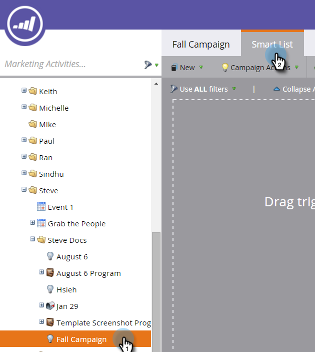
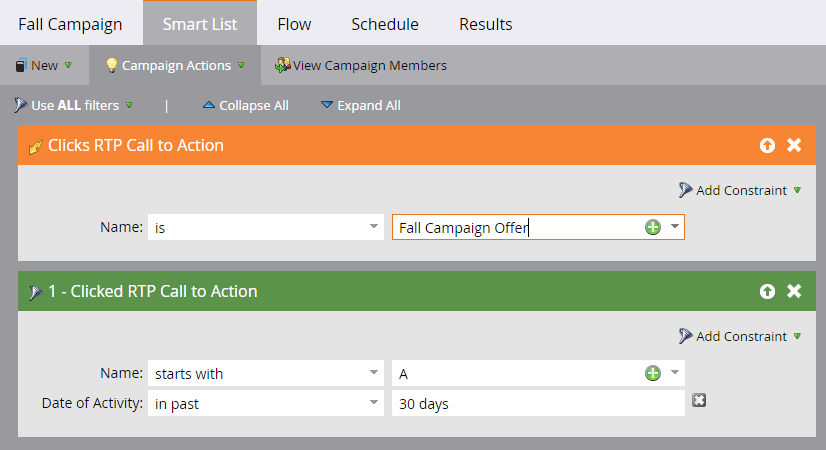

# 为Web个性化活动定义智能列表 {#define-a-smart-list-for-web-personalization-activities}

在智能营销活动中定义智能列表时，您可以在过滤器和触发器中使用Web个性化活动。 在这里，您要捕获单击Web个性化行动号召（营销活动）的任何人。

使用触发器发送电子邮件或警报，或根据点击并参与Web个性化行动动员的访客更改值或分数。 您还可以过滤和查看那些点击了Web个性化行动号召的潜在客户。

1. 在智能营销策划中，单击 **智能列表** 选项卡。

   

   >[!NOTE]
   >
   >智能列表可以做一些令人惊叹的事情。 在中了解详情 [智能列表深入分析](/help/marketo/product-docs/core-marketo-concepts/smart-campaigns/understanding-smart-campaigns.md).

1. 搜索触发器，然后将触发器拖放到画布上。

   

   >[!NOTE]
   >
   >具有触发器的智能营销活动在触发器模式下运行。 它根据触发的事件和添加的过滤器，每次只针对一个人运行。

1. 单击下拉菜单并选择运算符。

   

   >[!CAUTION]
   >
   >红色曲线表示错误。 如果未更正，则会使营销活动无效，并且无法运行。

1. 定义触发器。

   

1. 根据需要添加过滤器。

   

   >[!TIP]
   >
   >在同时具有触发器和过滤器的智能营销活动中，触发器位于顶部。 触发时，只有符合筛选条件的用户才会通过流。

   >[!NOTE]
   >
   >对于多个触发器，如果任何一个触发器被激活，则人员将通过流执行操作。

   要同时对一组人员运行活动，请了解如何 [为Smart Campaign定义智能列表 |批次](/help/marketo/product-docs/core-marketo-concepts/smart-campaigns/creating-a-smart-campaign/define-smart-list-for-smart-campaign-batch.md).

   >[!MORELIKETHIS]
   >
   >* [为Smart Campaign定义智能列表 |批次](/help/marketo/product-docs/core-marketo-concepts/smart-campaigns/creating-a-smart-campaign/define-smart-list-for-smart-campaign-batch.md)
   >* [向智能营销活动添加流量步骤](/help/marketo/product-docs/core-marketo-concepts/smart-campaigns/flow-actions/add-a-flow-step-to-a-smart-campaign.md)
   >* [定义预测内容活动的智能列表](/help/marketo/product-docs/predictive-content/define-a-smart-list-for-predictive-content-activities.md)
