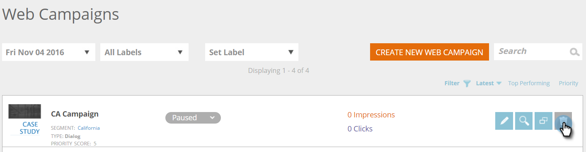

# 删除 Web 营销活动 {#delete-a-web-campaign}

1. 前往 **[!UICONTROL Web Campaigns]**。

   

   >[!NOTE]
   >
   >若要更轻松地查找所需的Web营销活动，请使用[筛选功能](/help/marketo/product-docs/web-personalization/working-with-web-campaigns/filter-web-campaigns.md)。

1. 在[!UICONTROL Web Campaigns]页面上，单击要删除的营销活动上的&#x200B;**[!UICONTROL Delete]**。

   

1. 此时会显示确认消息，确认您是否要删除Web营销活动。

>[!MORELIKETHIS]
>
>* [编辑Web营销活动](/help/marketo/product-docs/web-personalization/working-with-web-campaigns/edit-an-existing-web-campaign.md)
>* [启动/暂停Web营销活动](/help/marketo/product-docs/web-personalization/working-with-web-campaigns/launch-pause-a-web-campaign.md)
