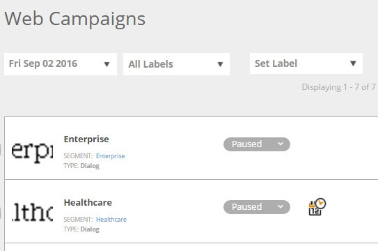

# 筛选 Web 营销活动 {#filter-web-campaigns}

创建数百个[!DNL Web Personalization]营销活动后，真正有帮助的是能够使用过滤器仅查看您感兴趣的营销活动。

1. 前往 **[!UICONTROL Web Campaigns]**。

   

1. 在[!UICONTROL Web Campaigns]页面上，单击&#x200B;**[!UICONTROL Filter]**。

   

1. 选中要过滤的营销活动的状态和/或类型的复选框，例如&#x200B;**[!UICONTROL Paused]**&#x200B;或&#x200B;**[!UICONTROL Dialog]**。 单击 **[!UICONTROL Apply]**。

   

   >[!TIP]
   >
   >使用&#x200B;**[!UICONTROL Select All]**&#x200B;复选框选择全部，或使用&#x200B;**[!UICONTROL Clear]**&#x200B;链接清除所有复选框。

1. 现在，仅显示与您的过滤器匹配的营销活动。

   

   一块蛋糕！
