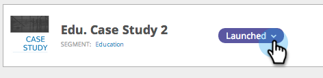
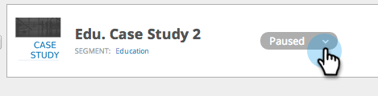

# 启动/暂停Web活动{#launch-pause-a-web-campaign}

Web活动是与特定区段关联的自定义反应，可以是网站上的[对话框](/help/marketo/product-docs/web-personalization/working-with-web-campaigns/create-a-new-dialog-web-campaign.md)、区域替换](/help/marketo/product-docs/web-personalization/working-with-web-campaigns/create-a-new-in-zone-web-campaign.md)中的[、构件功能或电子邮件警报。

可以从“Web活动”页面或“设置Web活动”页面以两种方式启动或暂停Web活动。

1. 单击&#x200B;**Web个性化**。

   

1. 转到&#x200B;**Web活动**。

   

1. 如果活动已启动，请单击&#x200B;**已启动**&#x200B;以将活动的状态更改为&#x200B;**已暂停**&#x200B;以暂停活动。

   

1. 如果活动已暂停，请单击&#x200B;**Paused**&#x200B;以将活动的状态更改为&#x200B;**Launched**。 这将激活并启动活动。

   

   >[!NOTE]
   >
   >您还可以在“设置活动”页面中更改活动状态。

1. 在活动中，单击&#x200B;**编辑**。

   

1. 单击&#x200B;**保存**&#x200B;以保存并暂停活动。 单击&#x200B;**启动**&#x200B;以启动并激活活动。

   

>[!MORELIKETHIS]
>
>* [创建对话框活动](/help/marketo/product-docs/web-personalization/working-with-web-campaigns/create-a-new-dialog-web-campaign.md)
>* [在区域中创建RTP活动](/help/marketo/product-docs/web-personalization/working-with-web-campaigns/create-a-new-in-zone-web-campaign.md)
>* [创建RTP Widget活动](/help/marketo/product-docs/web-personalization/working-with-web-campaigns/create-a-new-widget-web-campaign.md)

