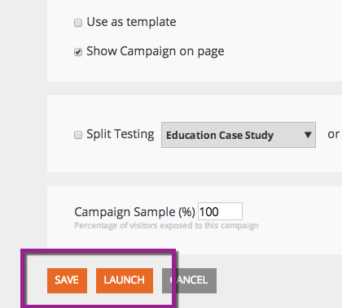

# 启动/暂停Web营销活动 {#launch-pause-a-web-campaign}

Web营销活动是与特定区段关联的自定义反应，可以是您网站上的[对话框](/help/marketo/product-docs/web-personalization/working-with-web-campaigns/create-a-new-dialog-web-campaign.md)、区域替换[&#128279;](/help/marketo/product-docs/web-personalization/working-with-web-campaigns/create-a-new-in-zone-web-campaign.md)中的、小组件功能或电子邮件警报。

您可以通过两种方式从“Web营销活动”页面或“设置Web营销活动”页面启动或暂停Web营销活动。

1. 单击&#x200B;**Web Personalization**。

   

1. 转到&#x200B;**网络营销活动**。

   

1. 如果营销活动已启动，请单击&#x200B;**已启动**&#x200B;以将营销活动的状态更改为&#x200B;**已暂停**，以暂停营销活动。

   

1. 如果营销活动已暂停，请单击&#x200B;**已暂停**&#x200B;以将营销活动的状态更改为&#x200B;**已启动**。 这将激活并启动营销活动。

   

   >[!NOTE]
   >
   >您还可以在设置营销活动页面中更改营销活动状态。

1. 在营销活动中，单击&#x200B;**编辑**。

   

1. 单击&#x200B;**保存**&#x200B;以保存并暂停营销活动。 单击&#x200B;**启动**&#x200B;以启动并激活该营销活动。

   

>[!MORELIKETHIS]
>
>* [创建对话营销活动](/help/marketo/product-docs/web-personalization/working-with-web-campaigns/create-a-new-dialog-web-campaign.md)
>* [在区域营销活动中创建RTP](/help/marketo/product-docs/web-personalization/working-with-web-campaigns/create-a-new-in-zone-web-campaign.md)
>* [创建RTP构件营销活动](/help/marketo/product-docs/web-personalization/working-with-web-campaigns/create-a-new-widget-web-campaign.md)
