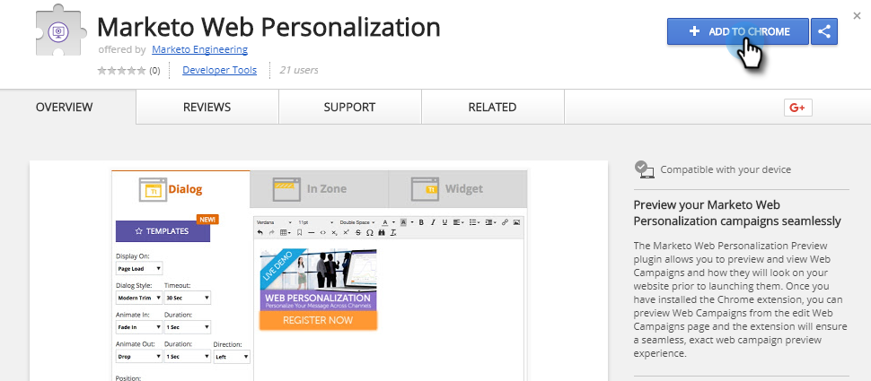

# 预览和测试Web活动 {#preview-and-test-a-web-campaign}

本文向您展示了预览Web活动的不同方法，以及如何使用网站上实时的沙箱段测试它。

## 预览创建页面上的Web活动 {#preview-a-web-campaign-on-the-creation-page}

1. 转到 **Web****活动**。

   

1. 单击**新建Web活动*******或图标以编辑现有活动。

   

1. 在站点预览中，添加页面URL并单击 **预览**。 将打开一个新窗口／选项卡，显示活动预览。

   

   >[!TIP]
   >
   >单 **击** “共享”以打开包含活动预览固定URL的电子邮件。

   >[!NOTE]
   >
   >您还可以选择安装浏览器插件(Chrome [或Firefox](https://chrome.google.com/webstore/detail/marketo-web-personalizati/ldiddonjplchallbngbccbfdfeldohkj))，以获得最佳的预览活动体验。 请参阅以下部分。

## 使用预览器插件在创建页面上活动Web {#preview-a-web-campaign-on-the-creation-page-using-the-browser-plug-in}

1. 按照中的步骤1和步骤2操 `section above`作。
1. 单击指向浏览器插件的链接（在本例中，我们使用的是Chrome）。

   

1. 将打开新窗口／选项卡。 单击 **添加到Chrome**。

   

1. 单击“ **添加扩展**”。

   

1. 回马克托。 添加页面URL并单击 **预览**。

   

1. 此时会打开一个新窗口／选项卡，用于预览活动在桌面、手机或平板电脑上的外观。

   

## 预览Web活动网页 {#preview-a-web-campaign-on-the-web-campaigns-page}

1. 查看Web活动列表时，只需选择一个活动并单击 **预览** 图标。

   

   放松！

## 预览网站上的Web活动 {#preview-a-web-campaign-on-your-website}

创建沙箱段和活动。

1. 转至 **区段**。

   

1. 单击 **新建**。

   

1. 命名区段。
1. 在“行为”下，将“包括页面”拖动到画布上。 添加值*sandbox=1*。 单击保存并定义活动。

   

1. 在“设置Web活动”页上，从目标中选择沙箱段，将列表段更改为沙箱段。

   

1. 完成活动创意并单击 **启动**。\
   

1. 转到您的网站，在URL末尾添加URL参数“?sandbox=1”。 示例： [www.marketo.com?sandbox=1](http://www.marketo.com/?sandbox=1)
1. 查看活动在您的网站上的反应。

>[!NOTE]
>
>活动在访客会话期间只做出一次反应。 要再次查看活动，请清除您的浏览器cookie。

>[!NOTE]
>
>无法预览重定向活动。 测试它们的唯一方法是使用沙箱段(即按特定页面目标- *sandbox=redirect*)

