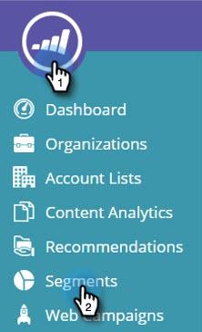

# 预览和测试Web营销活动 {#preview-and-test-a-web-campaign}

本文向您展示了预览Web营销活动的不同方式，以及如何使用网站上实时的沙盒区段来测试营销活动。

>[!NOTE]
>
>预览仅显示营销活动在所选网站上的外观。 链接和小组件将无法正常工作，以避免在分析中出现错误的点击/查看。

## 在创建页面上预览Web营销活动 {#preview-a-web-campaign-on-the-creation-page}

1. 转到 **Web营销活动**.

   

1. 单击 **创建新Web营销活动** 或图标以编辑现有营销活动。

   

1. 在网站预览中，添加页面URL并单击 **预览**. 随即会打开一个显示营销活动预览的新窗口/选项卡。

   

   >[!TIP]
   >
   >单击 **共享** 打开具有固定营销活动预览URL的电子邮件。

   >[!NOTE]
   >
   >您还可以选择安装浏览器插件( [铬黄](https://chrome.google.com/webstore/detail/marketo-web-personalizati/ldiddonjplchallbngbccbfdfeldohkj) 或 [Firefox](https://rtp-static.marketo.com/rtp/libs/mwp-0.0.0.8.xpi))，以获得预览营销活动的最佳体验。 请参阅下面的部分。

## 使用浏览器插件在创建页面上预览Web营销活动 {#preview-a-web-campaign-on-the-creation-page-using-the-browser-plug-in}

1. 按照上述部分中的步骤1和2操作。

1. 单击指向浏览器插件的链接（在本例中，我们使用的是Chrome）。

   

1. 将打开一个新窗口/选项卡。 单击 **添加到Chrome**.

   

1. 单击 **添加扩展**.

   

1. 回Marketo。 添加页面URL并单击 **预览**.

   

1. 此时会打开一个新窗口/选项卡，用于预览营销活动在桌面、手机或平板电脑上的外观。

   

## 在“网络营销活动”页上预览Web营销活动 {#preview-a-web-campaign-on-the-web-campaigns-page}

1. 查看Web营销活动列表时，只需选择营销活动并单击 **预览** 图标。

   

   放松！

## 在您的网站上预览Web营销活动 {#preview-a-web-campaign-on-your-website}

创建沙盒区段和营销活动。

1. 转到 **区段**.

   

1. 单击 **新建**.

   

1. 命名区段。

1. 在“行为”下，将“包含页面”拖到画布上。 添加值 &#42;sandbox=1&#42;. 单击 **保存并定义营销活动**.

   

1. 在“设置Web营销活动”页面上，通过从列表中选择Target区段以将其更改为沙盒区段。

   

1. 完成营销活动创作并点击 **Launch**.

   

1. 转到您的网站，在URL的末尾添加URL参数“？sandbox=1”。 示例： `www.marketo.com?sandbox=1`.

1. 查看您网站上的营销活动反应。

>[!NOTE]
>
>在访客会话期间，营销活动只做出一次反应。 要再次查看营销活动，请清除您的浏览器Cookie。

>[!NOTE]
>
>无法预览重定向营销活动。 测试这些区段的唯一方法是使用沙盒区段(按特定页面确定目标 —  &#42;sandbox=redirect&#42;)
