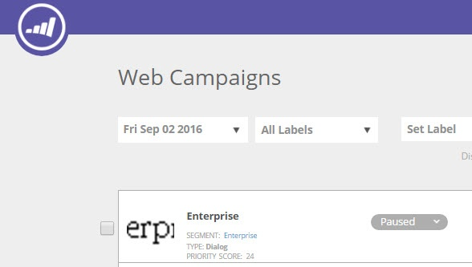

# 优先处理Web营销活动 {#prioritizing-web-campaigns}

当两个或更多Web营销活动重叠时，通过设置优先级得分来优先处理Web营销活动。

>[!NOTE]
>
>**重叠营销活动**
>
>在以下情况下，会发生Web营销活动重叠：
>
>* 两个或多个构件和/或对话框营销活动在同一页面上同时做出反应
>* 具有相同区域ID的两个或两个以上的In Zones在同一网页上同时反应
>
>In Zone营销活动和（小组件或对话框）营销活动可以在同一页面上做出反应。

1. 转到Web营销活动。

   

   >[!NOTE]
   >
   >为了更便于查找所需的Web营销活动，请使用 [过滤功能](/help/marketo/product-docs/web-personalization/working-with-web-campaigns/filter-web-campaigns.md).

1. 在“编辑促销活动”页面中，设置优先级得分（9999 =最高优先级1 =最低优先级）。

   

   >[!TIP]
   >
   >我们建议您仅在可能存在营销活动重叠时才使用营销活动优先级得分，其中一个营销活动具有较高重要性。 您无需为每个营销活动设置优先级。

1. 保存或启动营销活动。

1. 请参阅“网站营销活动”页面中显示的优先级得分。

