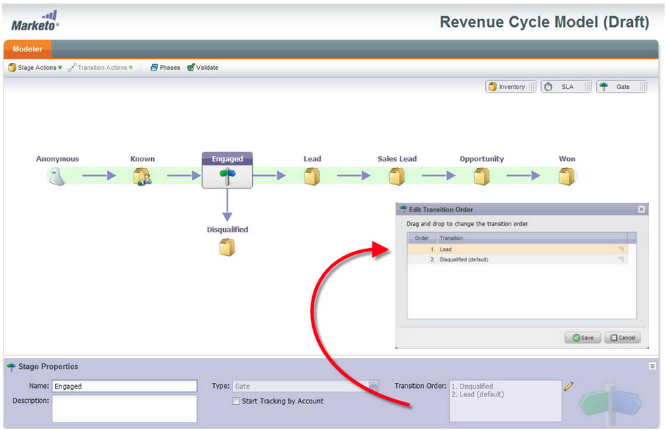

# 发行说明：2012年4月{#release-notes-april}

## 分段过滤器和触发器{#segmentation-filters-and-triggers}

您是否一致地目标同一组潜在客户？ 如果是，请在您的智能列表中使用细分定位潜在客户。 通过细分，您的整个潜在客户数据库始终处于细分状态，并且可以在您的项目中重复使用，以实现一致性。 分段结果会快速提取，因为它们不需要在请求时运行智能列表。

## 通过扩展的API功能{#insert-external-values-into-email-content-and-other-flow-steps-through-expanded-api-capabilities}将外部值插入电子邮件内容和其他流步骤

* 现在，通过请求活动API，您可以为特定活动运行的我的令牌发送值 — 这对于通过API填充电子邮件内容尤为有用
* 新的上传到列表和计划活动API支持上述列表潜在客户和批量活动。

## GoToWebinar和WebEx(Adobe Connect和ON24即将推出！){#easier-confirmation-emails-for-gotowebinar-and-webex-adobe-connect-and-on-coming-soon}更轻松的确认电子邮件

我们通过创建一个成员标记来简化确认URL，该标记显示每个潜在客户的唯一注册确认URL。 您不必再使用其他令牌创建此URL。 GoToWebinar和WebEx客户目前可使用此功能，在下一个版本中，Adobe Connect和ON24也可使用此功能。

## 只需单击一下，即可上传多个图像和文件！{#upload-multiple-images-and-files-with-a-single-click}

将图像和文件导入Marketo时节省时间并提高效率！ 如果您使用Firefox或Google Chrome，则可以多选文件并一次上载所有文件。 尽管可以上载的文件数量没有限制，但每个文件的单个大小限制是50MB。

注意：目前，由于浏览器的限制，Internet Explorer不支持此功能。

## 移动电子邮件中的文本{#move-text-in-an-email}

您可以对电子邮件中的文本块重新排序。 在文本编辑器中选择一个文本块；单击“编辑”图标时，您将看到向上或向下移动块的选项。

## 已删除非Salesforce用户{#salesforce-references-removed-for-non-salesforce-users}的Salesforce引用

如果您未将订阅与Salesforce同步，您将注意到引用Salesforce的所有文件夹和流操作都将被删除。

## Marketo收入周期分析{#marketo-revenue-cycle-analytics}

**收入周期建模器中的增强门阶段**

允许用户为其过渡规则定义订单。

