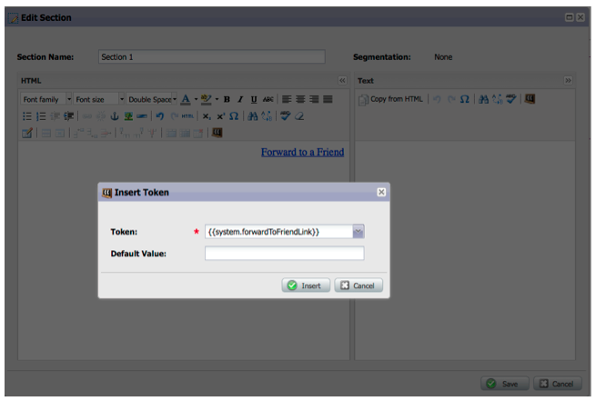

# 发行说明：2012年12月{#release-notes-december}

12月版本包括备受期待的&#x200B;**转发到Friend**&#x200B;功能，以及其他几种特性！ 请注意，标有星号(*)的功能仅在Select Edition和RCA（收入周期分析）中可用。

## 转发给朋友{#forward-to-friend}

通过在电子邮件中加入&#x200B;**转发到朋友**&#x200B;链接，可与他人共享内容。 新增的过滤器和触发器将帮助您识别您的意见领袖，包括转发电子邮件的用户以及接收转发电子邮件的用户。

要在您的电子邮件中包含&#x200B;**转发到Friend**&#x200B;邀请，请在编辑器中打开它并插入`{{system.forwardToFriendLink}}`令牌。

使用相应的触发器和过滤器来标识使用&#x200B;**转发到朋友**&#x200B;链接的用户和收到电子邮件的用户。

## 细粒度管理员权限{#granular-admin-permissions}

我们的最新版本通过控制每个角色在Marketo管理区域中的不同功能的访问权限，为您提供了对管理员角色的更大访问权限和控制。 创建新角色时，您可以分配该角色可以访问的特定管理员功能。

>[!NOTE]
>
>默认情况下，具有“访问管理员”权限的现有角色在修改之前对所有管理员功能具有访问权限。

## BrightTALK适配器{#brighttalk-adapter}

Marketo BrightTALK适配器使您能够从实时或点播网络广播捕获出席信息，直接捕获到Marketo事件!

## Marketo Sales Insight for Microsoft Dynamics {#marketo-sales-insight-for-microsoft-dynamics}

Microsoft Dynamics客户现在可以了解销售分析！

## Dynamics Opportunity Sync {#dynamics-opportunity-sync}

在Marketo和Microsoft Dynamics之间同步机会数据。

## 营销影响的机会报表* {#marketing-influenced-opportunities-report}

视图您的公司渠道和收入中受营销项目影响的百分比。 在&#x200B;**收入浏览器**&#x200B;中，您现在可以在“业务机会”分析中使用新的“受营销影响的业务机会”黄点创建自定义报表。 您还可以在标准文件夹中使用以下两个报表：

* 营销对所创造机会的影响
* 营销对已关闭商机的影响

## 项目机会分析中的自定义机会字段* {#custom-opportunity-fields-in-program-opportunity-analysis}

添加自定义业务机会字段，以便在收入浏览器中丰富您的项目业务机会分析报表。

## 活动检查器{#campaign-inspector}

您是否曾想过哪些活动正在使用特定流动操作，如“更改分数”或“请求活动”？ 或者某个过滤器的使用位置？ 新的活动检查器（可从Treasure Chest获得）使您能识别这些活动，以及存在错误的活动活动和活动。

转到&#x200B;**Admin** > **Treasure Chest**&#x200B;以启用&#x200B;**活动检查器**。

