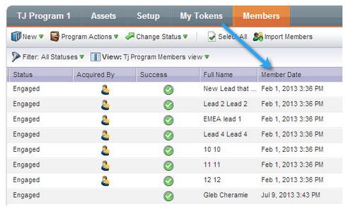

# 发行说明：2013年7月{#release-notes-july}

7月版本中包含以下功能，该版本计划于7月26日星期五推出。

## 仪表板{#exhausted-content-widget-on-the-dashboard}上已用尽的内容小部件

提供有关何时引导将耗尽流中内容的信息。 系统将向您提供有关将要达到耗尽内容的潜在客户数量或耗尽潜在客户的时间的信息。

## 通信限制{#communication-limits}

想停止过量发送Lead吗？ 现在，可以轻松地自动将频率限制到每个用户。 只需设置每日和每周的通讯限制，系统就会完成其余的工作。 在Select、Enterprise中提供，并随Add-On包提供，面向Standard客户。

## Cobalt用户界面{#cobalt-user-interface}

在接下来的几个月中，您将注意到我们新主题在应用程序的不同部分中不断推出。 不会移动或删除任何功能。

## 项目成员日期列{#program-member-date-column}

视图并按添加潜在客户的日期对成员网格进行排序。

## 对WYSIWYG编辑器中拼写检查的更改{#changes-to-spell-check-in-wysiwyg-editor}

WYSIWYG编辑器用于拼写检查的服务已停止。 我们从编辑器中删除了“拼写检查”按钮，直到找到替换项。
