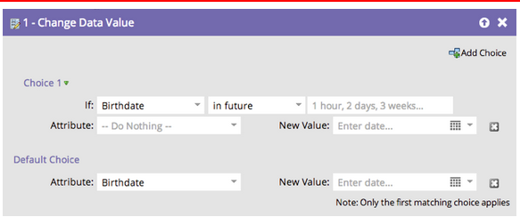

# 发行说明：2014年7月{#release-notes-july}

2014年7月版包含以下功能。 请查看Marketo版以了解功能可用性。 发布后再回来，获取详细功能文档的链接。

## 营销日历{#marketing-calendar}

查看所有事件、电子邮件等内容。 [此新产](/help/marketo/product-docs/core-marketo-concepts/marketing-calendar/understanding-the-calendar/navigating-the-marketing-calendar.md) 品将免费提供给拥有10个或更少Marketo潜在客户管理或对话的用户。

市场营销日历上的文档将在发布时提供。

## 新外观{#new-look-and-feel}

Marketo Lead Management将更新为新潮、新潮的外观，并包含更新的导航。

## 日期运算符{#date-operators}

[高级](/help/marketo/product-docs/core-marketo-concepts/smart-lists-and-static-lists/creating-a-smart-list/smart-list-filter-operators-glossary.md) 过滤器，用于“以前”、“将来”和“以后”。例如，查找在未来3个月中具有出生日期的潜在客户，或在6个月后过期的合同。

## 项目计划视图{#program-schedule-view}

除了管理事件和默认项目的营销日历外，计划中还有一个新的项目视图。

* 一次重新计划所有日期
* 新的试探性约会 — 用铅笔写！
* 自定义条目类型 — ToDo、新闻发布，任何您想要的

## 列表操作在ReST API {#list-operations-in-the-rest-api}中

我们已在ReST中添加了以下与列表操作相关的呼叫。 有关完整文档，请参阅[developers.marketo.com](https://developers.marketo.com/documentation/rest/)。

* 获取列表（按ID）
* 获取多个列表
* 导入到列表
* 获取导入到列表状态

## 快速列表导入{#fast-list-import}

在&#x200B;**速度比**&#x200B;快50倍的情况下，您的文件将放大到Marketo! 旧的“正常”和“针对新Lead优化”导入选项已替换为“默认（快速导入）”。

“跳过新潜在客户和更新”选项保持不变。

## 新改良的Munchkin!{#new-improved-munchkin}

Rollout将于7月中旬开始，并在今后几个月继续进行。

* 删除依赖项jQuery，实现完全兼容和将来兼容
* 与站点上的其他JavaScript更兼容
* 过去一年在许多站点上进行了充分测试！

## RTP:实时个性化活动模板{#rtp-real-time-personalization-campaign-templates}

“RTP集活动”页现在[包含现成模板](/help/marketo/product-docs/web-personalization/using-templates/using-templates-to-create-web-campaigns.md)。 从各种样式中进行选择，包括网络研讨会、案例研究和电子书。

## RTP:JavaScript API增强{#rtp-javascript-api-enhancements}

新的RTP API调用可获得实时访客数据，如组织、行业、位置和段代码匹配。 此外，将鼠标悬停在“区段”页面中的区段名称上方时，将显示显示段代码的工具提示。 有关完整文档，请参阅我们的[开发人员站点](https://developers.marketo.com/documentation/websites/rtp-js-api/)。

## RTP:活动内容编辑器{#rtp-html-support-in-campaign-content-editor}中的HTML5支持

“设置活动”页面中的内容“所见即所得”编辑器现在完全兼容HTML5。 单击编辑器中的“HTML”图标以插入任何HTML5代码。
