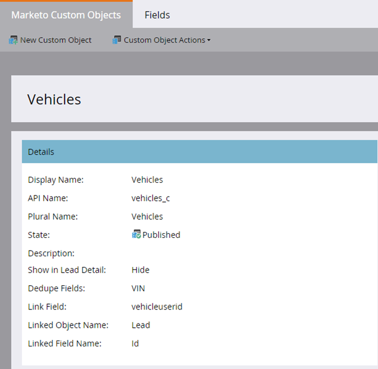

# 发行说明：2015年秋{#release-notes-fall}

’15年秋季版包含以下功能。 请查看Marketo版以了解功能可用性。

## 订阅智能列表{#subscribe-to-a-smart-list}

[订阅智能列表](/help/marketo/product-docs/reporting/basic-reporting/report-subscriptions/subscribe-to-a-smart-list.md)

订阅智能列表可让营销人员导出智能列表，并将其通过电子邮件发送给不使用Marketo的利益相关方，例如销售或电话营销团队。

可以每天、每周或每月计划导出，可以具有结束投放日期，并可以自定义以共享有限数量的列。


可以在智能订阅上创建多个列表。 每个订阅、不同工作区、每个Marketo实例都有10万个潜在客户的100个订阅存在限制。


## Marketo自定义对象{#marketo-custom-objects}

[Marketo自定义对象](/help/marketo/product-docs/administration/marketo-custom-objects/understanding-marketo-custom-objects.md)

从管理员UI轻松创建自定义对象。 目前，我们支持在Marketo中创建1:N自定义对象并将其连接到潜在客户或公司。

>[!NOTE]
>
>Marketo自定义对象不可用于Spark。



## Marketo Insights for Google Chrome {#marketo-insights-for-google-chrome}

[Marketo Insights for Google Chrome](/help/marketo/product-docs/marketo-sales-insight/msi-chrome-plugin/using-marketo-insights-for-google-chrome.md)

我们很高兴地宣布发布Google Mail Sales Insight扩展的更新！ 将其视图到[Chrome Store](https://nation.marketo.com/external-link.jspa?url=https://chrome.google.com/webstore/detail/marketo-insights-for-goog/jjkfbhajlmoeegbjgjipliamplidmbjb)中。

此更新包括许多新增功能和特性：

* 在与潜在客户互动之前，销售人员可以直接在Google Mail中查看有关其客户的相关信息，包括职位、twitter用户档案、公司信息、照片等。
* 销售人员可以实时查看潜在客户在各个渠道中参与的内容，如打开或点击的电子邮件、在线或亲临事件、访问的网页、下载的eBook等。
* 通过Google Mail发送的电子邮件将记录在Marketo中并实时跟踪。 这样，销售人员便可了解潜在客户查看其电子邮件的时间，以便在适当的时间进行跟进。 Marketo Sales Insight for Google Mail还使销售人员能够轻松利用由营销创建的模板来发送美观的邀请、优惠和其他类型的内容。


## Marketo Mobile Engagement — 令牌、发送示例和预览{#marketo-mobile-engagement-tokens-send-sample-preview}

* [令牌](/help/marketo/product-docs/mobile-marketing/push-notifications/configure-mobile-push-notification.md)
* [发送示例](/help/marketo/product-docs/mobile-marketing/push-notifications/send-a-push-notification-sample.md)
* [预览](/help/marketo/product-docs/mobile-marketing/push-notifications/preview-a-push-notification.md)

使用[令牌](/help/marketo/product-docs/mobile-marketing/push-notifications/configure-mobile-push-notification.md)轻松个性化推送通知。


在将[预览](/help/marketo/product-docs/mobile-marketing/push-notifications/preview-a-push-notification.md)或[示例](/help/marketo/product-docs/mobile-marketing/push-notifications/send-a-push-notification-sample.md)推送通知部署到客户之前，您还可以先发出该通知。


## 瞬间{#smart-campaigns-in-moments}中的智能活动

[瞬间智能活动](/help/marketo/product-docs/core-marketo-concepts/mobile-apps/marketo-moments/understanding-moments/understanding-smart-campaign-cards.md)

通过智能活动发送的电子邮件的统计信息现在在瞬间中可用。 此升级的其他功能包括：

* 轻扫至完成。 你的溪里有太多卡？ 你现在可以轻扫他们！
* 直接从预览屏幕发送示例
* 智能列表详细信息已添加到电子邮件项目卡
* 添加了对电子邮件项目“已中止”状态的支持


## RTP — 内容分析和Recommendations {#rtp-content-analytics-and-recommendations}

[内容分](/help/marketo/product-docs/web-personalization/understanding-web-personalization/understanding-content-analytics.md) 析和Recommendations

RTP内容分析显示来自常规Web访问的Web内容资产以及来自RTP内容推荐引擎的访问的性能。

* 了解哪些内容表现最佳并引入了最多的潜在客户
* 通过在RTP的预测内容引擎中启用内容自动向正确的访客推荐最佳内容，提高内容消费
* 深入分析每个内容资产，以查看更多详细量度、图表和性能

RTP的“资产”页面现在拆分为内容分析和内容Recommendations。

* **内容分析：** 显示所有发现和定义的Web内容的视图和直接潜在客户，帮助您分析效果最佳的内容
* **内容Recommendations**:显示来自RTP的推荐内容和关联潜在客户归因的展示次数和点击次数。您还可以编辑并启用此页中针对[bar](/help/marketo/product-docs/predictive-content/enabling-predictive-content/enable-the-content-recommendation-bar.md)和[富媒体](/help/marketo/product-docs/predictive-content/enabling-predictive-content/enable-predictive-content-for-web-rich-media.md)推荐的内容推荐。

* 自年度开始（2015年1月1日）起，这两个页面中的所有直接销售线索数据均已追溯更新。

## RTP — 克隆RTP活动{#rtp-clone-an-rtp-campaign}

[RTP — 克隆RTP活动](/help/marketo/product-docs/web-personalization/working-with-web-campaigns/clone-a-web-campaign.md)

克隆RTP活动可以更快、更高效地创建更个性化的Web活动。 使用RTP的活动页中的克隆功能复制活动设置并更改内容以进行拆分测试优化，或仿制内容相同的活动并将其目标到其他段。 在几秒内创建活动!


## 富文本编辑器改进{#rich-text-editor-improvements}

我们对富文本编辑器进行了几项改进。 在7月发布更新的编辑器后，我们收到了很多反馈，并能够将这些更改用于此升级。 未来几个月还有更多事情要做。 以下是第4季度新增功能的列表:

* HTML代码中现在支持VML:

```
<v:background xmlns:v="urn:schemas-microsoft-com:vml" fill="t">
<v:fill type="tile" src="<a href="https://i.imgur.com/YJOX1PC.png" rel="nofollow">https://i.imgur.com/YJOX1PC.png</a>" color="#7bceeb"/>
</v:background>
```

* 现在，任何内容都可以插入有效的HTML注释中（之前已删除下面所示的某些语法）：

`<!--[if gte mso 9]> <![endif]-->`

* 不用`&nbsp;`填充空表单元格

* 添加到HTML源编辑器的“最大化”/“最小化”按钮
* 现在，已标识并显示预存的表属性，并显示在“表属性”对话框中
* 现在，默认情况下显示两行按钮。
* 编辑器现在将接受任何元素（甚至已弃用或非标准元素）：

`<myCustomElement>Hello World!</myCustomElement>`

* 编辑器现在将接受任何属性（甚至已弃用或非标准属性）：

```
<myCustomElement myCustomAttribute="foo">Hello World!</myCustomElement>
<td background="someImage.png"> 
```

## Microsoft Dynamics — 验证同步{#microsoft-dynamics-validate-sync}

[Microsoft Dynamics — 验证同步](/help/marketo/product-docs/crm-sync/microsoft-dynamics-sync/sync-setup/validate-microsoft-dynamics-sync.md)

此新管理工具运行一系列检查，以查看您的同步配置是否已正确设置。


## 将字段添加到CRM自定义对象同步{#add-fields-to-crm-custom-object-sync}

轻松将新字段添加到从Salesforce和Dynamics同步的自定义对象。 现在，您无需禁用和启用整个自定义对象即可向自定义对象同步添加新字段。

## 对安全功能{#changes-to-security-features}的更改

* 密码尝试次数限制为5。 第五次尝试后，用户将被锁定。
* 现在可以为订阅配置非活动会话超时。


## IE 11支持（并停用对IE 9的支持）{#ie-support-and-deprecating-support-for-ie}

我们现在正式支持Microsoft Internet Explorer 11浏览器，并正在取消对Microsoft Internet Explorer 9浏览器的支持。

## 对MSI {#lightning-ui-support-for-msi}的Lightning UI支持

App Exchange上的最新MSI包可与Salesforce UI的Lightning和Legacy版本一起使用。

## 新的Dynamics插件{#new-dynamics-plug-in}

此新插件以异步模式运行各种操作以帮助提高性能。

## 在Design Studio {#search-by-url-of-landing-page-in-design-studio}中按登陆页的URL搜索

在Design Studio登陆页网格中，您现在可以按页面URL搜索以查找登陆页。 这也是可出口的。
