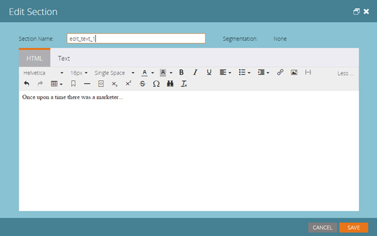

# 发行说明：2015年7月{#release-notes-july}

## Marketo矩{#marketo-moments}

午饭时外出，但需要重新安排一封电子邮件吗？ App Store或Google Play中提供的Marketo Moments应用程序使您能够实时查看电子邮件和事件活动的效果，以及将来通过iPhone、iPad或Android手机的效果。

## 富文本编辑器更新{#rich-text-editor-update}

更新的文本编辑器具有新式的外观，包括简化的文本格式、图像编辑、链接插入和HTML编辑。 HTML编辑器现在具有最小的验证，允许较少的代码编辑限制。
`<iframe width="420" height="315" src="https://www.youtube.com/embed/LmmBN6IQrII" frameborder="0" allowfullscreen></iframe>` 此更新将在7月版本发布后的几天内自动推出。之后，您将能够从&#x200B;**管理>电子邮件>编辑编辑器设置**&#x200B;在编辑器的新版本和旧版本之间切换。 如果您注意到新版文本编辑器存在问题，我们想知道！ 请向[`[email protected]`](https://docs.marketo.com/cdn-cgi/l/email-protection#d0bab3bfbfa0b5a2bdb1be90bdb1a2bbb5a4bffeb3bfbd)发送简短说明。

更新了链接和图像对话框。

切换文本编辑器版本。

## {#email-deliverability-single-sign-on}上的电子邮件可发送性单一登录

单击电子邮件可发送性拼贴后，您不再需要提供登录凭据。

## 活动优先级{#campaign-prioritization}

您是否设置了几个个性化的RTP活动并注意到其中一些可能与其他重叠？ 请继续设置一个优先级，活动的RTP应显示给其他优先级。

## 公司 API {#company-api}

**公司对象通过REST API访问**:REST API现在提供对Marketo公司（又称“帐户”）对象的访问。这意味着您可以读取、更新和删除在Marketo中创建的公司对象，并使用更新的潜在客户API将潜在客户与此类公司关联。

请阅读我们的公司 API参考指南，了解[更多](https://developers.marketo.com/documentation/company-api/)。

## 访问电子邮件发送能力{#access-email-deliverability}

**访问电子邮件发送工具：**此新权限允许管理员向用户授予对“电子邮件发送”工具的访问权限。
