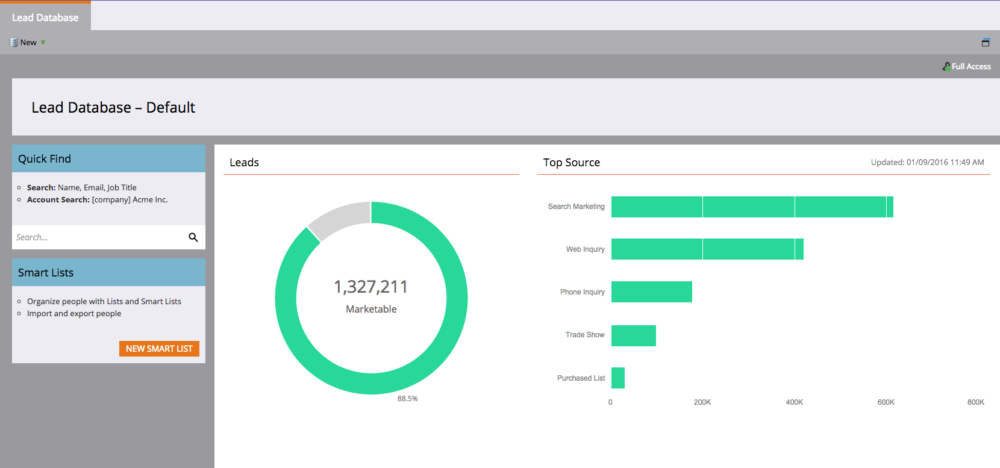

# 发行说明：’16年冬季{#release-notes-winter}

’16冬季版包含以下功能。 请单击标题链接，以视图每种功能的详细文章。

## [是匿名过滤器](/help/marketo/product-docs/administration/additional-integrations/add-munchkin-tracking-code-to-your-website/next-generation-munchkin-tracking-faq.md) {#is-anonymous-filter}

已删除智能列表的匿名过滤器。 有关详细信息，请参阅[下一代Munchkin跟踪常见问题解答](/help/marketo/product-docs/administration/additional-integrations/add-munchkin-tracking-code-to-your-website/next-generation-munchkin-tracking-faq.md)文档。 此更改不会影响Web个性化(RTP),RTP会继续识别匿名和已知的Web访客，并实时个性化内容给这些访客。

## [数据库仪表板](/help/marketo/product-docs/core-marketo-concepts/smart-lists-and-static-lists/managing-people-in-smart-lists/database-dashboard.md)  {#database-dashboard}

潜在客户仪表板库具有更新的摘要，包括人员数据库总大小、可销售潜在客户的数量以及按前五个来源划分的潜在客户。

## [Microsoft Edge Browser](/help/marketo/product-docs/administration/setup-administration/supported-browsers.md) {#microsoft-edge-browser}

我们已将Microsoft Edge添加到Marketo支持的浏览器](https://docs.marketo.com/display/public/DOCS/Supported+Browsers)的[列表中。

## [Microsoft Outlook 2016](/help/marketo/product-docs/marketo-sales-insight/msi-outlook-plugin/install-the-marketo-email-add-in-for-outlook-with-a-registration-code.md) {#microsoft-outlook}

[现在支持](/help/marketo/product-docs/marketo-sales-insight/msi-outlook-plugin/install-the-marketo-email-add-in-for-outlook-with-a-registration-code.md) Microsoft Outlook 2016。

## [电子邮件项目头开始](/help/marketo/product-docs/email-marketing/email-programs/email-program-actions/head-start-for-email-programs.md) {#email-program-head-start}

使用头开始指示应提前处理您的发送。 “主管开始”可确保事先完成这些任务，而不是在预定的项目时间确定潜在客户资格并准备电子邮件。 这样，您的受众将开始在预定时间接收电子邮件。

要使用此功能，电子邮件项目必须至少提前12小时计划，智能列表在发送前12小时被锁定。

>[!NOTE]
>
>此功能将在’16年冬季版发布后的一周内逐步推出。 无法与智能活动或API一起使用。

## [移动营销增强](/help/marketo/product-docs/mobile-marketing/admin/add-a-mobile-app.md) {#mobile-marketing-enhancements}

**PhoneGap支持：我** 们现在为您的移动应用程序优惠PhoneGap支持。[了解更多](https://developers.marketo.com/documentation/mobile/phonegap-plugin/)。

**支持沙箱应用程序**:

## [项目 API](https://developers.marketo.com/documentation/programs/) {#program-api}

通过REST API创建、更新和克隆项目。 这不包括在项目中创建或更新智能列表和智能活动。

## [Microsoft Dynamics增强功能](/help/marketo/product-docs/crm-sync/microsoft-dynamics-sync/microsoft-dynamics-sync-details/sync-status.md) {#microsoft-dynamics-enhancements}

**[同步状态](/help/marketo/product-docs/crm-sync/microsoft-dynamics-sync/microsoft-dynamics-sync-details/sync-status.md)**:监视同步进程的当前吞吐量和积压。按对象插入和更新的计数划分它。

**[通知](/help/marketo/product-docs/core-marketo-concepts/miscellaneous/understanding-notifications/notification-types.md)**:收到常见同步错误的通知，并列表存在该错误的潜在客户。

## [自定义对象增强功能](/help/marketo/product-docs/administration/marketo-custom-objects/create-marketo-custom-objects.md) {#custom-objects-enhancements}

您现在可以使用具有多个链接字段的中间对象在潜在客户/帐户和自定义对象之间创建多对多关系。

## [Facebook主要广告](/help/marketo/product-docs/demand-generation/facebook/set-up-facebook-lead-ads.md) {#facebook-lead-ads}

[Facebook潜在客户](https://www.facebook.com/business/a/lead-ads) 广告是企业在Facebook上运行潜在客户生成活动的更直接的方式。人们会填写表格来表达对产品或服务的兴趣，这样企业就可以跟进。 Marketo与Facebook潜在客户广告的集成可自动捕获潜在客户在潜在客户广告表单中提供的信息。 随后，可以使用新的“填写Facebook潜在客户广告”触发器自动执行跟进操作和通知。

## [Web（实时个性化）活动调度程序](/help/marketo/product-docs/web-personalization/working-with-web-campaigns/schedule-a-web-campaign.md) {#web-real-time-personalization-campaign-scheduler}

计划活动。 为个性化的Web内容设置开始和结束日期，并在特定的日期和时间重复活动。 根据Web计划的时间或选定的时区个性化活动以显示。

