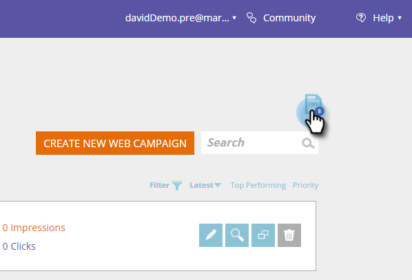

# 发行说明：’17年冬季{#release-notes-winter}

’17冬季版包含以下功能。 查看您的Marketo版本以了解功能可用性。

请单击标题链接，以视图每种功能的详细文章。

>[!NOTE]
>
>如果一个主题有多个子标题，则链接将放在该位置。

## [Facebook自定义受众的高级匹配](/help/marketo/product-docs/demand-generation/ad-network-integrations/add-facebook-custom-audiences-as-a-launchpoint-service.md) {#advanced-matching-for-facebook-custom-audiences}

“基本匹配”仅使用电子邮件地址，但新的“高级匹配”使用另外七个字段，从而提高匹配率以实现更多转换。

## [自定义对象导入API](https://developers.marketo.com/rest-api/lead-database/custom-objects/) {#custom-object-import-api}

此API提供了一个更快的界面，可将自定义对象同步到Marketo。 您可以将CSV、TSV或SSV电子表格文件作为自定义对象导入Marketo。

## [Web个性化活动导出](/help/marketo/product-docs/web-personalization/working-with-web-campaigns/export-web-campaign-data.md) {#web-personalization-campaigns-export}

以CSV格式导出所有Web活动详细信息和分析。 然后，您便可以在便捷的布局中视图数据。

## [本地化](https://docs.marketo.com/display/docs/web+personalization) {#localization}

Web个性化、预测内容和电子邮件洞察应用程序现在提供日语、德语和西班牙语版本。 您[选择您的语言和区域设置](/help/marketo/product-docs/administration/settings/select-your-language-locale-and-time-zone.md)以视图这些语言的内容。

## 基于帐户的营销增强{#account-based-marketing-enhancements}

**[导入指定帐户](/help/marketo/product-docs/account-based-marketing/target/named-accounts/import-named-accounts.md)**

使用“指定帐户导入”选项，通过CSV上传一次创建或更新多个记录。

**[电子邮件洞察支持](/help/marketo/product-docs/reporting/email-insights/filtering-in-email-insights.md)**

在“电子邮件分析”中将指定帐户或帐户列表用作维度。

## 预测内容增强{#predictive-content-enhancements}

**[按启用源筛选](/help/marketo/product-docs/predictive-content/working-with-predictive-content/understanding-predictive-content.md)**

过滤为电子邮件、富媒体或推荐栏启用的预测内容部分。

**[按源筛选分析](/help/marketo/product-docs/predictive-content/working-with-predictive-content/understanding-predictive-content.md)**

过滤特定来源的预测内容分析 — 电子邮件、富媒体或推荐栏。

**[预测内容编辑器](https://docs.marketo.com/display/docs/edit+predictive+content)**

改进的编辑体验和布局可按来源（电子邮件、富媒体或推荐栏）拆分内容准备。

**[用于预测的自动发现内容](/help/marketo/product-docs/predictive-content/getting-started/enable-content-discovery.md)**

图像URL和元数据现在可用于内容自动发现过程。

## [SDK增强](https://developers.marketo.com/mobile/) {#sdk-enhancements}

现在，开发人员可以通过添加新的SDK API调用来额外控制推送通知的投放，该调用允许开发人员删除推送令牌。

## [查看SMS LaunchPoint集成](/help/marketo/product-docs/mobile-marketing/vibes-sms-messages/use-vibes-sms-messages-in-smart-list-triggers-and-filters.md) {#vibes-sms-launchpoint-integration}

使用新的过滤器选项“Member of Vibes 列表”改进您的定位。

## [旧版富文本编辑器和表单编辑器1.0弃用](https://nation.marketo.com/docs/DOC-4315) {#legacy-rich-text-editor-and-form-editor-deprecation}

从2017年8月1日起，仍使用旧版富文本编辑器和表单编辑器1.0的客户将自动转换为新体验。

## [Marketo 活动 API](https://developers.marketo.com/blog/important-change-activity-records-marketo-apis/) {#marketo-activity-apis}

Marketo的活动API即将发生重要变化。 你准备好了吗？
