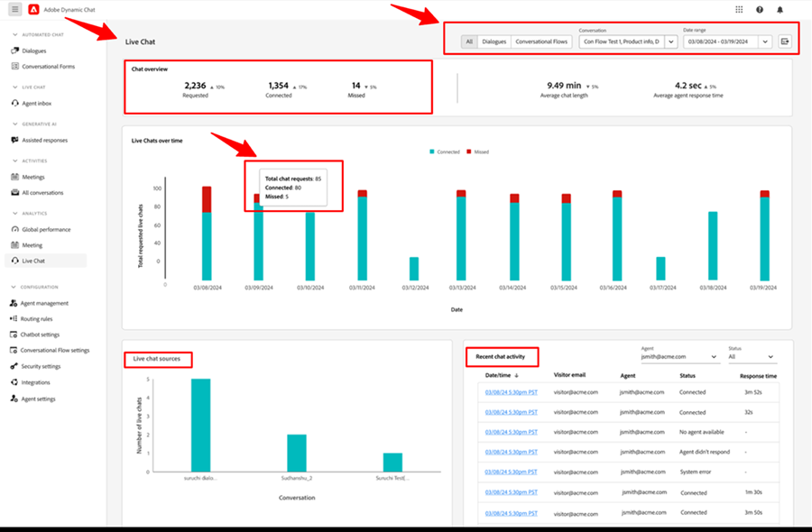

# Dynamic Chat 发行说明 {#dynamic-chat-release}

Adobe Dynamic Chat 发布采用持续交付模式，使功能部署更具可扩展性。有时一个月内会发布多个版本，请定期查看以获取最新信息。

Marketo Engage 的标准发行说明页面[可在此查看](/help/marketo/release-notes/current.md){target="_blank"}。

## 2025 年 6 月版 {#june-2025-release}

**发布日期：2025 年 6 月 30 日**

### 路由逻辑改造 {#routing-logic-revamp}

我们改进了 Dynamic Chat 中的实时聊天路由逻辑，以确保在所有路由类型（帐户、自定义、团队和轮询）中提供更智能且可预测的互动行为。新的逻辑简化了路由流程，并改进了在代理不可用时的回退处理。

#### 路由行为的主要改进

* **每个会话最多尝试两次互动**

   * 系统会尝试连接最多两位代理，但严格遵循主要路由规则。

   * 如果代理可用但未响应（例如拒绝或错过聊天），系统会尝试联系同一组中的另一位代理。

   * 回退逻辑（如轮询）仅在初始规则中找不到合格代理时触发，而不是在互动失败后重试。

* **路由规则特定行为**

##### —帐户路由—

如果访客的电子邮件域映射到已知帐户，系统会始终优先分配给映射的代理。

如果代理可用，聊天将直接路由给该代理。

如果代理不可用，系统将：

* 不尝试其他代理，即使启用了轮询作为回退。

* 而是会：

   * 显示该代理的会议日程表（若已启用）
   * 退回到默认消息（最坏情况）。

仅当帐户路由不适用（无匹配域名或代理）时，才会考虑卡片级路由规则（例如团队、自定义）。

##### —自定义/团队路由—

这些规则可能会返回多个符合条件的代理。

如果首位可用代理未参与，系统将从同一列表中再尝试联系另一位代理。

轮询回退不会仅因某个代理未响应而被触发。

如果两位代理均未参与：

* 系统将显示首次尝试联系的代理日程表（如果已启用），
-或-
* 显示默认回退消息。

##### —轮询路由—

作为主要路由规则使用时，系统会：

* 尝试联系轮询池中首位可用的代理。

* 如果首位代理未响应，系统将重试并联系下一位最合适的可用代理。

如果将轮询作为回退方式使用，则仅在主要规则未匹配到任何代理时才会启用。

##### 访客体验流程

系统会检查帐户路由是否适用。

* 如果适用且有代理可用，则立即建立连接。

* 如果代理不符合条件或不可用，系统将转到卡片级路由规则。

系统会评估卡片级路由规则（自定义、团队、轮询）。

* 系统会检查符合条件的代理是否可用（权限、状态）。

* 系统会联系一位代理，如有需要，再尝试联系同一规则下的第二位代理。

* 如果未能成功联系任何代理，则应用回退逻辑：

   * 显示日程表回退（如果已启用）
-或-
   * 显示默认消息。

轮询回退仅在主要路由规则未找到任何符合条件的代理时才会考虑，而不是在单个代理未响应时触发。

##### 用例

_**帐户路由**_

<table><thead>
  <tr>
    <th>类型</th>
    <th>示例</th>
    <th>结果</th>
  </tr></thead>
<tbody>
  <tr>
    <td>理想情况</td>
    <td>访客的域名映射到帐户；映射的代理已启用实时聊天并且可用</td>
    <td>聊天会直接连接到映射的代理</td>
  </tr>
  <tr>
    <td>回退（轮询）</td>
    <td>映射的代理不可用，启用轮询回退</td>
    <td>系统通过轮询选择一名可用代理并与其建立联系 </td>
  </tr>
  <tr>
    <td>无回退代理</td>
    <td>映射的代理不可用，未启用轮询回退；已启用会议预约</td>
    <td>系统会显示映射代理的日程表或展示默认回退消息</td>
  </tr>
</tbody></table>

_**自定义路由**_

<table><thead>
  <tr>
    <th>类型</th>
    <th>示例</th>
    <th>结果</th>
  </tr></thead>
<tbody>
  <tr>
    <td>理想情况</td>
    <td>自定义逻辑会解析一个代理列表；第一个代理可用并接受聊天。</td>
    <td>聊天会连接到第一位代理。</td>
  </tr>
  <tr>
    <td>回退（轮询）</td>
    <td>自定义规则未解析到任何代理，已启用轮询回退。</td>
    <td>系统通过轮询选择一名可用代理并与其建立联系。</td>
  </tr>
  <tr>
    <td>无回退代理</td>
    <td>解析到两名代理，但均未接受聊天，回退设置为会议日程表。</td>
    <td>显示第一个尝试的代理的日程表，或者显示默认回退消息。</td>
  </tr>
</tbody></table>

_**团队路由**_

<table><thead>
  <tr>
    <th>类型</th>
    <th>示例</th>
    <th>结果</th>
  </tr></thead>
<tbody>
  <tr>
    <td>理想情况</td>
    <td>团队包含已启用实时聊天的代理；首位可用代理接受聊天。</td>
    <td>聊天会连接到该代理。</td>
  </tr>
  <tr>
    <td>回退（轮询）</td>
    <td>团队中无可用代理，且已启用轮询回退。</td>
    <td>系统从轮询池中选择并连接一名代理。</td>
  </tr>
  <tr>
    <td>无回退代理</td>
    <td>有两名代理可用，但均未响应；已启用日程表回退。</td>
    <td>显示首位尝试代理的日程表或触发回退消息。</td>
  </tr>
</tbody></table>

_**轮询路由**_

<table><thead>
  <tr>
    <th>类型</th>
    <th>示例</th>
    <th>结果</th>
  </tr></thead>
<tbody>
  <tr>
    <td>理想情况</td>
    <td>轮询池中有多个代理；如果第一个代理不接受聊天，第二个代理会接受。</td>
    <td>聊天会连接到第二位代理。</td>
  </tr>
  <tr>
    <td>回退（轮询）</td>
    <td>轮询池中无可用代理；已启用会议日程表。</td>
    <td>显示列表中第一个代理的日程表（若已配置），或者显示回退消息。</td>
  </tr>
  <tr>
    <td>无回退代理</td>
    <td>无可用代理；回退已禁用。</td>
    <td>向访客显示静态回退消息。</td>
  </tr>
</tbody></table>

### Pulse 通知 {#pulse-notification}

当访客请求与代理连接时，我们会向代理提供应用程序内和浏览器通知。但有时代理会错过这些聊天请求。

本版本中，当有新访客想要聊天时，在线代理可以收到电子邮件、Slack、应用程序内及浏览器通知。

1. 在 Adobe Experience Cloud 首页，单击帐户图标并选择&#x200B;**首选项**。

   

1. 向下滚动至&#x200B;_通知_，并选择所需的 Dynamic Chat 通知选项。

   

>[!NOTE]
>
>Pulse 通知的内容可与应用程序内及浏览器通知的内容一致。

## 2025 年 4/5 月版本 {#apr-may-25-release}

### 消息通知声音 {#message-notification-sound}

现在，您可以选择在会话中每次触发聊天机器人时为访客启用提示音，并可从多种声音中进行选择。

### 在移动端启用 Poke 消息 {#enable-poke-messages-on-mobile}

“Poke” 会在聊天图标旁显示开场问题，访客无需点击即可查看，现在可为使用移动设备的访客启用该选项。

### 默认回退更新 {#default-fallback-update}

对于任何作为实时聊天卡片的自定义规则/团队——如果没有可用代理（或聊天无法连接），系统将回退至轮询以寻找可用代理（不论在流中使用了哪种路由逻辑/规则，只要当时可用即可）。

### Demandbase 集成 {#demandbase-integration}

Demandbase 用户可在 Dynamic Chat 中使用 Demandbase 人员属性进行对话定向、条件化品牌展示及自定义路由。

## 2024 年 9/10 月版本 {#sep-oct-release}

### 增强的实时聊天分析 {#enhanced-live-chat-analytics}

Analytics 功能板进行了多项增强，包括：

* 实时聊天请求总数：请求“与代理聊天”的访客数量

* 实时聊天连接总数：已连接的访客数量与请求“与代理聊天”的总数对比

* 错过的实时聊天请求总数：未接待访客数量与请求“与代理聊天”的总数对比

* 平均聊天时长（分钟）：分析访客与代理之间的“平均聊天时长”

* 平均代理响应时间（秒）：分析代理响应实时聊天问答所需的“平均时间”

* 每日仪表板：查看成功连接的实时聊天请求、错过的聊天请求，并对近期的实时聊天活动进行排序和筛选

### 对话评分 {#conversation-scoring}

根据聊天互动的质量为潜在客户打分，并将该量度用作 Marketo Engage 智能活动中的触发器/过滤器。在以下活动中使用新的&#x200B;_对话评分_&#x200B;属性：

* 参与了对话
* 参与了会话流
* 与代理互动

**注意事项：**

* 评分值范围为 0、1、2、3（默认值为空）。

* 当对话完成或中断后，评分值将无法编辑。

* 设置评分：

   * 在代理收件箱中 – 实时聊天过程中，代理可以更新或设置该对话的评分，评分将存储在对话活动中。

   * 在流设计器中 – 在目标卡片中，用户可以更新或设置该对话的评分。

### 新潜在客户创建逻辑 {#new-lead-creation-logic}

如果某个潜在客户在表单中填写了电子邮件 `abc@test.com`，并且其 Cookie 标识为 xyz，随后再次填写相同的表单但使用电子邮件 `def@test.com`，则会创建一个新的人员记录，但 Cookie xyz 会关联到新的人员，并从人员 `abc@test.com` 中移除。

因此，当一个带有 Cookie abc 的访客访问页面并提供电子邮件地址 `abc@test.com` 时：

<table><thead>
  <tr>
    <th>访客</th>
    <th>Cookie</th>
    <th>提供的电子邮件</th>
    <th>预期行为</th>
  </tr></thead>
<tbody>
  <tr>
    <td>匿名</td>
    <td>abc</td>
    <td>数据库中不存在</td>
    <td>创建新的人员</td>
  </tr>
  <tr>
    <td>匿名</td>
    <td>abc</td>
    <td>数据库中已存在</td>
    <td>合并人员</td>
  </tr>
  <tr>
    <td>匿名</td>
    <td>xyz</td>
    <td>数据库中已存在</td>
    <td>合并人员</td>
  </tr>
  <tr>
    <td>已知人员</td>
    <td>abc</td>
    <td>与现有人员相同</td>
    <td>更新人员</td>
  </tr>
  <tr>
    <td>已知人员</td>
    <td>abc</td>
    <td>与现有人员不同</td>
    <td>如果已存在已知人员，则转移 Cookie 并解析该人员的轮廓。如果没有与该电子邮件对应的人员，则创建新的人员记录并转移 Cookie。</td>
  </tr>
  <tr>
    <td>已知人员</td>
    <td>xyz</td>
    <td>与现有人员相同</td>
    <td>将新的 Cookie 添加到同一人员</td>
  </tr>
  <tr>
    <td>已知人员</td>
    <td>xyz</td>
    <td>与现有人员不同</td>
    <td>此场景不可行，因为如果是新的 Cookie，则默认会被视为新的匿名轮廓</td>
  </tr>
</tbody></table>

### 继承字体选项 {#option-to-inherit-font}

您现在可以启用聊天机器人直接继承其所在网页的字体，而无需在 Dynamic Chat 中管理品牌字体。启用此选项后，聊天机器人将使用页面 `<body>` 标记中定义的字体。

### Demandbase 与 Dynamic Chat 集成 {#demandbase-integration-with-dynamic-chat}

Demandbase 用户可以使用自己的 Demandbase 许可并启用该集成。可使用 Demandbase 人员属性进行对话定向、条件化品牌展示以及自定义路由。

这些属性值将实时解析到对应的人员，并存储在其个人轮廓中。

### 优化的会话流加载时间 {#optimized-conversation-flow-load-time}

为提升用户体验，现在在加载会话流时会显示闪动加载动画，而不是空白区域。

**之前**

**之后**

## 2024 年 8 月版 {#august-release}

**发行日期：2024 年 8 月 23 日**

### 自定义对话消息格式 {#custom-format-conversation-messages}

流设计器现在支持[插入 HTML](/help/marketo/product-docs/demand-generation/dynamic-chat/automated-chat/stream-designer.md#create-a-stream){target="_blank"}，以自定义对话的外观和风格。

### 聊天机器人滚动到底部 {#chatbot-scroll-to-bottom}

聊天机器人中新增了一个图标，方便 web 访客一键跳转到最后一条消息。这有助于访客在浏览长消息时快速返回对话内容。

### 核心 Pulse 通知 {#core-pulse-notifications}

当会议预约或实时聊天失败时，用户现在会收到[电子邮件通知](/help/marketo/product-docs/demand-generation/dynamic-chat/live-chat/live-chat-overview.md#failed-action-notifications){target="_blank"}。

### 支持多会话 {#support-for-multiple-conversations}

聊天机器人现在支持多个会话。网站访客可以同时在不同页面参与不同对话，并可在它们之间切换。

### 内容默认排序 {#default-sorting-for-content}

默认情况下，对话记录、未答问题和问题生成表将按创建日期排序（从最新到最早）。

### 实时潜在客户识别 {#real-time-lead-resolution}

当与匿名潜在客户对话并提供电子邮件 ID 时，系统会实时判断该邮箱 ID 是否对应已知潜在客户，并使用该记录进行个性化。如果发现多个记录，会实时合并。此行为适用于对话模式和会话流。

### 从 Marketo Engage 同步无 Cookie 的潜在客户 {#syncing-leads-without-cookies}

此前，启用 Marketo Engage 同步时，Dynamic Chat 仅会同步具有一个或多个 Marketo Engage Cookie ID 的已知潜在客户。现在，所有已知潜在客户（无论是否有 Cookie ID）都会同步到 Dynamic Chat，并可用于对话个性化。

### 向会话流传递额外访客数据 {#pass-additional-visitor-data}

如果您通过表单或登录等其他渠道采集访客信息，现在可以将这些信息直接传递给 Dynamic Chat。

### 推断数据更新 {#refreshed-inferred-data}

网站上的大部分对话发生在匿名访客之间。您仍可通过基于访客 IP 的推断数据来定向他们。我们更新了 IP 数据库及相关推断数据，现在可支持的 IP 数量增加了四倍。

### 为代理浏览器通知添加声音提示 {#sound-added-to-agent-browser-notification}

当实时聊天分配给代理时，会向其发送浏览器通知。但有时代理会错过这些通知。我们新增了[通知提示音](/help/marketo/product-docs/demand-generation/dynamic-chat/live-chat/live-chat-overview.md#when-a-live-chat-is-routed-to-an-agent){target="_blank"}，以帮助减少未来错过通知的情况。

### 实时聊天中更新潜在客户轮廓的能力 {#update-lead-profile-during-live-chat}

在实时聊天过程中，代理可以采集访客信息并更新相应的客户轮廓。现在新增了更新潜在客户和公司对象属性值的选项。

## 2024 年 6 月版 {#june-release}

**发布日期：2024 年 6 月 6 日**

### 会话流卡片 {#conversational-flow-card}

通过使用会话流卡片，您可以简化会话流中的多个步骤。

示例：如果您的目标是通过多个对话推动网络研讨会注册，过去您需要在每个具有该目标的对话中重复创建相同流程。并且如果需要更新任何细节，则必须逐一编辑每个对话。现在借助会话流卡片，您无需再如此繁琐。

除了可以在多个对话中复用流程外，您还可以使用相同的转化流程通过其他渠道触发，例如表单和登录页面。

### 使用限制 {#usage-limits}

“使用限制”页面会显示重要信息，例如套餐详情和当前的使用限制状态。

## 2024 年 5 月版 {#may-release}

**发行日期：2024 年 5 月 15 日**

### 预批准响应库 {#pre-approved-response-library}

[创建一个经过市场团队批准的库](/help/marketo/product-docs/demand-generation/dynamic-chat/generative-ai/response-library.md){target="_blank"}，用于存储 AI 生成的问题与答案，从而在数分钟内完成生成式 AI 聊天的设置。

### 未回答的问题 {#unanswered-questions}

[利用未回答问题库](/help/marketo/product-docs/demand-generation/dynamic-chat/generative-ai/unanswered-questions.md){target="_blank"}（源自先前的对话）生成新的预批准响应，从而保持响应库内容为最新信息。

### 对话摘要 {#conversation-summaries}

[为销售代理提供对话摘要](/help/marketo/product-docs/demand-generation/dynamic-chat/live-chat/agent-inbox.md#conversation-summary){target="_blank"}，其中包含会议前的关键讨论主题洞察，以缩短准备时间并让销售代理获得最新信息。

### 生成式 AI 销售快捷方式 {#genai-sales-shortcuts}

[为实时聊天代理提供更快捷的方式](/help/marketo/product-docs/demand-generation/dynamic-chat/live-chat/agent-inbox.md#shortcuts){target="_blank"}来访问 AI 生成的响应、编辑现有响应，并在对话期间搜索额外内容发送给买家。

### 对话辅助 {#conversation-assist}

使用市场团队预先批准的响应，帮助销售代理在实时对话中准确回复。

### 对话提示 {#conversation-nudges}

通过号召性用语提示 web 访客，推动对话走向结束。

## 2024 年 4 月版 {#april-release}

**发行日期：2024 年 4 月 23 日**

### 会话流现已向所有用户开放 {#conversational-flows-available-to-all-users}

使用对话表单让您的表单和登录页面更加互动化，并在表单提交后立即允许符合条件的潜在客户预约会议或与销售聊天，从而缩短销售漏斗。该功能现已全面&#42;向所有 Dynamic Chat 用户开放。

_&#42;此前作为试用功能提供，限 100 次存留期互动。会话流互动现在将计入 Select 套餐用户每月 250 次互动会话的限制中。_

### 回调函数 {#callback-functions}

[回调函数](/help/marketo/product-docs/demand-generation/dynamic-chat/setup-and-configuration/callback-functions.md){target="_blank"}允许您在访客与 Dynamic Chat 对话时，将 Dynamic Chat 分析事件收集到外部系统，例如 Adobe Analytics 或 Google Analytics。您可以通过在 API 中注册回调来启用 Dynamic Chat 分析事件，以监听这些事件。这样，您就可以在结合其他关键数据（如网站流量）的情况下，更全面地了解 Dynamic Chat 的互动表现。

### 在条件分支中新增实时代理可用性条件 {#live-agent-availability-conditional-branching}

除了原生和自定义的 Marketo Engage 字段外，您现在还可以根据代理可用性使用条件分支创建分支路径。如果您只希望在有实时代理可用时才向访客提供与其交谈的选项，这一功能非常实用。

### 在条件分支中新增智能列表条件 {#smart-list-condition}

通过在条件分支中新增 Marketo Engage 智能列表条件，您可以基于已在 Marketo Engage 中创建的现有受众来建立分支，而无需在 Dynamic Chat 中重新定义受众分支条件。

### 会话流的条件分支 {#conditional-branching-for-conversational-flows}

我们今年早些时候为对话模式推出了条件分支功能，现在您也可以在会话流中使用条件分支！条件分支允许您根据不同条件在流程中创建分支路径。

### 会话流的实时聊天功能 {#live-chat-for-conversational-flows}

我们在 2023 年为对话模式推出了实时聊天功能，现在您也可以将实时聊天互动添加到会话流中。如果您将会话流与 Marketo Engage 表单结合使用，现在可以在表单提交后立即允许符合条件的访客与实时代理进行聊天！

### 代理收件箱中的最新 Marketo Engage 活动 {#recent-marketo-engage-activities-in-agent-inbox}

我们在代理收件箱的“最新活动”部分中新增了最新的 Marketo Engage 活动，因此当访客请求与代理聊天时，代理可以快速查看该访客最近是否参与了以下任何 Marketo Engage 活动（最近 25 条活动）：

* 打开了电子邮件
* 访问过的网页
* 填写了表单
* 具有重要时刻

### 代理管理中的日程表连接状态 {#calendar-connection-status-in-agent-management}

管理员现在可以轻松查看哪些拥有会议预约权限的代理已在 Dynamic Chat 中连接了他们的日程表。这样您就可以确保整个销售团队已连接并准备好接收来自 Dynamic Chat 的会议请求。

### 代理日程表配置中的最短提前通知设置 {#minimum-notice-setting-in-agent-calendar-configuration}

有用户反映，web 访客在预约会议时的提前通知时间最短仅为 10 分钟，因此我们在代理日程表配置中引入了最短提前通知设置，并将默认提前时间设置为 24 小时。

### 新增/移除用户行为已更新 {#add-remove-user-behavior-updated}

有用户表示在 Dynamic Chat 中添加和移除代理时遇到问题，因此我们对此功能进行了改进。

当用户在 Admin Console 中被授予实时聊天或会议预约权限时，他们会立即出现在代理管理列表中，并可被添加到对话、会话流、路由规则和团队中。

当具有会议预约或实时聊天权限的用户从 Admin Console 中移除时，他们会立即从 Dynamic Chat 中删除，不再参与实时聊天或会议路由，并且不再计入许可证数量限制。

### 会话级报告性能提升 {#improved-conversation-level-report-performance}

单个对话和会话流级别的报告现在性能更高、准确性更强。以前，对话报告可能需要几秒钟才能加载，并且数据有时与全局性能报告不一致。现在，您的单个对话报告几乎瞬间加载，且数据将始终与全局报告数据保持一致。

### 权限更新 {#permission-updates}

我们优化了 Adobe Admin Console 中的权限结构和命名，使权限管理更加直观。

* “会话管理”类别现更名为“会话”
* “会议”类别现更名为“活动”
* “代理设置”类别现更名为“代理”
* “管理设置”类别现更名为“配置”
* “实时聊天”类别已移除，所有实时聊天权限均移至“代理”类别

### 代理收件箱支持超链接 {#support-for-hyperlinks-in-agent-inbox}

现在，当实时聊天代理在对话中与访客分享 URL 时，这些 URL 将自动转换为超链接，访客可以直接点击访问页面，而无需复制并粘贴到浏览器中。

### 代理收件箱中的回车键行为更新 {#enter-key-behavior-updated-in-agent-inbox}

我们更改了代理收件箱中的回车键行为，现在按 Return 或 Enter 键将发送消息，而按 Shift+Enter 键将创建换行。

### 轮询页面已移除 {#round-robin-page-removed}

请放心！轮询路由功能仍然可用，并且与以往一样运行。我们只是移除了显示轮询路由队列中代理列表及其顺序的页面，因为该页面经常不准确。

在 2022 年发布 Dynamic Chat 时，我们尚未支持实时聊天，仅支持会议预约，因此轮询路由页面的设计仅针对会议预约。随着去年引入实时聊天功能，该页面已无法准确反映同时拥有会议预约和实时聊天权限的代理间更复杂的轮询逻辑。我们曾探索过几种替代方案，但最终决定彻底移除该页面以最大程度减少混淆。

## 2024 年 2 月版 {#february-release}

**发行日期：2024 年 2 月 22 日**

### 对话页面 {#conversations-page}

全新的“对话”页面为您提供统一视图，可查看实例中发生的所有对话（自动化和实时）的记录，无论是已知还是匿名潜在客户，让您更好地洞察客户与您的对话、会话流以及实时代理的互动情况。

### 全局仪表板日期范围从 90 天扩展至 24 个月 {#date-range-in-global-dashboard}

根据您的反馈，我们进行了改进。现在，您可以在所有 Analytics 功能板中查看长达两年的 Dynamic Chat 互动数据。

### 对话中的条件分支 {#conditional-branching-in-dialogues}

条件分支允许您根据不同条件在会话流中创建分支。现在，您可以基于 Marketo Engage 中的潜在客户和公司属性，在同一对话中向不同对象呈现不同的内容。

## 2024 年 1 月版 {#january-release}

**发行日期：2024 年 1 月 24 日**

### 代理管理中的并发实时聊天限制设置 {#Concurrent-live-chat-limit-setting}

默认情况下，实例中的每位实时聊天代理可同时进行最多 5 场实时聊天。我们在代理管理中引入了一个新设置，允许您将此限制调整为 1 至 10。

