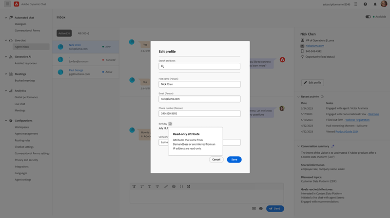

# Dynamic Chat 发行说明 {#dynamic-chat-release}

Adobe Dynamic Chat版本在持续交付模型上运行，通过该模型可采用更具可扩展性的方法来部署功能。 有时，一个月内会发布多个版本，因此请定期查看以获取最新信息。

可以在此处[&#128279;](/help/marketo/release-notes/current.md){target="_blank"}找到Marketo Engage 的标准发行说明页面。

## 2025年4/5月版 {#apr-may-25-release}

### 消息通知声音 {#message-notification-sound}

现在，您可以选择每次在会话中触发聊天机器人时都为访客启用声音。 有多种声音可供选择。

### 在移动设备上启用Poke消息 {#enable-poke-messages-on-mobile}

现在，“探查”为使用移动设备的访客提供了一个选项，该选项会在聊天图标旁边显示开始的问题，访客无需单击该图标即可查看问题。

### 默认回退更新 {#default-fallback-update}

对于作为实时聊天卡的任何自定义规则/团队 — 如果没有可用的座席（或聊天无法连接），它将回退到可用座席的循环配置资源（所有当时可用的座席，无论将哪个路由逻辑/规则放入流中）。

### Demandbase集成 {#demandbase-integration}

Demandbase用户可以使用Demandbase人员属性在Dynamic Chat中进行对话框定位、条件品牌推广和自定义路由。

## 2024年9/10月版 {#sep-oct-release}

### 增强实时聊天分析 {#enhanced-live-chat-analytics}

对Analytics功能板进行了一些增强，包括：

* 请求的实时聊天总数：“与代理聊天”请求的访客数

* 已连接的实时聊天总数：已连接的访客数与“与代理聊天”请求的总数

* 错过的实时聊天请求总数：无人参与的访客数与“与座席聊天”请求的总数

* 以分钟为单位的平均聊天时长：分析访客与代理之间的“平均聊天时长”

* 平均座席响应时间（以秒为单位）：分析座席响应其实时聊天问答的“平均所用时间”

* 每日仪表板：实时聊天请求连接成功，实时聊天请求丢失，排序和筛选最近的实时聊天活动

### 对话得分 {#conversation-scoring}

根据潜在客户聊天交互的质量对其量化并将该量度用作Marketo Engage智能营销活动中的触发器/过滤器。 在下列活动中使用新属性&#x200B;_对话分数_：

* 参与对话
* 已参与会话流
* 与代理接洽

**注意事项：**

* 得分值将介于0、1、2、3之间（默认值为null）

* 完成或删除对话后，无法编辑评分值

* 设置得分：

   * 在代理收件箱中 — 在实时聊天期间，代理能够更新或设置对话的分数，该分数存储在对话活动中

   * 在流设计器中 — 在目标卡片中，用户能够更新或设置对话的分数

### 新的潜在客户创建逻辑 {#new-lead-creation-logic}

如果潜在客户使用电子邮件`abc@test.com`填写表单并作为xyz进行Cookie，然后使用电子邮件`def@test.com`填写同一表单，则会创建新的人员记录，但Cookie xyz会与新人员关联并从人员`abc@test.com`中删除。

因此，当具有Cookie abc的访客登陆页面并提供电子邮件ID为`abc@test.com`时：

<table><thead>
  <tr>
    <th>访客</th>
    <th>Cookie</th>
    <th>已提供电子邮件</th>
    <th>预期行为</th>
  </tr></thead>
<tbody>
  <tr>
    <td>匿名</td>
    <td>abc</td>
    <td>数据库中不存在</td>
    <td>创建新人员</td>
  </tr>
  <tr>
    <td>匿名</td>
    <td>abc</td>
    <td>存在于数据库中</td>
    <td>合并人员</td>
  </tr>
  <tr>
    <td>匿名</td>
    <td>xyz</td>
    <td>存在于数据库中</td>
    <td>合并人员</td>
  </tr>
  <tr>
    <td>已知人员</td>
    <td>abc</td>
    <td>与现有人员相同</td>
    <td>更新人员</td>
  </tr>
  <tr>
    <td>已知人员</td>
    <td>abc</td>
    <td>与现有人员不同</td>
    <td>如果已经存在已知人员，请转移Cookie并解析该配置文件。 如果此电子邮件中不存在任何人员，请创建新的人员记录并转移Cookie</td>
  </tr>
  <tr>
    <td>已知人员</td>
    <td>xyz</td>
    <td>与现有人员相同</td>
    <td>向同一用户添加新Cookie</td>
  </tr>
  <tr>
    <td>已知人员</td>
    <td>xyz</td>
    <td>与现有人员不同</td>
    <td>这种情况不可能发生，就好像它是新Cookie，创建者：   默认视为新的匿名配置文件</td>
  </tr>
</tbody></table>

### 用于继承字体的选项 {#option-to-inherit-font}

您现在可以启用聊天机器人直接从托管该聊天机器人的网页中继承字体，而不是在Dynamic Chat中管理品牌字体。 启用此选项后，聊天机器人将采用在页面的`<body>`标记上定义的字体。

### Demandbase与Dynamic Chat集成 {#demandbase-integration-with-dynamic-chat}

Demandbase用户能够自带Demandbase许可证并激活集成。 使用Demandbase人员属性进行对话框定位、条件品牌推广和自定义路由。

针对人员的这些属性值的解析将实时完成，并存储在相应的人员配置文件中。

### 优化会话流加载时间 {#optimized-conversation-flow-load-time}

为了改善用户体验，在加载对话流时，现在会显示闪烁的加载器，而不是空格。

**早于**

**After**

## 2024 年 8 月版 {#august-release}

**发行日期： 2024年8月23日**

### 自定义对话消息的格式 {#custom-format-conversation-messages}

流设计器现在支持[插入HTML](/help/marketo/product-docs/demand-generation/dynamic-chat/automated-chat/stream-designer.md#create-a-stream){target="_blank"}以自定义对话的外观。

### 聊天机器人滚动到底部 {#chatbot-scroll-to-bottom}

聊天机器人中添加了一个图标，以便Web访客直接跳转到最后一条消息。 这有助于访客滚动浏览文本以快速返回对话。

### Core pulse通知 {#core-pulse-notifications}

现在，当会议预订或实时聊天失败时，用户会收到[电子邮件通知](/help/marketo/product-docs/demand-generation/dynamic-chat/live-chat/live-chat-overview.md#failed-action-notifications){target="_blank"}。

### 支持多个对话 {#support-for-multiple-conversations}

聊天机器人现在支持多个对话。 网站访客可以同时参与不同页面上的不同对话，并能够在这些对话之间进行切换。

### 内容的默认排序 {#default-sorting-for-content}

默认情况下，对话日志、未回答的问题和问题生成表按创建日期（从最近到最早）排序。

### 实时商机解决方案 {#real-time-lead-resolution}

在与匿名潜在客户进行对话并提供电子邮件ID期间，我们将解决是否存在具有该电子邮件ID的已知潜在客户记录，并使用该记录实时进行个性化。 如果我们找到多个记录，我们会实时合并它们。 此行为对对话框和对话流均实施。

### 从Marketo Engage同步不带Cookie的潜在客户 {#syncing-leads-without-cookies}

以前，在激活Marketo Engage同步时，Dynamic Chat仅将已知商机与Marketo Engage中的一个或多个Cookie ID同步。 现在，所有已知的潜在客户（无论是否存在Cookie ID）都将同步到Dynamic Chat中，并可用于个性化对话。

### 将其他访客数据传递到对话流 {#pass-additional-visitor-data}

如果您通过表单或登录等其他渠道捕获访客信息，则现在可以直接将此信息传递到Dynamic Chat。

### 已刷新推断的数据 {#refreshed-inferred-data}

网站上的大多数对话都是与匿名访客进行的。 您仍然可以通过推断的数据来定位他们，这依赖于访客IP。 我们更新了IP和相应推断数据的数据库，现在支持的IP是以前的4倍。

### 添加到代理浏览器通知的声音 {#sound-added-to-agent-browser-notification}

当实时聊天分配给座席时，座席将收到浏览器通知。 但他们偶尔会看不到他们。 我们添加了一个[通知声音](/help/marketo/product-docs/demand-generation/dynamic-chat/live-chat/live-chat-overview.md#when-a-live-chat-is-routed-to-an-agent){target="_blank"}，以帮助防止以后错过通知。

### 能够在实时聊天期间更新潜在客户配置文件 {#update-lead-profile-during-live-chat}

在实时聊天期间，代理希望捕获有关访客的信息并更新各自的配置文件。 现在提供了更新潜在客户和公司对象的属性值的选项。

## 2024 年 6 月版 {#june-release}

**发行日期： 2024年6月6日**

### 对话流卡 {#conversational-flow-card}

利用对话流卡简化对话框中流中的多个步骤。

示例：如果您的目标是通过多个对话框推动网络研讨会的注册，则必须在所有具有该目标的对话框中重新创建相同的流程。 如果您必须更新任何详细信息，则必须逐个编辑每个对话框。 现在情况已发生了变化，这要归功于“对话流”卡。

除了跨多个对话框重新调整流用途之外，您还可以使用相同的过渡流触发其他渠道，如表单和登陆页面。

### 使用限制 {#usage-limits}

“使用限制”页面会显示重要信息，例如包详细信息和使用限制状态。

## 2024 年 5 月版 {#may-release}

**发行日期： 2024年5月15日**

### 预批准的响应库 {#pre-approved-response-library}

[创建营销批准的库](/help/marketo/product-docs/demand-generation/dynamic-chat/generative-ai/response-library.md){target="_blank"} AI生成的问题和答案，以帮助在几分钟内设置创作AI聊天。

### 未解答的问题 {#unanswered-questions}

[使用以前对话中未回答问题的存储库](/help/marketo/product-docs/demand-generation/dynamic-chat/generative-ai/unanswered-questions.md){target="_blank"}生成新的预批准响应，并维护包含最新信息的响应库。

### 对话摘要 {#conversation-summaries}

[为销售代理提供总结的对话](/help/marketo/product-docs/demand-generation/dynamic-chat/live-chat/agent-inbox.md#conversation-summary){target="_blank"}，包括会议前对关键讨论主题的深入分析，以缩短准备时间，更好地为销售代理提供最新信息。

### GenAI销售快捷方式 {#genai-sales-shortcuts}

[以更快的方式提供实时聊天代理](/help/marketo/product-docs/demand-generation/dynamic-chat/live-chat/agent-inbox.md#shortcuts){target="_blank"}以访问AI生成的响应、编辑现有生成的响应并搜索要在对话期间发送给购买者的其他内容。

### 对话助手 {#conversation-assist}

使用您的营销团队预批准的响应，帮助销售代理在实时对话中做出准确响应。

### 对话轻推 {#conversation-nudges}

通过call-to-action轻推网络访客，推动对话结束。

## 2024 年 4 月版 {#april-release}

**发行日期： 2024年4月23日**

### 对话流现在可供所有用户使用 {#conversational-flows-available-to-all-users}

允许符合条件的潜在客户在提交表单后立即通过Conversational Forms预约会议或与销售人员聊天，从而使您的表单和登陆页面更具对话性并缩短销售漏斗。目前，所有Dynamic Chat用户均可完全使用&#42;。

_&#42;以前作为试用功能提供，有100个生命周期参与。 会话流参与现在将计入Select包上用户250次参与会话的每月限制。_

### 回调函数 {#callback-functions}

[回调函数](/help/marketo/product-docs/demand-generation/dynamic-chat/setup-and-configuration/callback-functions.md){target="_blank"}允许您在访客参与Dynamic Chat对话时，收集Adobe Analytics或Google Analytics等外部系统中的Dynamic Chat Analytics事件。 要启用Dynamic Chat Analytics事件，需要在API中注册回调以侦听事件。 这样，您就可以更全面地了解Dynamic Chat参与情况，因为它与其他关键数据（如Web流量）相关。

### 向条件分支添加了实时代理可用性条件 {#live-agent-availability-conditional-branching}

除了本机字段和自定义Marketo Engage字段之外，您现在还可以使用条件分支根据代理可用性创建分支。 如果您只想为访客提供在有实时代理可用时与实时代理通话的选项，则此功能非常有用。

### 智能列表条件已添加到条件分支 {#smart-list-condition}

通过在条件分支中添加新的Marketo Engage智能列表条件，您可以根据已在Marketo Engage中创建的预先存在的受众创建分支，而不是在Dynamic Chat中定义受众分支条件。

### 对话流的条件分支 {#conditional-branching-for-conversational-flows}

今年早些时候，我们发布了对话的条件分支，现在您还可以利用对话流中的条件分支！ 条件分支允许您根据不同的条件在流中创建分支。

### 对话流的实时聊天 {#live-chat-for-conversational-flows}

我们在2023年发布了对话的实时聊天功能，现在您还可以将实时聊天参与添加到对话流程中。 如果您在Marketo Engage表单中使用对话流程，您现在可以允许符合条件的访客在提交表单后立即与实时代理聊天！

### 代理收件箱中最近的Marketo Engage活动 {#recent-marketo-engage-activities-in-agent-inbox}

我们已将最近的Marketo Engage活动添加到代理收件箱的“最近的活动”部分，因此当网站访客请求与代理聊天时，代理可以快速查看该访客最近是否参与了以下任何Marketo Engage活动（最近25个活动）：

* 已打开的电子邮件
* 访问过的网页
* 已填写表单
* 具有有趣的时刻

### 代理管理中的日历连接状态 {#calendar-connection-status-in-agent-management}

管理员现在可以轻松查看哪些具有会议预订权限的座席在Dynamic Chat中连接了其日历。 这样，您就可以确保整个销售团队都已连接并准备好接受来自Dynamic Chat的会议请求。

### 代理日历配置中的最低通知设置 {#minimum-notice-setting-in-agent-calendar-configuration}

用户报告说，Web访客在其日历中预订会议，只需提前10分钟通知，因此我们在代理日历配置中引入了最低通知设置，并将默认提前期设置为24小时。

### 添加/删除用户行为已更新 {#add-remove-user-behavior-updated}

一些用户表示在Dynamic Chat中添加和删除代理时出现问题，因此我们进行了一些更改以解决这些问题。

将具有Live Chat或会议预订权限的用户添加到Admin Console后，这些用户将立即显示在“代理管理”列表中，并可添加到对话框、对话流、路由规则和团队中。

从Admin Console中删除具有Meeting Booking或Live Chat权限的用户后，这些用户将立即从Dynamic Chat中删除，不再可用于Live Chat或Meeting路由，并且不再计入许可证限制。

### 改进了对话级别的报告性能 {#improved-conversation-level-report-performance}

现在，各个对话框和对话流量级别报表的性能更高、更准确。 以前，加载对话框报表可能需要几秒钟时间，并且数据有时与全局性能报表不一致。 现在，您的单个对话框报表会立即加载，并且数据将始终与全局报表数据保持一致。

### 权限更新 {#permission-updates}

我们清理了Adobe Admin Console中的权限结构和命名，以使权限管理更直观。

* “对话管理”类别现在称为“对话”
* “会议”类别现在称为“活动”
* “代理设置”类别现在称为“代理”
* “管理员设置”类别现在称为“配置”
* 已删除“实时聊天”类别，并且所有实时聊天权限均已移至“座席”类别

### 支持代理收件箱中的超链接 {#support-for-hyperlinks-in-agent-inbox}

现在，当实时聊天代理与聊天中的访客共享URL时，这些URL将超链接，因此访客只需单击它们即可导航到页面，而无需将URL复制并粘贴到浏览器中。

### 在代理收件箱中输入更新的密钥行为 {#enter-key-behavior-updated-in-agent-inbox}

我们切换了“代理收件箱”中的返回键行为，因此按Return或Enter键将发送您的消息，按Shift+Enter将创建换行符。

### 已删除循环调度页 {#round-robin-page-removed}

别担心！ 轮循路由仍然可以完全正常运行，并且运行方式与以往相同。 我们刚刚删除了显示代理及其在round robin路由队列中的顺序经常不准确的页面。

在2022年发布Dynamic Chat时，我们不支持live chat，只提供会议预订，并且设计了循环路由页面，其中只考虑会议预订。 随着去年实时聊天技术的推出，轮循页面已过时，因为它未能准确反映具有会议预订和实时聊天权限的代理之间轮循路由的复杂性质。 我们探索了几种不同的方法来解决这个问题，但最终决定完全消除它是最大程度地减少混乱的最佳选择。

## 2024 年 2 月版 {#february-release}

**发行日期： 2024年2月22日**

### “对话”页面 {#conversations-page}

新的“对话”页面为您提供了一站式服务，可查看实例中发生的所有对话（自动化和实时）的文字记录（来自已知和匿名潜在客户），让您更好地了解客户如何与您的对话、对话流程和实时代理进行互动。

### 全局功能板中的日期范围从90天增加到24个月 {#date-range-in-global-dashboard}

你问，我们实现了。 现在，您可以在所有Analytics功能板中看到长达两年的Dynamic Chat参与数据。

### 对话框中的条件分支 {#conditional-branching-in-dialogues}

条件分支允许您根据不同的条件在Dialog流中创建分支。 现在，您可以根据Marketo Engage中的商机和公司属性，在同一对话框中向不同人员展示不同的内容。

## 2024 年 1 月版 {#january-release}

**发行日期： 2024年1月24日**

### 代理管理中的并发实时聊天限制设置 {#Concurrent-live-chat-limit-setting}

默认情况下，您实例中的每个实时聊天代理一次最多可以参与5个实时聊天会话。 我们在代理管理中引入了新设置，允许您将此限制从1调整为10。

