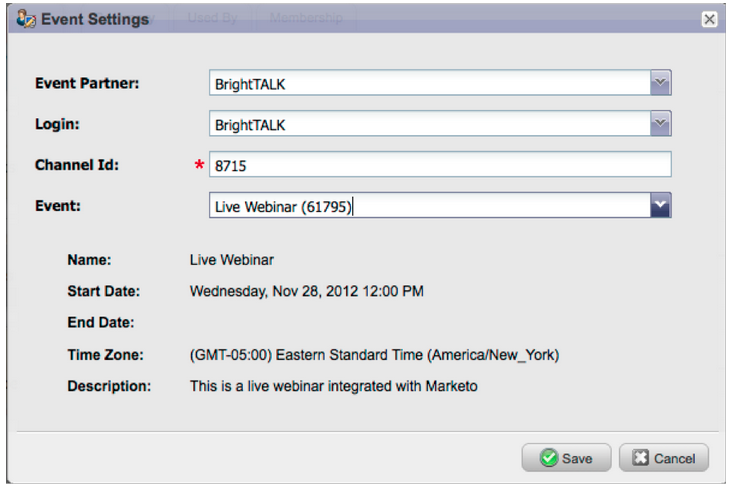

# 发行说明： 2012年12月 {#release-notes-december}

12月版本包括备受期待的&#x200B;**转发到Friend**&#x200B;功能以及其他几个实用组件！ 请注意，标有星号(&#42;)的功能仅在Select版本和RCA (Revenue Cycle Analytics)中可用。

## 转发给朋友 {#forward-to-friend}

通过在您的电子邮件中包含&#x200B;**转发给好友**&#x200B;链接来启用与他人共享内容。 添加新的过滤器和触发器将帮助您识别影响者，方法是识别转发电子邮件的用户以及收到转发电子邮件的用户。

要在电子邮件中包含&#x200B;**转发给朋友**&#x200B;邀请，请在编辑器中打开该邀请并插入`{{system.forwardToFriendLink}}`令牌。

使用相应的触发器和筛选器来识别使用&#x200B;**转发给Friend**&#x200B;链接的用户以及收到电子邮件的用户。

## 粒度管理员权限 {#granular-admin-permissions}

通过控制每个角色对Marketo [!UICONTROL Admin]区域中不同功能的访问，我们的最新版本为您提供了对[!UICONTROL Admin]角色的更大访问和控制。 创建新角色时，您可以分配该角色可以访问的特定[!UICONTROL Admin]功能。

>[!NOTE]
>
>默认情况下，具有“[!UICONTROL Access Admin]”权限的现有角色在修改之前可以访问所有[!UICONTROL Admin]函数，除非对其进行修改。

## [!UICONTROL BrightTALK]适配器 {#brighttalk-adapter}

Marketo [!UICONTROL BrightTALK]适配器允许您从实时或按需网络广播中直接将出席情况信息捕获到Marketo事件中！

## 用于[!DNL Microsoft Dynamics]的Marketo [!DNL Sales Insight] {#marketo-sales-insight-for-microsoft-dynamics}

[!DNL Sales Insight]现在可供[!DNL Microsoft Dynamics]客户使用！

## [!DNL Dynamics]机会同步 {#dynamics-opportunity-sync}

在Marketo和[!DNL Microsoft Dynamics]之间同步机会数据。

## 营销影响机会报告&#42; {#marketing-influenced-opportunities-report}

查看您的营销计划对贵公司的管道和收入的影响百分比。 在&#x200B;**[!UICONTROL Revenue Explorer]**&#x200B;中，您现在可以创建在Opportunity Analysis中使用新“营销影响的Opportunity”黄点的自定义报告。 您还可以在Standard文件夹中使用以下两个报表：

* 营销对所创建机会的影响
* 营销对成功的机会的影响

## Program Opportunity Analysis&#42;中的自定义Opportunity字段 {#custom-opportunity-fields-in-program-opportunity-analysis}

添加自定义机会字段以在[!UICONTROL Revenue Explorer]中扩充您的项目机会分析报告。

## 活动检查器 {#campaign-inspector}

您是否曾想过哪些营销活动正在使用特定的流量操作，如[!UICONTROL Change Score]或[!UICONTROL Request Campaign]？ 或者在何处使用特定过滤器？ 新的[!UICONTROL Campaign Inspector]（可从宝藏箱中获取）使您能够识别这些营销活动，以及存在错误的活跃营销活动和营销活动。

转到&#x200B;**[!UICONTROL Admin]** > **[!UICONTROL Treasure Chest]**&#x200B;以启用&#x200B;**[!UICONTROL Campaign Inspector]**。

