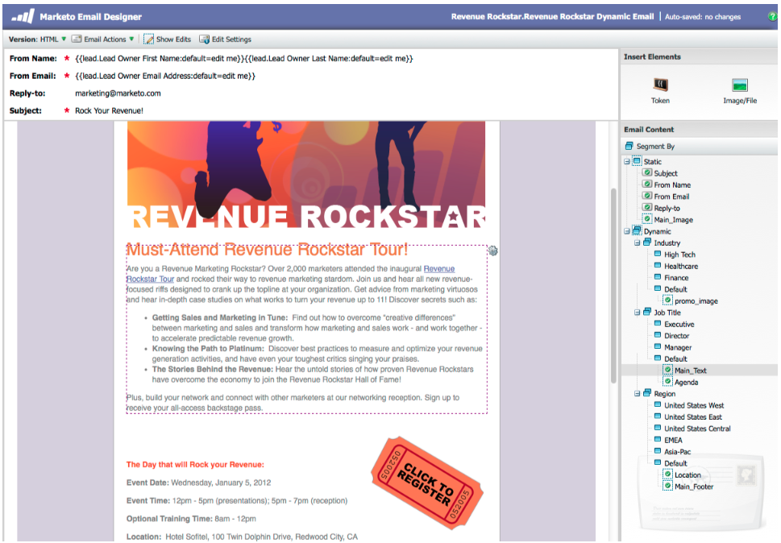
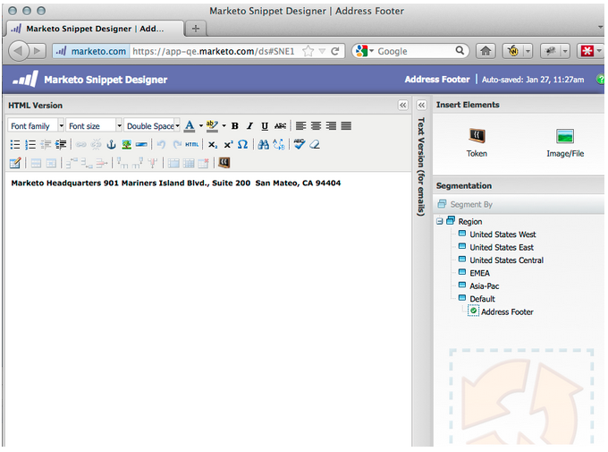

# 发行说明： 2012年1月/2月 {#release-notes-jan-feb}

1月/2月版本中包含以下功能。 查看Marketo版本以了解功能可用性。 请在发布后返回以访问指向详细功能文档的链接。

## 高级动态内容 {#advanced-dynamic-content}

_适用于Pro和Enterprise版本_

利用高级动态内容，您可以创建与受众相关的引人入胜的电子邮件通信和登陆页面，而无需为同一消息创建多个资产。 升级后的预览器允许您在单个屏幕中查看每个唯一版本。

## 分段  {#segmentation}

_适用于Pro和Enterprise版本_

分段是指一组区段，区段是指面向您的市场的一组个人。 区段由规则定义，这些规则由类似于智能列表的过滤条件驱动。 您的区段可以基于人口统计数据（如职称或行业），也可以基于行为（如访问的网页或单击的链接）。

## 代码片段 {#snippets}

_适用于Pro和Enterprise版本_

存储丰富的内容，可重复使用它们来创建静态或动态电子邮件和登陆页面。

## PURL {#purls}

_适用于Pro和Enterprise版本_

现在，使用个性化URL (PURL)，营销人员可以创建联系人特定的URL，以便在多点触控营销方案中推动直邮和电子邮件营销活动的个性化、可测量性和提升响应。

## 欧盟隐私指令支持 {#eu-privacy-directive-support}

尊重浏览器“不跟踪”设置的新功能包括禁用匿名潜在客户跟踪的功能；这使得遵守欧盟更严格的隐私跟踪法规更加容易。

## 单点登录 {#single-sign-on}

现在，企业能够支持使用SAML 2.0从企业门户进行单点登录来无缝登录Marketo应用程序。

## 更新了电子邮件和登陆页面编辑器 {#updated-email-and-landing-page-editors}

电子邮件和登陆页面编辑器经过重新设计，具有更吸引人的界面、直观的导航和显着改进的用户体验，其中包括：

并排HTML和文本视图

编辑器中将显示发件人姓名、发件人电子邮件、回复（新）和主题。 可通过“编辑设置”按钮访问所有其他设置。

## 浏览器支持 {#browser-support}

* Mozilla Firefox 9.0
* Google Chrome 16
* Microsoft Internet Explorer 8和9
* **注释**：我们不再支持Internet Explorer 7

## 项目管理 {#program-management}

简化的程序管理通过令牌删除提高了可用性，并且更容易删除程序。

## 取消订阅订阅报告 {#unsubscribe-from-subscription-report}

现在，您可以直接从报表取消订阅该订阅！

## Munchkin更新 {#munchkin-updates}

新的Munchkin调用可减少网页加载时间，并为点击链接事件提供更一致的性能。

## 计划机会分析（仅限RCA） {#program-opportunity-analysis-rca-only}

了解营销对单个机会收入的贡献

## 项目收入阶段分析 {#program-revenue-stage-analysis}

通过了解哪些计划获得了快速推进器，深入了解计划领先速度

