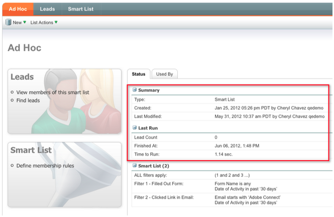

# 发行说明：2012年6月 {#release-notes-june}

## Marketo潜在客户管理增强功能 {#marketo-lead-management-enhancements}

### 重命名 {#rename}

您可以重命名智能列表、静态列表和营销活动。 如果您在过滤器、触发器或流中使用这些资产，则名称也会在此处自动更新。 您始终能够重命名电子邮件、表单和文件夹。

另外，我们还改进了资产描述文本的输入和查看功能。

## 导入字段映射 {#import-field-mapping}

我们让将列表导入Marketo更简单！ 在导入过程中，您可以将Marketo字段的名称映射到导入文件中的列标题名称。 此外，在“管理员”中，您可以设置映射到Marketo中字段名称的别名，以确保用户每次选择正确的字段。

在您继续导入和映射字段时，Marketo将在导入期间记住并显示映射，以便于使用。 为了更轻松地开展工作，您可以单击Sample Value标题以查看将填充到字段中的不同值。 这有助于确保您每次映射正确的字段！

## 智能列表和静态列表的摘要页面 {#summary-page-for-smart-lists-and-static-lists}

您是否曾想过清单的使用位置？ 或者是谁创建了列表，还是上次修改了列表？ 智能列表和静态列表上提供的新摘要页面将为您提供这些重要的详细信息。

在现有项目和营销策划摘要页面上，我们还添加了“创建日期/用户”和“上次修改日期/用户”信息！

## 用于资产 {#used-by-for-assets}

我们在资产摘要页面中添加了一个名为“使用者”的新选项卡！

示例：用于静态列表

## 登陆页面网格线 {#landing-page-gridlines}

登陆页面网格线的添加使登陆页面上的文本、图形和表单的对齐变得更加容易。 为任何给定的登陆页面打开和关闭它，并调整线条之间的宽度！

## 阻止邮件的潜在客户 {#leads-blocked-from-mailings}

在计划营销活动时，您可以单击链接以查看邮件中阻止的潜在客户列表。

## 等待步骤 — 潜在客户令牌和我的令牌 {#wait-step-lead-token-and-my-token}

在5月版中，我们为等待流程步骤添加了高级选项。 通过这些更改，您可以指定工作日、日期和时间。 在此版本中，我们添加了在等待步骤中使用令牌的功能。 例如，您可能希望使用 `{{lead.Birthday}}` 在生日时发送电子邮件，或使用 `{{my.Event Date}}` 发送最终网络研讨会提醒。

## 在Design Studio中以缩略图形式查看 {#view-as-thumbnails-in-design-studio}

将视图从图像列表切换到缩略图视图！

注意：从此版本开始，之前对智能列表网格进行排序将不适用于您查看的下一个智能列表。 例如，如果您按公司名称对智能列表进行排序，我们不会自动对同一字段查看的下一个智能列表进行排序。

提醒：正在升级电子邮件性能报表！

## Marketo收入周期分析增强功能 {#marketo-revenue-cycle-analytics-enhancements}

### 计划机会分析中的新量度  {#new-metrics-in-program-opportunity-analysis}

现在，您可以深入了解在创建或关闭机会之前的平均营销接触次数，以及营销接触的平均值。

## 显示多图表 {#displaying-multi-charts}

多图表功能允许您在单个收入周期浏览器报表中显示多个图表。 例如，当您想要在不同月份显示相同的数据时，可以使用此功能。 此功能还可防止您创建单独的过滤器和报表。

## 热网格图类型  {#heat-grid-chart-type}

通过热网格，您能够可视化数据，从而识别营销效果的模式。 此可视化图表类型将对结果进行颜色编码，以便您在易于理解的可视化图表中查看复杂的业务分析。

## 散点图类型  {#scatter-chart-type}

散点图可帮助您在一个图表中显示多个维度上的数据。 此可视化图表类型将根据所使用的属性在图表上绘制气泡图。 然后，可以使用测量对气泡进行颜色编码和/或使用测量来指定气泡的大小。

