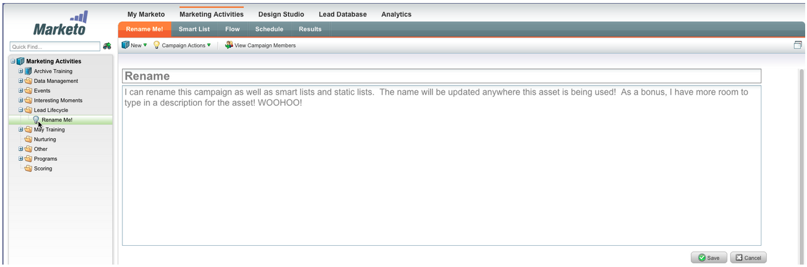

# 发行说明： 2012年6月 {#release-notes-june}

## Marketo商机管理增强功能 {#marketo-lead-management-enhancements}

### 重命名 {#rename}

您可以重命名智能列表、静态列表和营销活动。 如果您在过滤器、触发器或流中使用这些资源，则名称也会自动更新。 您始终能够重命名电子邮件、表单和文件夹。

另外，我们还改进了对资产描述文本的输入和查看功能，这是一项额外举措。

## 导入字段映射 {#import-field-mapping}

我们简化了将列表导入Marketo的过程！ 在导入过程中，您可以将Marketo字段的名称映射到导入文件中的列标题名称。 此外，在Admin中，您可以设置映射到Marketo中的字段名称的别名，确保用户每次都选择正确的字段。

在继续导入和映射字段时，为方便使用，Marketo将在导入期间记住和显示映射。 为了使工作更轻松，您可以单击示例值标题以查看将填充该字段的不同值。 这有助于确保每次都映射正确的字段！

## 智能列表和静态列表的摘要页面 {#summary-page-for-smart-lists-and-static-lists}

您是否曾想过您的列表在哪里被使用？ 或者是谁创建了列表，还是最后修改了列表？ 智能列表和静态列表中提供的新摘要页面将为您提供这些重要的详细信息。

在现有的项目和营销策划摘要页面上，我们还添加了“创建日期/用户”和“上次修改日期/用户”信息！

## 用于资产 {#used-by-for-assets}

我们在资产摘要页面中新增了一个选项卡，名为“使用者！

示例：用于静态列表

## 登陆页网格线 {#landing-page-gridlines}

添加登陆页面网格线可让您更轻松地对齐登陆页面上的文本、图形和表单。 打开和关闭任何给定登陆页面的导航栏，并调整线条之间的宽度！

## 邮件中阻止的潜在客户 {#leads-blocked-from-mailings}

在计划促销活动时，您可以单击链接以查看阻止您发送邮件的潜在客户列表。

## 等待步骤 — 潜在客户令牌和我的令牌 {#wait-step-lead-token-and-my-token}

在5月版本中，我们在等待流步骤中添加了高级选项。 通过这些更改，您可以指定工作日、日期和时间。 在此版本中，我们增加了在等待步骤中使用令牌的功能。 例如，您可能要使用 `{{lead.Birthday}}` 在他们的生日当天发送电子邮件，或使用 `{{my.Event Date}}` 发送最终网络研讨会提醒。

## 在Design Studio中查看缩略图 {#view-as-thumbnails-in-design-studio}

将视图从图像列表切换到缩略图视图！

注意：从本版本开始，智能列表网格上的先前排序将不会应用于您查看的下一个智能列表。 例如，如果您按公司名称对智能列表进行排序，我们将不会自动对由此字段查看的下一个智能列表进行排序。

提醒：电子邮件性能报告升级正在进行中！

## Marketo收入周期Analytics增强功能 {#marketo-revenue-cycle-analytics-enhancements}

### 计划机会分析中的新指标  {#new-metrics-in-program-opportunity-analysis}

您现在可以深入了解在创建或关闭机会之前的平均营销接触次数，以及营销接触的平均值。

## 显示多图表 {#displaying-multi-charts}

多图表功能允许您在单个Revenue Cycle Explorer报表中显示多个图表。 例如，当您希望在不同月份显示相同的数据时，可以使用此功能。 此功能还可让您不必创建单独的过滤器和报告。

## 热网格图表类型  {#heat-grid-chart-type}

利用热网格，可可视化数据，以便识别营销绩效模式。 此可视化图表类型将为您的结果添加颜色代码，以便您在易于理解的可视化图表中查看复杂的业务分析。

## 散点图类型  {#scatter-chart-type}

散点图有助于在一个图形中显示多个维度的数据。 此可视化图表类型将根据使用的属性，在图形上绘制气泡。 然后，可以使用测量对气泡进行颜色编码和/或使用测量指定气泡的大小。

