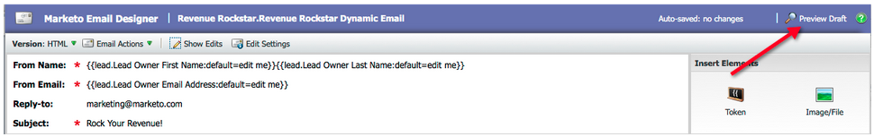

# 发行说明：2012年3月 {#release-notes-march}

## 解析我的令牌 {#resolve-my-tokens}

我的令牌（程序令牌）将在预览电子邮件、发送测试电子邮件以及通过单个流程操作发送本地电子邮件时解析。 您不再需要在项目中创建智能营销活动即可测试我的令牌！

## 在电子邮件和登陆页面中的预览者和编辑者之间进行切换 {#toggle-between-previewer-and-editor-in-emails-and-landing-pages}

单击一下，即可在编辑器和预览器之间轻松地来回切换。

预览器编辑器：

编辑器预查看器：

## 代码片段预查看器 {#snippet-previewer}

通过从菜单中选择“预览代码片段”，您可以查看代码片段，而无需将其设为草稿。此外，如果您（通过工作区）对共享的代码片段具有只读访问权限，则可以通过此操作查看代码片段

## 发送多个测试电子邮件 {#send-multiple-test-emails}

随着动态内容的添加，预览和测试可能发送给潜在客户的所有电子邮件变体变得越来越重要。 使用“按潜在客户详细信息查看”进行预览时，您可以选择发送对潜在客户列表中各个变体的测试（最多100封测试电子邮件）。

## 基于URL参数的动态登陆页面 {#dynamic-landing-pages-based-on-url-parameter}

匿名潜在客户在您的登陆页面访问量中占很大比例。 通过添加动态内容和将分段作为参数放入URL中的功能，您可以在匿名或已知潜在客户单击链接时动态显示登陆页面内容。
